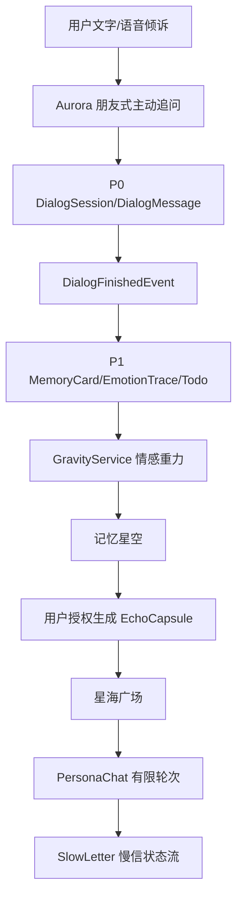

# Inner Cosmos 架构说明

## 核心闭环

## 分层

- `controller`：Spring MVC API 边界。
- `service` / `service.impl`：业务编排。
- `mapper`：MyBatis-Plus 数据访问。
- `entity`：数据库实体。
- `ai.client`：LLM Adapter，默认 `MockLlmClient`。
- `ai.prompt`：Prompt Builder 与模板注册。
- `ai.agent` / `ai.strategy`：Agent 能力与策略模式落点。
- `event`：对话结束后的观察者模式整理链路。
- `letterstate`：慢信件状态模式。
- `safety` / `service.SafetyService`：安全边界。

## 设计模式落点

1. Adapter：`LlmClient` 对接 Mock / DeepSeek / Qwen。
2. Observer：`DialogFinishedEvent` 触发记忆、情绪、待办、重力、共鸣体建议监听器。
3. State：`LetterState` 管理慢信生命周期。
4. Builder：`PromptBuilder` 组合系统边界、最近消息、记忆和输出要求。
5. Strategy：`AgentReplyStrategy` 区分 Aurora、碎纸机、共鸣体回应策略。

## 数据分层

- P0：`tb_dialog_session`、`tb_dialog_message`，只保存文本与语音元数据，不保存原始音频。
- P1：`tb_memory_card`、`tb_thought_fragment`、`tb_emotion_trace`、`tb_todo_item`。
- P2：`tb_echo_capsule`、`tb_capsule_boundary`。
- P3：`tb_persona_chat_session`、`tb_persona_chat_message`、`tb_slow_letter`、`tb_letter_status_log`。

## API 总览

- Auth：`/api/auth/register`、`/api/auth/login`、`/api/auth/logout`、`/api/auth/current`
- Dialog：`/api/dialog/session/create`、`/api/dialog/session/{id}/messages`、`/api/dialog/session/{id}/finish`
- Aurora：`/api/aurora/message`、`/api/aurora/stream`
- Memory：`/api/memory/extract/{sessionId}`、`/api/memory/cards`、`/api/memory/starfield`
- Capsule/Plaza：`/api/capsule/my`、`/api/capsule/create-from-memory`、`/api/plaza/capsules`
- PersonaChat：`/api/persona-chat/session/create`、`/api/persona-chat/message`
- Letters：`/api/letters/draft`、`/api/letters/{id}/send/read/reply/decline/block/archive`
- Safety：`/api/safety/resources`、`/api/safety/check`
- Logs/Admin：`/api/ai-logs`、`/api/admin/users`、`/api/admin/capsules`、`/api/admin/reports`
