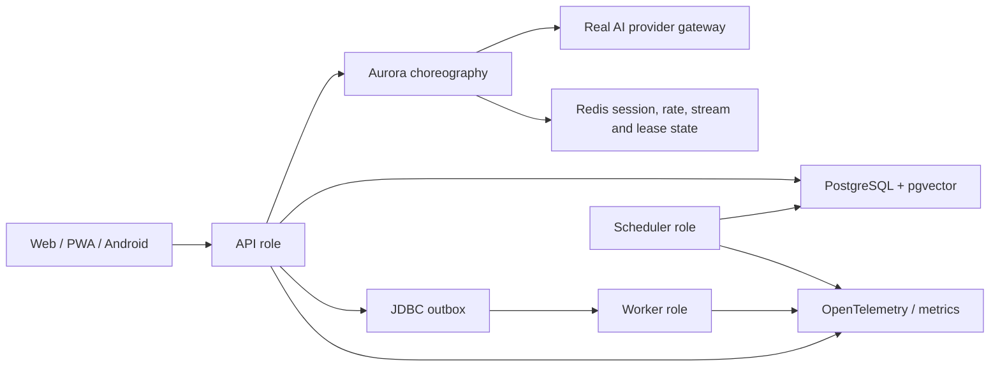

# Inner Cosmos — competition judge guide

Inner Cosmos is an AI-native self-understanding and slow-social product. Aurora helps a person turn
conversation into correctable memories and an evolving self-model. The user may then authorize a
carefully bounded Echo Capsule to represent selected facets in a resonance network—without exposing
the original private conversation.

## Five-minute product route

1. **Talk to Aurora.** Send a real concern, interrupt or continue naturally, and inspect the visible
   provider/runtime disclosure instead of assuming the reply source.
2. **Open Inner Cosmos.** End the session, then inspect the new memory, its provenance, emotional
   gravity, and the starfield detail/retry/correction path.
3. **Correct the system.** Change or reject an understanding claim. The product treats AI output as
   revisable evidence, not unquestionable identity truth.
4. **Enter Resonance.** Compile or inspect an Echo Capsule, its consent scope, conversation boundary,
   Genome version, and public projection.
5. **Connect slowly.** Explore explainable matching, speak with a Capsule, and—only when its owner
   allows it—send a slow letter or continue into friends/groups.

For a hosted classroom session, use the live URL or APK supplied by the operator and follow the
[public demo runbook](../demo/DEMO-RUNBOOK.md). If no runtime is available, the repository still
contains the [self-contained experiment pack](../demo/INNER-COSMOS-SELF-CONTAINED-EXPERIMENT-PACK-2026-07-28.md)
and reproducible evidence.

## Ten-minute engineering route

- **Conversation continuity:** typed SSE events, staged turns, durable choreography, interruption,
  fencing/leases, replay, and Pod-takeover evidence.
- **Data authority:** PostgreSQL/Flyway is production truth; memories and profile claims retain
  provenance, confidence, correction, consent, and retraction paths.
- **Social boundaries:** self-access, block relations, Capsule visibility, letter permissions,
  ownership, public projections, and idempotency are enforced server-side.
- **Cloud-native mechanisms:** one immutable Java artifact runs as API, worker, scheduler, or
  migration roles; Redis coordination, JDBC outbox, KEDA/HPA, Gateway API, NetworkPolicy,
  observability, SBOM, image signing, and schema gates are represented in deploy/CI assets.
- **Failure honesty:** dev Mock proves deterministic flow, not provider quality; kind proves local
  Kubernetes behavior, not EKS multi-AZ; public tunnel proves reachability, not commercial hosting.

## Evidence labels

| Label | Meaning |
|---|---|
| `VERIFIED` | Reproduced in the named environment with a recorded command/result. |
| `STATIC-ONLY` | Source, manifest, or geometry validation passed; no live runtime claim. |
| `PARTIAL` | Some required layers passed, but at least one named gate remains. |
| `BLOCKED` | The named external prerequisite was unavailable and no substitute is claimed. |
| `HUMAN-GATED` | Requires owner, device, legal, provider-account, or independent-review action. |

See the [current verification snapshot](VERIFICATION-SNAPSHOT-2026-07-31.md) and the
[machine-readable acceptance ledger](../goal/complete-product-acceptance.yml) before quoting a
completion claim.

## Questions worth asking the team

- How does a user correct or withdraw an AI-derived belief?
- What survives an API Pod deletion, and what evidence proves it?
- Which data can an Echo Capsule read, and which data is structurally excluded?
- What changes between Mock, real-provider, public-demo, local-complete, kind, and Academy EKS?
- Which remaining claims are machine-verifiable, and which are deliberately human-gated?
