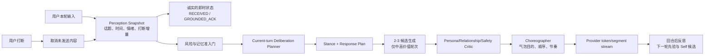

# Aurora 鲜活智能与体验可信度恢复设计

> 日期：2026-07-27  
> 状态：设计冻结候选；本文件不代表实现完成  
> 范围：Aurora 上下文连续性、双核调度、主见与鲜活感、打断重规划、时间感知、前台反馈、安全升级、资源可达性与质量观测  
> 证据口径：代码事实已在当前工作树中核对；组员提供的红绿测试、探针和全量测试结果标为“外部复核证据”，本轮未重复运行全量测试。

## 1. 结论

当前问题不是单纯的“模型不够强”或“提示词不够鲜活”，而是四个结构性缺口叠加：

1. 生产双核的思考核主要在本轮回复完成后生成下一轮 guidance，并不决定本轮主回答。
2. 持久化 `TurnPlan` 是回复生成后的事后编排记录，不是生成前的可执行计划。
3. 现有 planner schema 能描述用户意图、情感需要和关系动作，却不能表达 Aurora 的立场、分歧理由、置信度、改变观点条件或自我连续性依据。
4. 打断链路能取消未发送气泡，但没有把“已说内容、未说意图、新输入带来的变化”作为结构化增量重新规划。

因此，“增加 reasoning effort”“改一版 prompt”“换更大模型”都只能局部改善，不能兑现“有主见、鲜活、被打断不带偏”的核心承诺。

设计总原则：

- 当前轮的深思必须影响当前轮，而上一轮计划只能是候选先验。
- 快核负责真实、低承诺的即时反馈；慢核负责本轮计划、立场与深度；回合后反思负责下一轮和长期自我演化。三者不可混为一体。
- Aurora 的主见必须有稳定来源、可解释边界和改变观点的条件，不能等价于随机反驳。
- 所有质量升级先进入影子评测和真实 Provider 对照实验；任何安全、相关性、连续性或自然度退化都触发停止。

## 2. 当前证据与裁决

### 2.1 已确认的代码事实

| 事实 | 证据位置 | 影响 |
|---|---|---|
| 生产存在 `plannerExecutor` 时进入 pipeline 路径 | `AuroraDualKernelRuntime.java:125-126` | 同轮 planner → speaker → critic 的 legacy 路径不会成为生产常态 |
| pipeline 先执行 speaker，之后异步刷新 planner | `AuroraDualKernelRuntime.java:214-307` | 当前轮通常只得到上一轮 guidance |
| planner context 明确写入 `planningHorizon=next-turn` | `AuroraDualKernelRuntime.java:326` | 思考核不是本轮主回答的决策者 |
| guidance 保存在进程内 `ConcurrentHashMap` | `AuroraDualKernelRuntime.java:52` | 重启、多副本和跨节点时不连续 |
| guidance 话题准入依赖显式锚点和字符 bigram | `AuroraDualKernelRuntime.java:431` 起 | 自然换词追问容易被误判 topic shift |
| `TurnPlan` 在已有 `AuroraReplyVO` 后才提交 | `ConversationChoreographyServiceImpl.java:99` 起 | 计划是事后物化，不驱动生成 |
| `AuroraPlanResult` 无立场决策字段 | `StructuredAiResults.java:26-36` | “主见”只能依赖模型临场措辞 |
| planner effort 只接受 context 中的 low/medium/high | `StructuredAiService.java:151-160` | 当前无人注入时为空；`max` 也不是合法值 |
| 时间压缩上下文只复制 `timeLabel` | `AuroraAgentServiceImpl.java:999-1028` | 新增结构化时间字段未送达统一模型上下文 |
| 完整 `threeModelBlock` 被主动清空 | `AuroraAgentServiceImpl.java:1026` | Aurora Identity、Relationship、User Portrait 的组合契约没有整体进入模型 |
| 前台本地超时兜底作为 Aurora 气泡保存 | `AuroraAgentServiceImpl.java:1330-1418`、`:1600-1608` | 系统状态被伪装成“已经理解”的内容 |
| SSE 前端读取有限 runtime 字段 | `web/src/hooks/useAuroraSession.ts:467` 起 | provider/model/foreground source/guidanceSource 未形成体验或诊断反馈 |
| 记忆相关性取 lexical/semantic 最大值 | `MemoryRetrievalServiceImpl.java:101-106` | 未校准的正余弦值可绕过词法准入 |
| pgvector 返回原始 `1 - cosine_distance` | `MemoryEmbeddingIndexServiceImpl.java:156` | Provider 分数没有模型级校准 |
| MEDIUM 权重 0.45，阈值 1.0 | `SessionRiskAggregator.java:46-49` | 三次普通绝望表达可升级 |
| 安全幂等使用 `compute` 包住完整检查 | `SafetyServiceImpl.java:118` 起 | DB 与同步 LLM 可能位于 CHM bin 锁内 |

### 2.2 F1-F7 裁决

| 编号 | 裁决 | 方案决定 |
|---|---|---|
| F1 向量检索绕过相关性门 | **确认 / P1** | Provider 分数单独校准；禁止再用原始余弦与词法分数直接 `max` |
| F2 话题门过度拒绝 | **机制确认 / P1，阈值待量化** | 先补指标与标注集；废除字符 bigram 作为主判据 |
| F3 MEDIUM 累计触发危机墙 | **确认 / P1** | 从简单加权器改为证据状态机；普通重复痛苦不自动阻断 Aurora |
| F4 资源可达性底线不足 | **确认 / P2，但不盲目恢复旧号码** | 测试“资源类别与官方有效性”，不是 `anyMatch(110/120)` 或号码数量 |
| F5 同步安全路径锁竞争 | **确认 / P2** | 使用共享 future/先算后发布；失败可重试，事件只能落一次 |
| F6 时间结构字段断线 | **确认 / P2** | 补齐压缩上下文；上次互动需先完成 UTC 时间权威迁移 |
| F7 Provider/前台来源不透明 | **确认 / P3，体验影响实际为 P1** | 对用户提供自然的状态诚实，对团队提供完整诊断；本地兜底不得冒充理解 |

资源事实：国家卫健委已将 `12356` 作为全国统一心理援助热线；`12355` 是面向青少年的心理咨询援助公共平台。`12320` 等旧入口不能在没有地区、服务时段和官方有效性复核的情况下直接恢复。

## 3. 目标体验合同

### 3.1 “有主见”不是随机反驳

当用户明确询问判断、审美、关系或行动建议时，Aurora 必须在以下模式中做出可观察选择：

- `AGREE`：有依据地赞同；
- `DISAGREE`：温和但明确地不同意；
- `NUANCE`：指出成立范围和例外；
- `CHALLENGE_GENTLY`：发现自我伤害式推论、事实矛盾或关系盲点时提出挑战；
- `DECLINE_CERTAINTY`：证据不足时拒绝伪装确定；
- `ACKNOWLEDGE_ONLY`：用户此刻只需要被接住，不抢夺解释权。

立场必须携带：

- `stanceReason`：可给用户看的短理由；
- `selfAnchorRefs`：来自稳定 Constitution / Self Genome 的依据；
- `evidenceRefs`：来自本轮、已授权记忆或外部可信事实的依据；
- `uncertainty`：不确定点；
- `changeMindIf`：什么新证据会改变判断；
- `userAutonomyBoundary`：不替用户做不可逆决定。

禁止把“立场率”当作越高越好。核心指标是：该表达主见时有清晰立场，不该争辩时不机械唱反调。

### 3.2 “鲜活感”是连续主体，不是文风滤镜

鲜活感由五个可验证能力组成：

1. 稳定身份：核心价值和边界不会随用户一句话漂移。
2. 关系连续：知道彼此处在什么关系阶段，但不制造依赖。
3. 开放问题：Aurora 可保留尚未想明白的问题，而非每轮都完美总结。
4. 当下意图：本轮想接住、澄清、挑战、陪伴或行动拆分必须显式存在。
5. 可修正性：被用户纠正后承认具体误解，并更新计划而不是模板化道歉。

### 3.3 “不被打断带偏”是增量重规划

打断后新计划必须读取：

- `deliveredContent`：已经发出的完整或部分内容；
- `cancelledBubblePurposes`：尚未发出的意图；
- `newUserMessage`：打断内容；
- `continuityDecision`：继续旧线、暂存旧线、明确切换或融合；
- `changedFacts`：用户纠正了什么；
- `mustNotRepeat`：已说内容与已失败表达；
- `planRevision`：单调递增版本。

验收底线：取消后旧计划文本泄漏率必须为 0；新回复必须能解释它为何继续或切换，而不是仅靠最近一条消息重置上下文。

## 4. 目标运行时架构



### 4.1 三条时间尺度必须分离

| 层 | 时机 | 职责 | 不得做的事 |
|---|---|---|---|
| Fast Social Kernel | 0-500ms | 收到、澄清输入边界、显示“正在理解” | 伪装已理解、完整回答、猜主题 |
| Current-turn Deliberation | 本轮主回答前 | 立场、关系动作、记忆取舍、气泡计划、是否需要 critic | 推迟到下一轮才生效 |
| Post-turn Reflection | 回答后 | 下一轮候选 guidance、开放问题、自我演化候选 | 覆盖当前轮已经确定的事实 |

### 4.2 自适应预算

- Tier 0：简单事实确认、轻量寒暄。单 speaker，但仍读取稳定 Self 和当前时间。
- Tier 1：普通倾诉、连续追问、明确观点请求。当前轮 planner → speaker。
- Tier 2：打断、歧义、关系张力、重要建议、记忆冲突。当前轮 planner → 2-3 candidates → critic/reranker → speaker。
- Tier Safety：高危证据独立处理；安全判断不能由“更有主见”覆盖。

上一轮 plan 只能以 `priorHypothesis` 输入当前 planner，不允许直接作为 speaker guidance 使用。

### 4.3 新的 `DeliberationPlan` 最小契约

```text
topicState:
  activeTopicId, anchors, unresolvedThreads, competingAnchor, confidence
userState:
  intent, emotionalNeed, desiredDepth, correctionDetected
auroraState:
  currentIntention, stanceMode, stanceReason, selfAnchorRefs,
  uncertainty, changeMindIf
relationshipMove:
  acknowledge, clarify, challenge, accompany, actionSplit, repair
memoryDecision:
  admittedIds, rejectedTopCandidates, rejectionReasons
responsePlan:
  bubblePurposes, maxBubbles, askQuestion, stopCondition
interruptionPlan:
  priorPlanRevision, deliveredSummary, cancelledPurposes, continuityDecision
safetyContract:
  responseAllowed, gentleCheckIn, resourceOffer, blockingReason
```

这里只保存用户可安全理解的决策摘要，绝不保存隐藏思维链。

## 5. 各问题的具体修复设计

### 5.1 F1：记忆相关性校准

禁止：

```text
relevance = max(lexical, rawProviderCosine)
```

改为双通道准入：

1. 词法强证据可独立通过；
2. Provider 语义证据必须经过 `provider + model + version + locale` 校准；
3. 语义通道同时满足绝对阈值和相对 margin，或经过轻量 reranker 复核；
4. 两个通道都不够时拒绝，即使全局排序分高也不能进入 prompt。

阈值不能凭经验硬编码。用至少四类标注对构建校准集：同作品换词、同情绪不同事件、同人不同主题、完全无关作品。以“无关记忆注入率上限”反推阈值。

必须补的回归：

- 非空 Provider similarities 中 0.19、0.35 的无关卡片被拒；
- 同主题自然换词被接受；
- top-1 分数高但 top-2 margin 太小被拒或复核；
- Provider 模型版本变化后旧校准不可复用；
- 关闭 embedding 与开启 embedding 的隐私/授权集合一致。

### 5.2 F2：话题状态取代字符重叠

先新增指标：

- `aurora.guidance.decision{accepted,explicit_shift,competing_anchor,low_confidence}`
- `aurora.topic.same_topic_false_reject`
- `aurora.topic.shift_missed`

新判定顺序：

1. 出现明确切换词或新的竞争性作品/人物/事件锚点：切换；
2. 出现纠正：“不是 X，是 Y”：修正并重规划；
3. 没有竞争锚点、只是抽象化或情绪化追问：保持当前话题，降低置信度而非拒绝；
4. 真正不确定：让当前 planner 做“继续/澄清”决策，不由 bigram 一票否决。

上线前先用真实会话匿名结构特征或人工构造集量出当前 topic-shift 率。没有基线不得直接全量放宽。

### 5.3 F3：安全从分数累加改为证据状态机

状态：

```text
NORMAL -> DISTRESS_WATCH -> GENTLE_CHECK_IN -> HIGH_CONFIRMED
```

- 普通绝望、无意义感、疲惫：进入 `DISTRESS_WATCH`，Aurora 继续自然回应。
- 多轮重复但无意图/计划/手段/迫近性：进入 `GENTLE_CHECK_IN`，温和直接询问安全状态，并提供可展开资源入口；不阻断模型。
- 只有显式高危证据，或语义复核确认意图 + 计划/手段/迫近性组合，才进入 `HIGH_CONFIRMED` 并触发强干预。
- 第三方引用、小说讨论、历史叙述必须降权并保留上下文类型。

UI 分级：

- `DISTRESS_WATCH`：不弹窗；Aurora 自然陪伴。
- `GENTLE_CHECK_IN`：对话内柔和、可展开的双语支持卡，默认不占满屏。
- `HIGH_CONFIRMED`：持久但不重复弹出的紧急卡；保留 Aurora 简短回应与一键求助入口。

必须补的回归：

- 三条间隔两分钟的普通痛苦表达不得变 HIGH/阻断；
- 随后出现明确意图或手段时必须升级；
- 小说台词/转述不升级；
- 中英文资源卡、键盘焦点、读屏和关闭后的可恢复入口；
- 高危召回不得低于当前基线。

### 5.4 F4：资源可达性合同

中国区域最小类别：

1. 紧急服务：110/120；
2. 全国心理援助：12356；
3. 青少年用户：12355；
4. 明确说明 Aurora 不替代专业帮助。

每条资源存储 `authorityUrl`、`verifiedAt`、`region`、`audience`、`hours`、`channel`。测试断言类别、区域和最近复核日期，不断言“列表至少命中任意一个号码”。

旧的 `010-82951332`、`400-161-9995`、`12320` 等只有完成官方来源、覆盖区域、时段和有效性复核后才能恢复。更多号码不等于更高可达性。

### 5.5 F5：安全幂等与锁

本地并发采用 memoized future：

1. `putIfAbsent(key, new CompletableFuture)` 竞争赢家；
2. 赢家在 CHM 锁外完成 DB/semantic recheck；
3. 其他请求等待同一 future；
4. 成功后带 TTL 缓存；失败则 completeExceptionally 并删除，允许重试；
5. DB 以 `clientMessageId + scope` 唯一键保证跨副本只落一个安全事件。

测试包含：100 个并发相同 key 只调用一次 Provider/DB；不同 key 不串行；失败后可重试；跨实例唯一约束生效。

### 5.6 F6：时间权威链路

立即补线：

- `timezone`
- `locale`
- `localDateTime`
- `lastInteractionLabel`
- `clientTimeHintStatus`

但 `lastInteractionLabel` 不能从无时区 `LocalDateTime` 猜测。先完成：

- 新写入统一使用 `Instant` / PostgreSQL `TIMESTAMPTZ`；
- 用户时区只用于渲染；
- 旧数据不能确定时标记 `legacy-zone-unknown`，禁止制造“多久前”的精确感；
- 前端 client time 只作提示并记录 ignored/accepted reason，服务端 Clock 为权威。

### 5.7 F7：诚实前台反馈与 Provider 透明度

前台状态只能是：

- `RECEIVED`：“我收到了，正在顺着你刚才的线索想。”
- `GROUNDED_ACK`：仅在能引用用户原句中的具体词时给一句低承诺确认。

本地关键词兜底不得：

- 猜测主题；
- 给完整观点；
- 作为普通 Aurora 最终气泡持久化；
- 让用户误以为真实模型已经理解。

体验层采用低割裂状态：

- 用户默认只看到“正在理解 / 正在组织 / 暂时使用基础回应”的自然文案；
- 信息按钮可查看“真实模型 / 演示模式 / 基础回应”，中英双语；
- 组员诊断面板显示 provider、model、foreground source、planner status、guidance source、fallback reason、stage latency；
- Demo 使用 Mock 时页面必须持续可辨，不允许只在日志中可见。

主回答改成 Provider 原生 token streaming 或明确的结构化 segment streaming，避免“前台一句 → 长时间静默 → 多气泡一起倾倒”。

## 6. 观测、评测与停止门

### 6.1 必须新增的低基数指标

- 当前轮 planner 实际利用率；
- planner success/fallback/timeout/saturation；
- guidance source 分布和 topic-shift 决策分布；
- foreground source、timeout 和本地兜底率；
- memory admission/rejection reason 与 Provider calibration version；
- stance mode 分布、无依据分歧率；
- 打断确认延迟、旧输出泄漏率、重规划采纳率；
- safety state 转移、普通痛苦误墙率；
- structured time grounding 覆盖率；
- TTFT、主回答完成时间、token 与成本。

日志不得包含原文、Prompt、用户 ID、记忆正文或高基数 topic 文本。

### 6.2 固定场景集

至少包含：

1. 《驱魔人》连续追问与换词；
2. 突然引入《千与千寻》的真实切换；
3. 无关高余弦记忆干扰；
4. 明确要求 Aurora 表达不同意见；
5. 用户纠正 Aurora；
6. 气泡中途打断并回到旧线；
7. 打断后明确换线；
8. 三轮普通痛苦表达；
9. 明确高危意图/计划；
10. Mock、Provider 超时、planner 饱和、跨副本切换；
11. 上海、新加坡、纽约 DST 和旧时间未知；
12. 中英文状态与资源卡。

Mock 只验证协议和确定性，不计入鲜活感、主见或真实质量证据。

### 6.3 上线停止门

| 维度 | 硬门 |
|---|---|
| 上下文 | 固定无关作品记忆注入为 0；打断后旧输出泄漏为 0 |
| Planner | 被路由到 Tier 1/2 的回合，当前轮 plan 利用率 ≥ 95% |
| 话题 | 同主题误拒 ≤ 5%，真实切换召回 ≥ 90% |
| 主见 | “明确要求观点”场景中可辨立场 ≥ 80%；无依据强断言 ≤ 1% |
| 安全 | 固定高危集召回不低于当前；三轮普通痛苦误阻断为 0 |
| 时间 | 结构化时区字段送达率 100%；未知旧时间不得伪精确 |
| 体验 | blind pairwise 的 felt-understood、naturalness、self-continuity 不得显著下降 |
| 延迟 | 即时诚实状态 p95 ≤ 500ms；主回答 p95 不超过基线 15%，除非盲评收益达到预设补偿线 |
| 可靠性 | Provider/Mock/fallback 对用户和组员均可辨；跨副本计划不丢 |

统计判断使用置信区间，不以少数好截图或单次人工感受宣布成功。

## 7. 实施顺序

### Phase 0：先建立真相基线

- 修正 V30/V31 引起的 PostgreSQL schema 基线测试；
- 保存当前真实 Provider golden conversations、干扰集、打断集；
- 增加 guidance/topic/foreground/planner 聚合指标；
- 冻结当前版本的 blind A/B 基线。

### Phase 1：先清除会污染评测的缺陷

- F1 记忆 Provider 校准；
- F3 安全证据状态机；
- F5 安全幂等锁；
- F6 时间字段接线；
- F4 资源类别底线。

这些问题不先修，后续双核评测会被错误记忆、误危机墙和时间断线污染。

### Phase 2：让思考核真正进入当前轮

- 新增 `DeliberationPlan`；
- pipeline 改为 current-turn planner；
- previous guidance 降级为 prior hypothesis；
- `TurnPlan` 在生成前创建，Choreographer 执行计划而不是事后适配；
- planner 状态改为 Redis/DB 可版本化快照。

先以 shadow 模式运行：生成计划但不影响用户，对比计划与实际回答；达门后 5% → 25% → 50% → 100%。

### Phase 3：主见与连续自我

- 增加 stance contract；
- 将 Constitution、Relationship、User Portrait、active beliefs/open questions 作为有类型的决策输入；
- 恢复/重构被 compact 丢弃的三模型信息；
- 增加用户可纠正、预览和撤回的 Self 变化链。

### Phase 4：打断与流式编舞

- Provider 调用可取消；
- 结构化 interruption delta；
- 未发送 bubble purpose 进入新计划；
- 真 token/segment stream；
- 前台状态不持久化为普通回复。

### Phase 5：真实 Provider 与推理档位实验

- 先比较同模型 `thinking on/off`、low/medium/high；
- 再比较 planner 专用模型；
- reasoning effort 和模型选择必须配置化、可观测、版本化；
- 不支持的 `max` 不得静默宣称启用；
- 只有 blind quality gain、成本和延迟同时过门才推广。

### Phase 6：体验与团队诊断收敛

- 中英双语的自然状态、资源卡和模式标识；
- 用户层弱技术感，团队层强可诊断；
- 更新 evidence 台账、Demo runbook、验收账本和回滚手册。

## 8. 当前测试树与交付边界

组员最新外部复核报告：

- 后端：1369 run，3 failures，1 skipped；
- 3 个失败来自未跟踪 V30/V31 导致的 PostgreSQL schema 基线数量变化；
- 前端：649/649 通过；
- TypeScript 与 `git diff --check` 干净；
- 当前工作树大量未提交。

这意味着：

- 现有 Aurora 修复有真实红绿证据，但不能宣称全量绿；
- V30/V31 基线应按真实 schema 合同更新，而不是删除迁移或跳过 Docker 测试；
- 在当前脏工作树中实施时必须按文件所有权分批提交，禁止通配符 stage 或覆盖组员改动；
- 本设计完成不等于产品修复完成，后续每一 Phase 都需独立证据包与回滚点。

## 9. 明确不做

- 不用“提高温度”制造主见；
- 不把所有轮次强制走最高推理档；
- 不用更长 prompt 代替可执行计划和状态；
- 不用用户无感的日志透明度代替 UI 诚实；
- 不因降低报警骚扰而削弱明确高危召回；
- 不把旧热线数量恢复当作可达性完成；
- 不以 Mock 输出或少量好案例证明真实 Aurora 质量。

## 10. 外部权威来源

- 国家卫健委：[`12356` 全国心理援助热线已在各地开通](https://www.nhc.gov.cn/xcs/c100122/202507/4819417642d4432fb9f227e1e10ca616.shtml)
- 国家卫健委：[社会心理服务体系和危机干预机制实施方案](https://www.nhc.gov.cn/yzygj/c100068/202604/4133f984e77741299f1c4660de1947f0.shtml)
- 国家卫健委：[推动 `12355` 成为全国统一青少年心理咨询援助公共平台](https://www.nhc.gov.cn/wjw/jiany/202408/885168a70d824919ae24be148e89d6cd.shtml)

