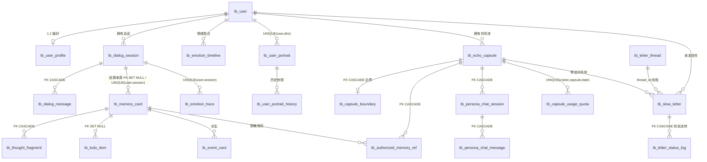

# Inner Cosmos（内宇宙）数据库设计文档

> 版本：v2（与当前代码库实际 schema 对齐）
> 当前生产数据源真相：`src/main/resources/db/migration/postgresql/` 的 Flyway 版本化迁移 + `@TableName` 实体类。`schema.sql` 与 `Schema*Initializer` 仅服务 H2 本地开发/历史 MySQL 迁移来源；Flyway 启用时所有旧运行时 DDL 初始化器均被禁用。下文未更新段落属于原型期历史说明，不得覆盖这一生产事实源。

---

## 1. 概述

### 1.1 数据库引擎策略

Inner Cosmos 通过 **MyBatis-Plus** 访问数据库，支持两套引擎，由 Spring Profile 切换，无需改动任何业务代码：

| 场景 | 引擎 | 连接串 | 说明 |
| --- | --- | --- | --- |
| **默认 / 演示（零配置）** | H2 文件库 | `jdbc:h2:file:./data/innercosmos;MODE=MySQL;DATABASE_TO_LOWER=TRUE;DB_CLOSE_DELAY=-1` | 开箱即用，数据落盘到 `./data/`，重启不丢；`MODE=MySQL` 保证 SQL 方言与 MySQL 一致 |
| **生产 / 可选** | MySQL 8 | `jdbc:mysql://localhost:3306/inner_cosmos?...&serverTimezone=Asia/Shanghai` | 启用 `mysql` / `prod` profile（`application-mysql.yml` / `application-prod.yml`），支持 12-Factor 环境变量注入 |

> 关键点：H2 以 `MODE=MySQL` 运行，因此 `schema.sql` 是同一份建表脚本在两套引擎上通用。多个 NULL 在 UNIQUE 索引下被视为互不相同（H2/MySQL 行为一致），这是若干「去重」约束允许 NULL 外键多行并存的前提。

### 1.2 建表与迁移机制

- **全量建表**：`schema.sql`（约 870 行）使用 `CREATE TABLE IF NOT EXISTS`，由 `spring.sql.init.mode=always` 在每次启动执行 —— 这是「全新库」的真相。
- **增量迁移**：因为 `CREATE TABLE IF NOT EXISTS` 不会修改既有表，针对**已存在的旧库**，一组 `ApplicationRunner`（`@Order` 0→9）在启动时做幂等的 `ALTER TABLE ADD COLUMN` / `ADD CONSTRAINT`。H2 不支持 `ADD COLUMN IF NOT EXISTS`，因此这些 Initializer 都先探测 `information_schema` 再执行 guarded DDL，失败仅记日志、绝不阻断启动。
- 迁移器与其新增列/约束已**全部回灌进 `schema.sql`**，所以全新库与旧库最终 schema 一致。下表汇总迁移器：

| Initializer | @Order | 作用 |
| --- | --- | --- |
| `SchemaM0M6Initializer` | 0 | `tb_dialog_session` / `tb_user_profile` 补 `preferred_model` |
| `SchemaM2Initializer` | 1 | `tb_user_profile` 补主动设置列；建 `tb_proactive_event_log`、`tb_private_timer` |
| `SchemaM4Initializer` | 2 | `tb_weekly_review` V2 列；`tb_emotion_timeline` 模式列 |
| `SchemaM5Initializer` | 5 | `tb_daily_record` 补 `UNIQUE(user_id, record_date)` |
| `SchemaEmotionSpectrumInitializer` | 6 | `tb_emotion_trace` 补 `emotion_spectrum`、`analysis_source` |
| `SchemaCapsuleQuotaInitializer` | 7 | 建 `tb_capsule_usage_quota` + `UNIQUE(visitor,capsule,date)` |
| `SchemaMemoryCardUniqueInitializer` | 8 | `tb_memory_card` 补 `UNIQUE(user_id, source_session_id)` |
| `SchemaCapsuleEnergyInitializer` | 8 | `tb_echo_capsule.last_activity_at`；`tb_capsule_sync_queue` 重试列；建 `tb_notification` |
| `SchemaLetterThreadInitializer` | 9 | `tb_slow_letter` 补 `thread_id` |

### 1.3 命名与字段规约

- **表前缀**：所有业务表统一 `tb_` 前缀。
- **主键**：统一 `id BIGINT AUTO_INCREMENT PRIMARY KEY`（少数单例配置表如 `tb_aurora_constitution`、`tb_aurora_self_profile` 用 `id INT` 定值主键）。
- **时间戳**：除少数单例表外，所有表保留 `created_at` 与 `updated_at`（`DEFAULT CURRENT_TIMESTAMP`）。
- **JSON 存储**：V1 阶段所有结构化/列表/JSON 字段统一用 **`TEXT`** 存储（字段名常以 `_json` / `_tags` / `_refs` 结尾），以规避 MySQL 版本对原生 JSON 类型的兼容差异。
- **枚举语义**：状态/类型字段用 `VARCHAR(16/32)` 存字符串枚举（如 `status`、`*_type`、`privacy_level`），不使用数据库 ENUM。
- **共 55 张业务表**，每张表均有对应的 `@TableName` 实体，schema.sql 与实体一一对应、无孤表/孤实体。

---

## 2. 用户 / 认证 / 社交关系

### tb_user — 用户账户
| 字段 | 类型 | 说明 |
| --- | --- | --- |
| id | BIGINT PK | 用户主键 |
| username | VARCHAR(64) | 登录名，`NOT NULL UNIQUE` |
| password_hash | VARCHAR(255) | BCrypt 密码哈希 |
| nickname / avatar_url / email | VARCHAR | 资料 |
| role | VARCHAR(32) | 角色（USER / ADMIN） |
| status | VARCHAR(32) | 账户状态 |
| last_login_at | TIMESTAMP | 最近登录 |

约束：`UNIQUE(username)`。

### tb_user_profile — 用户偏好与 Aurora 个性化设置
| 字段 | 类型 | 说明 |
| --- | --- | --- |
| user_id | BIGINT | 关联用户，`UNIQUE` |
| aurora_name / aurora_tone | VARCHAR(64) | Aurora 自定义昵称与语气 |
| preferred_input_type | VARCHAR(32) | 偏好输入方式（文字/语音） |
| reflection_depth | INT | 反思深度（默认 3） |
| allow_memory_recall | BOOLEAN | 是否允许唤起记忆 |
| quiet_hours_start/end | VARCHAR(8) | 免打扰时段 |
| proactive_sensitivity / proactive_intensity | INT / VARCHAR | 主动触达灵敏度与强度 |
| sleep_window_start/end | VARCHAR(8) | 睡眠窗口（主动引擎用） |
| focus_mode_enabled / focus_windows_json | BOOLEAN / TEXT | 专注模式与时段 JSON |
| weather/time_awareness_enabled | BOOLEAN | 天气/时间感知开关 |
| preferred_model | VARCHAR(64) | 偏好 LLM 模型 |
| boost_until | TIMESTAMP | 临时提升主动性的截止时间 |

约束：`UNIQUE INDEX uk_user_profile_user(user_id)`。

### tb_friend_relation — 好友关系
关键字段：`requester_id` / `addressee_id` / `status` / `source`。约束：`UNIQUE(requester_id, addressee_id)`，索引 `idx_friend_requester`、`idx_friend_addressee`。

### tb_block_relation — 拉黑关系
`blocker_user_id` / `blocked_user_id` / `reason`，索引 `idx_block_blocker`。慢社交场景下用于阻断信件/共鸣体交互。

### tb_social_group — 社交小组
`owner_user_id` / `group_name` / `intro` / `visibility`（默认 PRIVATE）。

### tb_social_group_member — 小组成员
`group_id` / `user_id` / `member_role`（默认 MEMBER）/ `status`（默认 ACTIVE）。约束 `UNIQUE(group_id, user_id)`。

---

## 3. Aurora 对话

### tb_dialog_session — 对话会话
| 字段 | 类型 | 说明 |
| --- | --- | --- |
| user_id | BIGINT | 所属用户 |
| title / session_type / status | VARCHAR | 标题、类型、状态 |
| summary_anchor | TEXT | 会话摘要锚点（长会话压缩） |
| message_count / token_estimate | INT | 消息数、token 估算 |
| started_at / ended_at | TIMESTAMP | 起止时间 |
| goodbye_trigger | VARCHAR(32) | 收尾触发源 |
| current_mode | VARCHAR(32) | 当前模式（默认 DAILY_TALK） |
| preferred_model | VARCHAR(64) | 本会话指定模型 |

索引 `idx_dialog_user`。

### tb_dialog_message — 对话消息（P0）
| 字段 | 类型 | 说明 |
| --- | --- | --- |
| session_id | BIGINT | 所属会话，`FK→tb_dialog_session ON DELETE CASCADE` |
| user_id | BIGINT | 用户 |
| speaker | VARCHAR(32) | 发话方（USER / AURORA） |
| text_content | TEXT | 文本内容 |
| input_type | VARCHAR(32) | 输入类型（文本/语音） |
| audio_duration_sec / speech_rate / pause_count / long_pause_count | INT/DOUBLE | 语音元数据（**不存原始音频**） |
| emotion_hint | VARCHAR(64) | 情绪提示 |
| safety_level | VARCHAR(32) | 安全级别 |

索引 `idx_message_session`、`idx_message_user`。

### tb_dialog_summary — 会话滚动摘要
`session_id` / `user_id` / `summary_text` / `key_topics` / `emotion_tone` / `message_count_at_summary`。用于长上下文压缩。

### tb_session_summary — 会话收尾两句话摘要
`user_id` / `session_id` / `summary_2_sentences` / `key_topics` / `emotional_arc` / `started_at` / `closed_at`。

### tb_voice_transcription — 语音转写
`user_id` / `session_id` / `message_id` / `original_text` / `edited_text` / 语音元数据 / `status`（默认 RAW）。

---

## 4. 记忆星空（记忆系统深化）

### tb_memory_card — 记忆卡片（P1，记忆星空核心）
| 字段 | 类型 | 说明 |
| --- | --- | --- |
| user_id | BIGINT | 所属用户 |
| source_session_id | BIGINT | 来源会话，`FK→tb_dialog_session ON DELETE SET NULL` |
| title / summary | VARCHAR/TEXT | 标题与摘要 |
| memory_type | VARCHAR(32) | 类型（EMOTION/COGNITION/RELATION/TODO…） |
| emotion_tags / keyword_tags / people_tags | TEXT | 标签（JSON 文本） |
| intensity_score / emotional_gravity | DOUBLE | 情绪强度、情绪引力 |
| recurrence_count / trigger_count | INT | 复现/触发次数 |
| user_importance | DOUBLE | 用户主观重要度 |
| visibility_level | VARCHAR(32) | 可见层级（共鸣体授权用） |
| status | VARCHAR(32) | ACTIVE / … |

约束：**`UNIQUE(user_id, source_session_id)`**（`uk_memory_card_user_session`，防结算重复卡；NULL source 的碎纸机卡多行允许）。

### tb_thought_fragment — 思维碎片（P1）
`user_id` / `memory_card_id`（`FK ON DELETE CASCADE`）/ `fragment_type` / `raw_excerpt` / `ai_analysis` / `reframe_text`。承载认知重构。

### tb_todo_item — 待办（P1）
`user_id` / `source_memory_card_id`（`FK ON DELETE SET NULL`）/ `task_name` / `priority` / `status` / `deadline`。索引 `idx_todo_user_status(user_id, status)`。

### tb_event_card — 事件卡
`user_id` / `source_session_id` / `memory_card_id` / `event_title` / `event_summary` / `event_time_label` / `scene` / `people_tags` / `emotion_tags`。

### tb_relation_mention — 关系提及
`user_id` / `memory_card_id` / `relation_label` / `relation_type` / `emotion_tags` / `trigger_summary` / `boundary_hint`。

### tb_memory_theme — 记忆主题聚类
`user_id` / `theme_name` / `theme_summary` / `theme_type` / `keywords` / `memory_count` / `average_gravity` / `last_touched_at` / `status`。

### tb_daily_record — 每日记录
`user_id` / `record_date` / `source_session_id` / `theme` / `event_summary` / `emotion_weather` / `cognitive_summary` / `todo_summary` / `aurora_summary` / `capsule_suggested` / `user_accepted` / `status`（默认 DRAFT）。约束：**`UNIQUE(user_id, record_date)`**（`uk_daily_record_user_date`，每人每天一条）。

### tb_weekly_review — 周回顾（含 V2 扩展）
基础：`user_id` / `week_start_date` / `week_end_date` / `dominant_theme` / `theme_summary` / `emotion_trend` / `completed_todos` / `total_todos` / `gravity_change_summary` / `aurora_observation` / `status`。
V2 扩展列（迁移）：`title` / `date_range` / `top_themes` / `memory_count` / `dominant_emotion` / `emotion_spectrum` / `intensity_average` / `todo_ratio` / `recommendation` / `daily_snapshots` / `legacy`。

### tb_belief_pattern — 信念模式
`user_id` / `belief_content` / `belief_type` / `belief_category` / `strength_score` / `supporting_memory_ids` / `contradicting_memory_ids` / `confirmation_count` / `status`。索引含 `idx_belief_strength`。

---

## 5. 情绪系统

### tb_emotion_trace — 情绪足迹（P1）
| 字段 | 类型 | 说明 |
| --- | --- | --- |
| user_id | BIGINT | 用户 |
| source_session_id | BIGINT | 来源会话（日记型为 NULL） |
| emotion_name / emotion_score | VARCHAR/DOUBLE | 主导情绪与分值 |
| weather_type | VARCHAR(32) | 情绪天气隐喻 |
| trigger_scene | TEXT | 触发场景 |
| record_date | DATE | 记录日期 |
| emotion_spectrum | TEXT | 情绪光谱 JSON（迁移列） |
| analysis_source | VARCHAR(32) | 分析来源（迁移列） |

约束：**`UNIQUE(user_id, source_session_id)`**（`uk_emotion_trace_user_session`，两个 DialogFinished 监听器 upsert 去重；NULL session 日记行多行允许）。

### tb_emotion_timeline — 情绪时间线 / 模式
基础：`user_id` / `record_date` / `dominant_emotion` / `emotion_spectrum` / `intensity_average` / `trigger_summary` / `memory_count`。
模式扩展列（迁移）：`trigger_scenes` / `related_memory_titles` / `confidence_score` / `pattern_type`。索引 `idx_emotion_timeline_user_date`。

> 情绪基线 / 长期语气：情绪信号经聚合后回流到 Aurora 用户建模（双时间尺度：实时「能量丸」+ 长期基线），主要落在本组及 `tb_user_portrait`。

---

## 6. 共鸣体 / 慢社交

### tb_echo_capsule — 共鸣体
| 字段 | 类型 | 说明 |
| --- | --- | --- |
| owner_user_id | BIGINT | 拥有者 |
| capsule_type | VARCHAR(32) | 类型 |
| pseudonym / intro | VARCHAR/TEXT | 化名、简介 |
| persona_prompt | TEXT | 人格 Prompt |
| public_tags / authorized_memory_ids | TEXT | 公开标签、已授权记忆 ID 列表 |
| echo_energy / freshness_score | DOUBLE | 回声能量、新鲜度（随活动衰减） |
| conversation_limit_per_day | INT | 每日对话上限（默认 5） |
| visibility_status / is_public | VARCHAR/BOOLEAN | 可见性 |
| style_profile_json / context_preview_json | TEXT | 风格画像、上下文预览 |
| stand_in_enabled / real_contact_policy | BOOLEAN/VARCHAR | 替身模式与真人联系策略 |
| last_memory_update_at / last_activity_at | TIMESTAMP | 记忆更新、最近活动（`last_activity_at` 为迁移列） |

索引 `idx_capsule_public(is_public, visibility_status)`、`idx_capsule_owner`。

### tb_capsule_boundary — 共鸣体边界
`capsule_id`（`FK ON DELETE CASCADE`）/ `allow_topics` / `blocked_topics` / `max_conversation_turns` / `allow_letter_request` / `privacy_level`。

### tb_capsule_usage_quota — 共鸣体每日配额（防刷）
`visitor_user_id` / `capsule_id` / `quota_date` / `turn_count`。约束：**`UNIQUE(visitor_user_id, capsule_id, quota_date)`**（`uk_quota`，每访客每共鸣体每天独立配额）。

### tb_persona_chat_session — 拟人对话会话（P3）
`visitor_user_id` / `capsule_id`（`FK ON DELETE CASCADE`）/ `status` / `turn_count` / `daily_limit`。

### tb_persona_chat_message — 拟人对话消息（P3）
`session_id`（`FK ON DELETE CASCADE`）/ `sender_type` / `text_content`。

### tb_authorized_memory_ref — 授权记忆引用
`capsule_id`（`FK CASCADE`）/ `memory_card_id`（`FK CASCADE`）/ `data_use_grant_id` / `abstract_excerpt` / `authorization_status`（默认 AUTHORIZED）。共鸣体只能访问脱敏摘录，不直连原始记忆；有效引用必须同时通过版本化授权校验。

### tb_data_use_grant — 版本化数据使用授权
记录 `owner_user_id` 快照、资源类型/id/版本、用途、消费者、授权版本与父版本、同意来源、状态、授权/撤销时间与原因。普通共鸣体和模拟器使用不同 purpose，Provider egress 单独授权。FORGET 删除内容引用但保留不含原文的撤销墓碑；因此 owner id 是审计快照而非级联外键。

### tb_capsule_sync_queue — 共鸣体记忆同步队列
`user_id` / `capsule_id` / `status`（默认 PENDING）/ `proposed_context_diff` / `decided_at`。重试列（迁移）：`attempt_count` / `last_error` / `failed_at` / `next_retry_at`。索引 `idx_sync_user`、`idx_sync_status`。

---

## 7. 慢信件

### tb_slow_letter — 慢信件（P3）
| 字段 | 类型 | 说明 |
| --- | --- | --- |
| sender_user_id / receiver_user_id | BIGINT | 收发双方 |
| receiver_capsule_id | BIGINT | 寄给共鸣体 |
| thread_id | BIGINT | 所属信件线程（迁移列，回复关联） |
| title / letter_body | VARCHAR/TEXT | 标题与正文 |
| status | VARCHAR(32) | SENT/FLYING/DELIVERED/READ/REPLIED… |
| parallax_distance | INT | 视差飞行距离（「在路上」可视化） |
| estimated_arrival_at / sent_at / delivered_at / read_at / replied_at | TIMESTAMP | 生命周期时间戳 |

索引 `idx_letter_sender`、`idx_letter_receiver`、`idx_letter_status`。

### tb_letter_thread — 信件线程
`first_letter_id` / `participant_a` / `participant_b` / `capsule_id` / `status`（默认 ACTIVE）/ `last_letter_at`。索引 `idx_thread_participants(participant_a, participant_b)`。

### tb_letter_status_log — 信件状态流转日志
`letter_id`（`FK ON DELETE CASCADE`）/ `from_status` / `to_status` / `operator_user_id` / `reason`。

---

## 8. 安全 / AI 运营 / 可观测 / 通知 / 画像 / 纠错

### 8.1 安全

**tb_safety_event** — 安全事件：`user_id` / `session_id` / `message_id` / `risk_type` / `risk_level` / `matched_rule` / `handled_action` / `trigger_scene`。
**tb_report_record** — 举报记录：`reporter_user_id` / `target_type` / `target_id` / `reason` / `status`，索引 `idx_report_status`。

### 8.2 AI 运营 / 可观测

**tb_ai_interaction_log** — AI 调用全量日志：`user_id` / `module_name` / `provider` / `model_name` / `request_prompt` / `response_text` / `request_json` / `response_json` / `success` / `fallback_used` / `error_message` / `latency_ms` / `token_input/output_estimate`。可观测核心。
**tb_ab_test_config** — A/B 测试配置：`test_name`（UNIQUE）/ `mock_percentage` / `control_group` / `enabled` / `status` / 起止时间。
**tb_ab_test_metrics** — A/B 指标：`user_id` / `test_name` / `assigned_group` / `module_name` / `request_count` / `avg_latency` / `success_rate` / `fallback_count`。
**tb_model_config** — 模型/运行参数键值：`config_key`（UNIQUE）/ `config_value` / `description`。
**tb_prompt_template** — Prompt 版本化：`prompt_key` / `version` / `content` / `enabled`，索引 `idx_prompt_key_version`。M-052 PromptBuilder 以此做 DB 覆盖兜底。
**tb_admin_action_log** — 管理操作审计：`admin_user_id` / `action_type` / `target_type` / `target_id` / `detail`。

### 8.3 通知

**tb_notification** — 系统通知（区别于慢信件）：`user_id` / `type` / `title` / `body` / `ref_id` / `ref_type` / `is_read`。索引 `idx_notification_user`。

### 8.4 用户画像 / 纠错 / 长期记忆

**tb_user_portrait** — 用户画像（最新值）：`user_id` / `dim`（维度）/ `value_json` / `score` / `confidence` / `evidence_refs`。约束 `UNIQUE(user_id, dim)`。
**tb_user_portrait_history** — 画像历史快照：`user_id` / `dim` / `value_json` / `score` / `confidence` / `recorded_at`。支撑画像可视化与校准。
**tb_user_correction** — 用户纠错：`user_id` / `target_type` / `target_id` / `field_name` / `old_value` / `new_value` / `reason`。用户对画像/记忆的纠正写回。
**tb_user_long_term_memory** — 用户长期事实记忆：`user_id` / `fact_type` / `fact_value` / `source_session_id` / `confidence` / `privacy_level`（默认 INNER）/ `user_approved`。

### 8.5 Aurora 主体性 / 连续性

**tb_aurora_constitution**（单例，`id INT` PK）— Aurora 宪法：`identity_json` / `core_values_json` / `product_rights_json` / `hard_boundaries_json`。
**tb_aurora_self_profile**（单例，`id INT` PK）— Aurora 自我档案：`identity_json` / `mission_json` / `voice_style_json` / `stable_boundaries_json` / `continuity_rules_json`。
**tb_aurora_self_model** — 针对每个用户的 Aurora 自我建模：`user_id` / `dimension` / `belief` / `confidence` / `evidence_refs` / `status` / `revision_count`。约束 `UNIQUE(user_id, dimension, status)`。
**tb_aurora_self_statement** — Aurora 自我陈述：`user_id` / `session_id` / `message_id` / `statement_text` / `trigger`。
**tb_aurora_self_reflection** — Aurora 自我反思：`user_id` / `trigger` / `depth` / `summary` / `proposed_belief` / `confidence` / `status` / `risk_flags` / `evidence_refs`。
**tb_agent_user_relationship** — Agent↔用户关系：`user_id` / `relationship_stage` / `intimacy/trust/familiarity_level` / `user_disclosure_level` / `preferred_addressing` / `continuity_anchors`。约束 `UNIQUE(user_id)`。
**tb_relationship_event** — 关系演变事件：`user_id` / `event_type` / `evidence_turn_ids` / `delta_proposed` / `applied_at`。
**tb_rupture_repair_log** — 关系破裂—修复日志：`user_id` / `event` / `user_feedback` / `repair_action` / `status`（默认 open）。

### 8.6 主动引擎 / 私人定时器

**tb_proactive_event_log** — 主动触达事件：`user_id` / `event_type` / `trigger_meta` / `content` / `sent_at` / `user_responded_at` / `accepted` / `decision_source` / `reason_internal`。
**tb_private_timer** — 私人定时器：`user_id` / `fire_at` / `kind` / `content` / `fired_at` / `cancelled_at`。

---

## 9. 隐私分层数据模型（P0 / P1 / P2 / P3）

Inner Cosmos 以「隐私同心圆」划分数据敏感度，越外层越接近可对外暴露的脱敏数据。该模型与 `docs/architecture.md` 一致：

| 层级 | 含义 | 承载表 |
| --- | --- | --- |
| **P0 — 原始对话** | 最敏感。仅保存文本与语音**元数据**，绝不保存原始音频 | `tb_dialog_session`、`tb_dialog_message`（及 `tb_voice_transcription`、`tb_dialog_summary`、`tb_session_summary` 等会话派生） |
| **P1 — 内层记忆** | 经 AI 结构化的个人记忆/情绪/待办，属用户私域 | `tb_memory_card`、`tb_thought_fragment`、`tb_emotion_trace`、`tb_todo_item`（以及 `tb_event_card`、`tb_relation_mention`、`tb_emotion_timeline`、`tb_belief_pattern`、`tb_user_long_term_memory` 等派生） |
| **P2 — 共鸣体配置** | 用户主动构造、可半公开的人格容器（仍含边界控制） | `tb_echo_capsule`、`tb_capsule_boundary`（及 `tb_authorized_memory_ref`、`tb_capsule_sync_queue`） |
| **P3 — 对外交互** | 真正对他人可见的脱敏交互产物 | `tb_persona_chat_session`、`tb_persona_chat_message`、`tb_slow_letter`、`tb_letter_status_log`（及 `tb_letter_thread`） |

**脱敏链路**：P1→P2/P3 的暴露由 `DataMaskingService` 控制，`maskText(raw, privacyLevel)` 支持三档强度 `STRICT` / `MODERATE` / `LOW`（脱敏手机号、邮箱、学校、QQ/微信等 PII）；共鸣体只能通过 `tb_authorized_memory_ref` 访问脱敏摘录，不直连原始 `tb_memory_card`。字段级隐私标记：`tb_memory_card.visibility_level`、`tb_user_long_term_memory.privacy_level`（INNER 等）、`tb_capsule_boundary.privacy_level`。

> 注意：本节的 P0–P3 是**数据隐私分层**，与 `docs/audit/*` 中表示「缺陷严重程度」的 P0–P3 是两套不同语义，勿混淆。

---

## 10. 核心表 ER 关系图

> 说明：图中实线 `||--o{` 表示一对多；`FK CASCADE` / `FK SET NULL` 标注 `schema.sql` 中实际的外键删除策略；`tb_emotion_trace`、`tb_memory_card` 的会话关联同时受 `UNIQUE(user_id, source_session_id)` 去重约束。

---

## 11. 关键约束与索引速查

| 表 | 约束/索引 | 目的 |
| --- | --- | --- |
| tb_user | `UNIQUE(username)` | 登录名唯一 |
| tb_user_profile | `UNIQUE(user_id)` | 每用户单档 |
| tb_memory_card | `UNIQUE(user_id, source_session_id)` | 防会话结算重复卡 |
| tb_emotion_trace | `UNIQUE(user_id, source_session_id)` | 防情绪足迹重复 upsert |
| tb_daily_record | `UNIQUE(user_id, record_date)` | 每人每天一条 |
| tb_capsule_usage_quota | `UNIQUE(visitor_user_id, capsule_id, quota_date)` | 每访客每共鸣体每日配额 |
| tb_user_portrait | `UNIQUE(user_id, dim)` | 每维度单一最新值 |
| tb_agent_user_relationship | `UNIQUE(user_id)` | 每用户单一关系档 |
| tb_aurora_self_model | `UNIQUE(user_id, dimension, status)` | 自我建模维度唯一 |
| tb_friend_relation | `UNIQUE(requester_id, addressee_id)` | 好友对唯一 |
| tb_social_group_member | `UNIQUE(group_id, user_id)` | 成员唯一 |
| tb_ab_test_config / tb_model_config | `UNIQUE(test_name)` / `UNIQUE(config_key)` | 配置键唯一 |
| tb_dialog_message → tb_dialog_session | FK CASCADE | 会话删除级联消息 |
| tb_thought_fragment → tb_memory_card | FK CASCADE | 卡片删除级联碎片 |
| tb_persona_chat_* → tb_echo_capsule | FK CASCADE | 共鸣体删除级联拟人会话 |
| tb_letter_status_log → tb_slow_letter | FK CASCADE | 信件删除级联日志 |
| tb_memory_card → tb_dialog_session | FK SET NULL | 会话删除保留卡片 |
| tb_todo_item → tb_memory_card | FK SET NULL | 卡片删除保留待办 |
