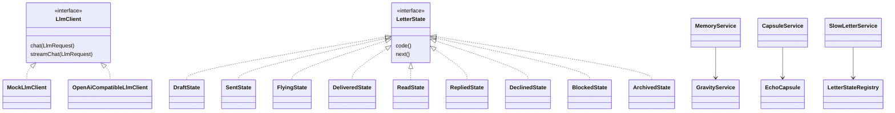
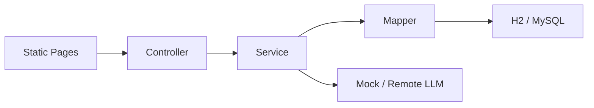

# 类图与架构图

## 后端类图

```mermaid
classDiagram
  class LlmClient {
    <<interface>>
    chat(LlmRequest)
    streamChat(LlmRequest)
  }
  LlmClient <|.. MockLlmClient
  LlmClient <|.. OpenAiCompatibleLlmClient

  class LetterState {
    <<interface>>
    code()
    next()
  }
  LetterState <|.. DraftState
  LetterState <|.. SentState
  LetterState <|.. FlyingState
  LetterState <|.. DeliveredState
  LetterState <|.. ReadState
  LetterState <|.. RepliedState
  LetterState <|.. DeclinedState
  LetterState <|.. BlockedState
  LetterState <|.. ArchivedState

  class MemoryService
  class GravityService
  class CapsuleService
  class SlowLetterService
  MemoryService --> GravityService
  CapsuleService --> EchoCapsule
  SlowLetterService --> LetterStateRegistry
```

## MVC 架构图

```mermaid
flowchart LR
  HTML["Static Pages"] --> Controller
  Controller --> Service
  Service --> Mapper
  Mapper --> DB["H2 / MySQL"]
  Service --> AI["Mock / Remote LLM"]
```
