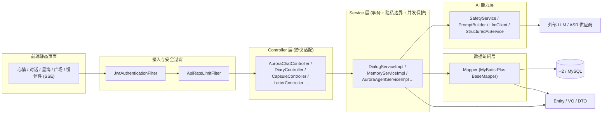
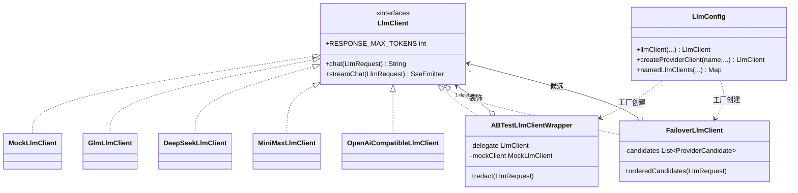
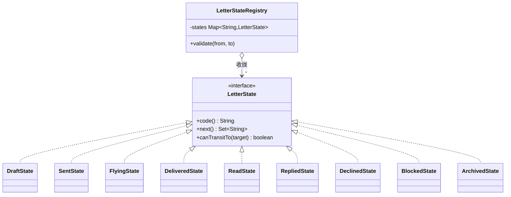
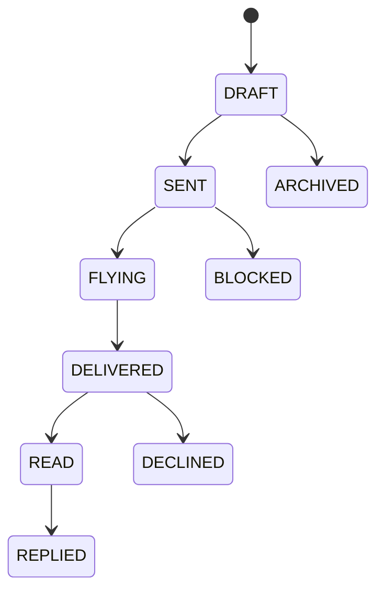
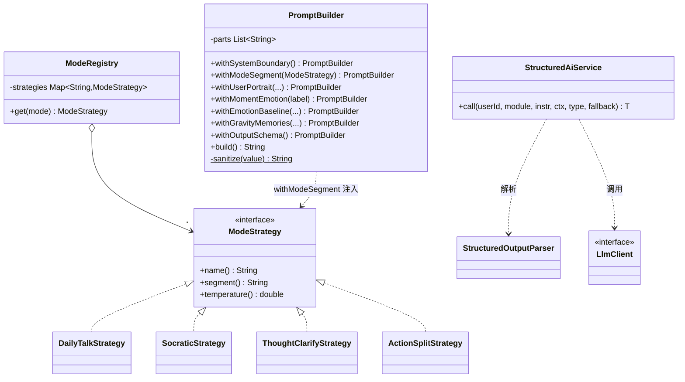
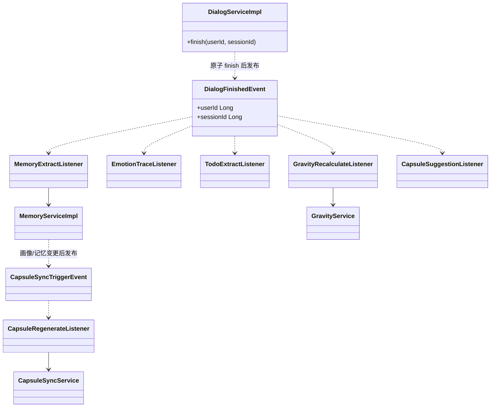

# Inner Cosmos 类图与架构图

> 配套《软件设计文档.md》阅读。下列类图中的每个类与关系均来自 `src/main/java/com/innercosmos/`，可逐一核对。

---

## 一、MVC 分层架构图

**说明**：请求自上而下穿过五层。`JwtAuthenticationFilter` 先完成鉴权并把 `userId` 注入上下文，`ApiRateLimitFilter` 做限流；Controller 仅做参数与协议适配，不含业务规则；Service 是唯一承载 `@Transactional` 事务、P0–P3 隐私边界与并发幂等保护的层；需要大模型能力时 Service 转向 AI 能力层（安全闸门 + 提示词 + LlmClient + 结构化解析），需要落库时走 Mapper（MyBatis-Plus 单表 CRUD）。Entity/VO/DTO 是层间的数据载体。这种分层使「协议、业务、数据、AI」四种关注点彼此隔离、可独立演进与测试。

---

## 二、LLM 适配子系统类图（适配器 + 装饰器 + 容错 + 工厂）

**说明**：`LlmClient`（`ai/client/LlmClient.java`）是系统对大模型的唯一抽象。各供应商客户端（`GlmLlmClient`、`DeepSeekLlmClient`、`MiniMaxLlmClient`、`OpenAiCompatibleLlmClient`）是把异构 HTTP 协议适配为该接口的**适配器**；`MockLlmClient` 是离线实现，使全链路在无网络/无 key 时也能跑通。`ABTestLlmClientWrapper` 同样实现 `LlmClient` 并持有一个被包裹的 `delegate`，是**装饰器**——它在转发前做 PII 脱敏（`redact`）与 A/B `forceMock` 分流。`FailoverLlmClient` 持有一组 `ProviderCandidate`，按 `preferredProvider` 排序后逐个尝试、失败自动切换，提供**容错**。`LlmConfig` 作为**工厂**，依据配置在运行期组装出「真实客户端 → 被 ABTest 装饰 → (生产环境)再被 Failover 编排」的这条链，并产出 `namedLlmClients` 供模型路由按名取用。上层业务只认 `LlmClient`，对装饰/容错/供应商差异完全无感。

---

## 三、慢信件状态机类图（状态 + 注册表）

**说明**：`LetterState`（`letterstate/LetterState.java`）把「当前状态允许转移到哪些后继状态」封装为 `next()`，并以默认方法 `canTransitTo()` 复用判断逻辑。9 个具体状态类各自只声明自己的 `code()` 与合法后继集合（例如 `DraftState.next()={SENT, ARCHIVED}`），从而把整张状态转移图分散内聚到各状态对象里，彻底消除 Service 里的大 `switch`。`LetterStateRegistry`（`letterstate/LetterStateRegistry.java`）借助 Spring 把所有 `LetterState` Bean 自动收集为 `List` 注入，按 `code()` 建索引，对外只暴露一个 `validate(from, to)` 作为状态转移的统一校验入口——任一非法流转都会抛 `LetterStateException`。这正是「状态模式提供行为、注册表提供统一入口」的组合，新增状态只需加一个实现类即自动生效。

**说明**：上图为慢信件的典型生命周期（具体后继以各状态类 `next()` 为准）。信件先是草稿，发送后进入飞行（`FLYING`，前端展示「在路上」的在途状态），投递、被读、被回复或被拒/被屏蔽，最终可归档。该状态机是 P3 隐私边界的执行者：寄给他人的信只能沿合法路径流转，杜绝越级访问。

---

## 四、AI 提示词与对话管线类图（建造者 + 策略 + 模板方法）

**说明**：`PromptBuilder`（`ai/prompt/PromptBuilder.java`）是**建造者**，用一连串返回 `this` 的 `withX()` 步骤按需拼装系统提示词，并作为唯一入口对所有用户派生文本执行 `sanitize()` 防注入与限长。`ModeStrategy`（`ai/mode/ModeStrategy.java`）是**策略**接口，`DailyTalkStrategy`/`SocraticStrategy` 等各封装一种对话模式的提示片段与温度；`ModeRegistry` 按 `name()` 收拢全部策略供查找，`PromptBuilder.withModeSegment()` 把选中的策略片段注入提示词。`StructuredAiService.call()`（`ai/structured/StructuredAiService.java`）是**模板方法**，固化「A/B 分组 → 组装提示词 → `LlmClient.chat()` → 空输出兜底 → `StructuredOutputParser` 解析 → 失败回退」的骨架，仅把目标类型与回退逻辑作为参数留给调用方填充。三个模式协同构成了 Aurora 灵活又安全的提示词管线。

---

## 五、记忆 / 重力 / 共鸣体服务类图（事件驱动沉淀）

**说明**：这是「对话 → 记忆沉淀 → 共鸣体」闭环的事件驱动骨架（**观察者模式**）。`DialogServiceImpl.finish()` 用条件 `UPDATE … WHERE status<>'FINISHED'` 原子结束会话，只有竞态赢家才发布 `DialogFinishedEvent`，避免重复沉淀。该事件被 5 个互相独立、均标注 `@Async + @TransactionalEventListener(AFTER_COMMIT)` 的监听器订阅，分别在后台抽取记忆、沉淀情绪、抽待办、重算重力、生成共鸣体建议——发布方完全不知道订阅者是谁，新增沉淀只需再加一个监听器。第二条同型链路 `CapsuleSyncTriggerEvent → CapsuleRegenerateListener → CapsuleSyncService` 刻意用事件总线打破「画像服务 ↔ 共鸣体服务」的循环依赖，并用 PENDING 行去重保证同步队列在多源触发下仍然安全。整套设计让用户的回复主链路与所有后处理彻底解耦、互不阻塞。
