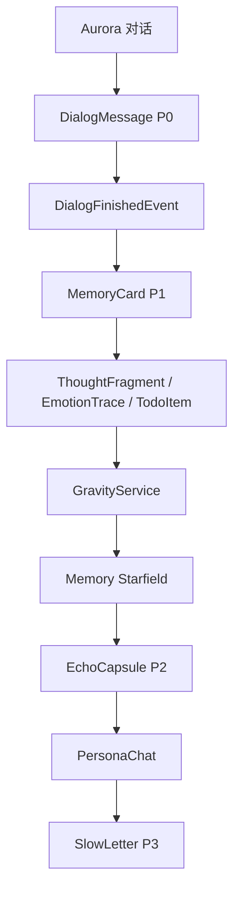

# Inner Cosmos 软件设计文档

## 架构

系统采用 Spring Boot MVC 分层：

- Controller：HTTP API。
- Service：业务流程和隐私边界。
- Mapper：MyBatis-Plus 数据访问。
- Entity：数据库映射。
- AI Client：LLM / ASR 适配。
- Event：对话结束后的观察者流程。
- LetterState：慢信件状态模式。

## 核心链路

## 设计模式

- Adapter：`LlmClient`、`AsrClient`。
- Observer：`DialogFinishedEvent` 与多个 Listener。
- State：`LetterState` 和各种信件状态类。
- Builder：`PromptBuilder`。
- Strategy：`AgentReplyStrategy`。

## 安全设计

P0 原始对话只用于用户本人和 Aurora，不进入星海广场。P2 共鸣体只能读取授权后的抽象信息。高风险内容由 `SafetyBoundaryFilter` 和 `SafetyService` 处理。
