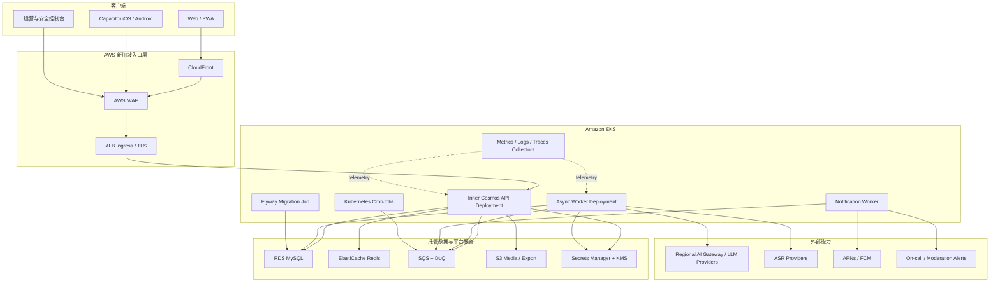

# Inner Cosmos 项目理解与云原生产品化总纲

> 文档性质：后续架构迁移、产品改进、移动端建设、国际化与新加坡发行的上位对齐文件
> 形成时间：2026-07-14
> 事实基线：当前分支 `feat/run006-aurora-self-understanding`，提交 `66f2b5d`
> 验证状态：本轮已执行全量 `mvn test`，613 tests / 0 failures / 0 errors / 0 skipped
> 输入材料：现有愿景文档、工程总纲、UI/UX 设计、真实代码，以及 `01`—`07` 对齐文档。

---

## 0. 执行摘要

我对 Inner Cosmos 的核心认识是：

> **它不是一个“有聊天界面的 AI 应用”，而是一套把自然表达转化为长期自我理解资产，并在用户明确授权后，把自我理解延伸为低压力真实连接的系统。**

它真正独特的闭环不是某一个页面或某一个模型，而是：

```text
表达
  → 被 Aurora 承接、澄清
  → 沉淀为记忆、情绪、关系、信念和行动
  → 经过时间形成可回看的个人世界模型
  → 用户选择性地生成脱敏共鸣体
  → 通过有限对话和慢信走向真实的人
```

现有 V0.1.0 已经证明了这条闭环在工程上可以成立，而且完成度明显超过普通课程原型：领域模型完整，P0-P3 隐私分层有真实落点，Mock LLM 能支撑离线演示，多模型适配、安全管道、容器化和可观测基础也已经存在。

但它目前仍然是一个**面向单机演示和单副本运行的产品原型**，还不是可直接多副本部署、可持续运营、可面向真实用户承担责任的商业系统。当前差距不是“少几份 Kubernetes YAML”，而是以下五次转型同时发生：

1. **从单机 Java Web 到云原生运行系统**：状态外置、任务解耦、弹性伸缩、故障恢复、可观测、安全供应链和自动化交付。
2. **从 Web 演示到多端产品**：版本化 API、统一身份、推送、离线、设备权限、移动端安全体验。
3. **从功能集合到可验证产品**：围绕核心用户问题取舍功能，用真实指标验证“更清楚、更自由、更安全、更愿意走向现实连接”。
4. **从个人项目到协作工程**：明确仓库边界、契约、ADR、CI/CD、评审规则、环境和发布责任。
5. **从中文课程原型到新加坡可运营产品**：语言、时区、文化、安全资源、数据流、跨境 LLM、商店、支付、税务和运营体系一起国际化。

因此，后续工作的总原则应是：

> **产品发现与工程改造并行；先消除生产红线，再建立共享平台能力；先做模块化单体和运行角色拆分，再依据真实负载决定是否拆微服务；每一阶段都必须有用户体验成果、工程证据和安全证据。**

---

## 1. 我理解的产品本质

### 1.1 它解决的不是“没有 AI”，而是“内在经验无法被连续理解”

用户已经可以使用通用大模型聊天，也可以使用日记、待办、冥想、社交和心理内容产品。Inner Cosmos 存在的理由不能是“模型回答得更温柔”，因为模型能力会迅速同质化。

它要解决的是通用工具之间留下的结构性空白：

- 用户的表达往往混乱、片段化、难以主动整理。
- 一次聊天可以安慰当下，却很少形成可纠正、可回看、可积累的长期资产。
- 日记能保存内容，却不会温柔地追问，也不能主动发现重复主题。
- 普通社交强调即时、曝光和互动强度，不适合脆弱、谨慎、需要边界的连接。
- 心理健康服务有专业价值，但不应该被一个普通 AI 产品冒充；大量日常自我整理需求又确实存在。

Inner Cosmos 的机会是成为“专业医疗之外、普通聊天之上”的日常自我理解基础设施，但必须始终保持非诊断、非治疗、现实导向的边界。

### 1.2 三层核心用户价值

#### 第一层：当下变得更清楚

Aurora 不是急于建议，而是先帮助用户把“发生了什么、我感受到什么、我真正担心什么、下一步是否需要行动”说清楚。用户完成一次对话后，应感到负担被整理，而不是被更多功能淹没。

#### 第二层：长期看见自己的模式

MemoryCard、ThoughtFragment、EmotionTrace、TodoItem、关系线索、信念和情感重力不是后台数据装饰，而是把零散表达变成长期个人世界模型。记忆星空的价值不是视觉奇观，而是让用户发现：什么持续牵引自己、什么正在变化、哪些旧叙事可以被重新理解。

#### 第三层：从 AI 回到现实连接

共鸣体是授权、抽象、脱敏后的“数字回声”，不是用户本人，也不是可无限代理用户的数字替身。慢信是从共鸣到真人之间的缓冲层。产品成功不是用户无限依赖 Aurora，而是用户更有能力理解自己，并在合适的时候走向现实中的人。

### 1.3 真正的产品护城河

Inner Cosmos 的护城河不应被描述成“接入了 GLM、MiniMax、DeepSeek”或“有一个星空 UI”。更可信的长期壁垒是：

1. **用户可控制、可纠正、可遗忘的长期个人世界模型**。
2. **表达 → 结构化资产 → 复盘 → 行动的闭环质量**。
3. **P0-P3 数据边界与授权机制形成的可信度**。
4. **共鸣体 + 有限交流 + 慢信组成的低压力连接机制**。
5. **不利用脆弱性制造依赖的产品节律和安全治理**。
6. **对多语言、多文化语境和本地支持资源的适配能力**。

模型是可替换的能力供应商，用户信任、长期记忆质量、边界和连接机制才是产品资产。

---

## 2. 对现有项目的事实判断

### 2.1 已经具备的高价值资产

| 资产 | 当前价值 | 后续应如何保留 |
|---|---|---|
| 完整业务闭环 | Aurora、记忆、星空、共鸣体、慢信已经贯通 | 任何重构都用端到端旅程做回归门禁 |
| P0-P3 隐私分层 | 原始对话、结构化记忆、授权共鸣体、社交数据已有明确边界 | 升级为数据分类、访问策略、保留期和审计规则 |
| 模块化领域雏形 | controller/service/mapper、AI 子系统、事件、状态机较完整 | 先做模块化单体治理，不急于拆微服务 |
| Mock LLM | 无 Key 可运行、可重复演示、可支持多数测试 | 保留为本地开发、CI、故障演练和契约测试后端 |
| 多模型适配与 failover | 已具备 Provider 抽象和降级思路 | 收敛统一 AI Gateway，补可观测、预算、区域和安全策略 |
| 危机安全基础 | 模型调用前同步门控、固定安全流程、资源页和事件审计 | 统一所有内容通道，国际化资源，增加运营告警和人工流程 |
| 视觉与情感设计 | 设计 token、暗色、动效、星空、时间/天气/音乐体系鲜明 | 从“氛围资产”升级为跨 Web/App 的设计系统和无障碍规范 |
| 容器与指标基础 | 非 root Docker、Actuator、Prometheus、Compose 已存在 | 演进到标准镜像供应链、K8s probes、OTel、SLO 和 GitOps |
| 大量自动化测试 | 已形成较强回归意识 | 从数量导向转为风险导向，补权限、迁移、Provider、MySQL 和契约测试 |

### 2.2 当前不是生产系统的关键原因

以下不是“以后优化”的普通技术债，而是进入真实用户环境前的门禁：

#### 安全与隐私红线

- 已发现的两处 IDOR 必须修复，并建立系统化 ownership/authorization 测试，而不是只补两个点。
- 当前配置中存在真实 LLM 密钥默认值；必须立即吊销轮换，并从 Git 历史、配置、镜像和日志路径中彻底移除。
- 基于 Session Cookie 却全局禁用 CSRF，不应直接作为公网生产认证方案。
- 生产 JDBC 默认关闭 TLS，监控端点和日志路径也需要重新划定暴露边界。
- 心理、关系、信念和原始对话属于高度敏感数据；目前缺少完整的数据保留、删除验证、字段级加密策略、访问审计和数据流台账。

#### 多副本阻断

- HttpSession、SSE emitter、流式握手上下文、回合计数、限流桶、Token 用量、A/B 分组等状态仍在单个 JVM 内。
- 五个 `@Scheduled` 会在每个 Pod 重复运行，夜间能量衰减等操作甚至不是天然幂等。
- 部分事务在等待 LLM 网络调用期间长期占用数据库连接。
- `@Async` 只是进程内队列；Pod 重启会丢任务，也无法可靠重试和追踪。

#### 数据与演进阻断

- MySQL 生产环境没有正式的版本化迁移工具，依赖人工 schema 和多个启动初始化器。
- 多个长期增长列表无分页，移动端和真实历史数据会使首屏和内存压力持续恶化。
- 统一响应仍有三种形状，API 无版本前缀，弱类型 `Map` 请求体较多。
- 失败后写入“看起来像真实结果”的默认摘要，会污染下游分析和用户信任。

#### 产品运营阻断

- 主动消息依赖前台 SSE；用户离线或 App 被杀后会丢失，却可能被记录为已发送。
- 当前安全资源、危机词、时区、语言和文化假设主要面向中文/中国大陆。
- 管理后台有数据展示，但还不是具备分级权限、案件工作流、审计和运营 SLA 的控制台。

### 2.3 对当前成熟度的结论

可以把当前状态概括为：

| 层面 | 当前成熟度 |
|---|---|
| 产品概念 | 已清晰，差异化有潜力 |
| 核心闭环 | 已贯通，可演示 |
| 领域工程 | 中高，有真实结构和大量功能 |
| 单机可靠性 | 中等，Mock/demo 体验较完整 |
| 多副本云原生 | 低，状态和任务模型阻断明显 |
| 移动端基础 | UI 可复用性高，后端能力缺口大 |
| 生产安全与合规 | 低，仍有明确红线 |
| 商业运营 | 早期，尚缺验证和运营体系 |

它已经越过“想法是否能做出来”的阶段，接下来要证明的是：**这套系统能否被可信地运行、被真实用户持续使用，并在不伤害用户的前提下形成独特价值。**

---

## 3. 对这次新项目转型的理解

### 3.1 NUS Cloud Computing 项目不应只是基础设施展示

课程可以要求 Kubernetes、弹性、可观测和高可用，但一个优秀项目需要让云能力与业务特性产生因果关系：

- 为什么需要扩容？因为 LLM 等待、SSE 长连接、异步记忆抽取和推送具有不同负载形态。
- 为什么需要消息队列？因为记忆沉淀、通知和 Provider 调用不能随着 Web Pod 重启而丢失。
- 为什么需要 Redis？因为会话/令牌、分布式限流、短期状态和跨 Pod 实时通道需要共享状态。
- 为什么需要对象存储和 CDN？因为媒体不应跟随每次应用发布进入镜像。
- 为什么需要 tracing？因为一次用户回复可能跨越数据库、模型路由、重试、failover、安全检查和异步沉淀。
- 为什么需要 GitOps 和渐进发布？因为心理安全策略和模型变化都需要可追溯、可回滚和小流量验证。

云原生部分的展示重点应该是“真实问题如何被云架构解决”，而不是服务图标的数量。

### 3.2 “Collaborative” 必须体现为工程运行方式

新项目不能继续依赖一个人理解全部隐含上下文。协作能力应体现在：

- 一份清晰的产品北极星、范围和非目标。
- API、事件、数据和安全边界都有明确契约。
- 架构决策通过 ADR 记录原因、替代方案和后果。
- 每个功能有 owner、验收标准、测试和可观测指标。
- PR 小步、可评审、可回滚，主分支持续可部署。
- 开发、预发布、生产环境差异由代码化配置管理，而非口头知识。
- 产品、后端、移动端、云平台、安全/合规可以并行工作，却通过契约和里程碑对齐。

### 3.3 商用能力不等于一次性“达到生产级”

商用能力应被拆成逐层可验证的成熟度：

1. **Production-safe**：没有已知高危漏洞、秘密不进入代码、数据可恢复、变更可回滚。
2. **Pilot-ready**：可以承载受控的真实用户试点，有告警、支持流程、隐私同意和故障处置。
3. **Launch-ready**：商店、法规、支付、客服、内容治理、SLO、成本和容量均有证据。
4. **Scale-ready**：在真实指标证明需要时扩容和拆分，不以架构复杂度冒充业务增长。

---

## 4. 目标产品定位与市场假设

### 4.1 建议的定位

建议把 Inner Cosmos 定位为：

> **面向希望更好理解自己、但不喜欢传统日记压力和高噪声社交的人群的 AI 自我整理与慢共鸣空间。**

对外表达应避免“心理治疗”“治愈焦虑/抑郁”“诊断”等医疗化承诺。更准确的关键词是：

- reflection / self-understanding；
- guided journaling / voice reflection；
- personal memory map；
- consent-based resonance；
- slow, safe connection。

### 4.2 建议的首批用户假设

在新加坡/NUS 场景中，可以优先验证一个窄人群，而不是一开始声称服务所有人：

> **处于高压力、跨文化或人生转变阶段，愿意表达但缺少连续整理空间的 18 岁以上大学生和年轻专业人士。**

这个假设的好处是场景清楚：学业与职业压力、异地生活、语言切换、关系变化、夜间独处和低压力表达。但它仍然只是需要访谈和试点验证的产品假设，不能因为创始人身处 NUS 就直接当作市场事实。

### 4.3 竞品分析不应只列功能表

后续竞品研究建议覆盖四类替代品：

| 类别 | 用户为什么选择它 | Inner Cosmos 必须回答的问题 |
|---|---|---|
| 通用 AI 助手 | 模型强、入口成熟、成本低 | 为什么用户愿意把长期内在记录放在这里？ |
| AI 陪伴产品 | 情感反馈强、关系感强 | 如何提供温度却不制造依赖或人格欺骗？ |
| 日记/情绪/冥想产品 | 结构清晰、隐私预期明确 | 如何证明 AI 追问和长期记忆带来额外价值？ |
| 匿名/兴趣/慢社交产品 | 可以认识真实的人 | 如何让共鸣匹配比标签和即时聊天更安全、更真诚？ |

核心比较轴应包括：长期记忆可控性、结构化沉淀质量、用户纠正权、隐私边界、危机安全、真人连接机制、互动压力、国际化、价格和数据可携带性。

### 4.4 需要尽快验证的产品命题

1. 用户是否真的感觉 Aurora 的追问比空白日记更容易开始？
2. 对话后生成的记录卡，用户有多大比例愿意确认、修改或保存？
3. 一周后回看主题/星空，是否帮助用户产生新的理解，而不只是“好看”？
4. 用户是否理解并信任共鸣体的授权边界？
5. 共鸣体对话是否真的提高了慢信质量，还是增加了一层复杂度？
6. 低频主动提醒是在帮助用户，还是造成情绪压力和通知疲劳？
7. 中英文及新加坡多文化表达下，模型的共情、安全和语义抽取是否同样可靠？

---

## 5. 目标技术架构

### 5.1 总体原则：模块化单体优先，运行角色分离

当前最合适的演进不是立刻拆十几个微服务。业务仍在快速探索，团队规模和真实负载尚未证明微服务收益。建议：

- 保留一个主要 Spring Boot 代码库和统一领域模型。
- 通过模块边界禁止 controller 直连 mapper，逐步把领域能力收口。
- 将同一代码库构建为不同运行角色：API、Worker、CronJob/Migration。
- 先在部署和运行层解耦负载，再根据队列、团队边界和数据所有权决定是否拆服务。

这既能展示 Kubernetes 的工作负载编排，也能控制分布式系统复杂度。

### 5.2 目标逻辑架构



### 5.3 各运行角色的责任

#### API Deployment

- 提供 `/api/v1` REST API、前台 SSE 和管理 API。
- 只执行短事务和快速校验，不在事务内等待 LLM。
- 接收命令后写业务数据和 outbox，再把耗时任务交给队列。
- 保持无状态；Pod 可随时终止、替换和水平扩容。

#### Async Worker Deployment

- 执行记忆抽取、摘要、画像更新、共鸣体生成、模型重试等耗时任务。
- 每个任务有幂等键、重试策略、超时、状态、trace 和死信队列。
- 以队列深度、最老消息年龄和 Provider 配额作为扩缩容依据，而不是只看 CPU。

#### Notification Worker

- 统一在线事件、App Push、站内通知和安全运营告警。
- 使用投递状态机区分 queued、sent、provider_accepted、delivered/unknown、failed，而不是把“调用了 push()”等同于送达。
- 尊重用户时区、静默时段、频率预算、通知类型授权和本地法规。

#### CronJob / Scheduled Work

- 非幂等或全量批处理任务迁移为 Kubernetes CronJob。
- 高频扫描任务优先改为事件/队列驱动；确需常驻调度时使用分布式锁。
- 每次执行记录业务日期和 run id，保证同一周期只结算一次。

#### Migration Job

- 采用 Flyway 或 Liquibase，版本化、可审计、先迁移后发布。
- 应用 Pod 不再通过多个 `ApplicationRunner` 临时修表。
- CI 在 MySQL 容器上验证从空库和上一生产版本升级两条路径。

### 5.4 状态和消息的边界

| 数据类型 | 推荐归属 | 原因 |
|---|---|---|
| 用户、对话、记忆、授权、信件、审计 | RDS MySQL | 强一致业务事实与事务边界 |
| 短期会话、刷新令牌状态、限流、短期流上下文 | Redis | 低延迟、TTL、跨 Pod 共享 |
| 记忆抽取、通知、模型任务 | SQS + DLQ | 持久、可重试、可观测、Pod 重启不丢 |
| 跨 Pod 在线事件 | Redis Pub/Sub/Streams | 实时 fan-out；不能替代持久任务队列 |
| 音频、导出包、静态媒体 | S3 + CloudFront | 从镜像和数据库剥离大对象 |
| 密钥和证书 | Secrets Manager + KMS | 轮换、权限和审计 |

### 5.5 身份与 API

云原生与移动端应共享同一身份改造，不要分别做两套：

- 目标语义采用 OAuth 2.1 / OpenID Connect 和短期 access token。
- Web 端优先使用 `HttpOnly + Secure + SameSite` Cookie/BFF 方式，避免 token 暴露给页面脚本。
- App 的 refresh token 存 Keychain/Keystore，并采用轮换和撤销机制。
- 身份提供方可选择 AWS Cognito 等托管 IdP，或课程阶段自建签发；必须用 ADR 记录选择，不因 pom 中已有 jjwt 就默认自研完整认证系统。
- `currentUserId` 统一从 Spring Security principal 获取，所有资源访问由 service/domain authorization 规则控制。
- API 使用 `/api/v1`、统一错误模型、DTO、OpenAPI 和自动生成客户端。
- 所有创建类命令支持 `Idempotency-Key`，列表采用 cursor pagination。

### 5.6 AI Gateway

多 Provider 适配应升级为一个可治理的 AI Gateway 能力：

- Provider、模型、区域和用途路由；
- timeout、retry、circuit breaker、bulkhead 和预算；
- prompt 版本、输出 schema 和解析失败可见；
- 输入最小化、PII 脱敏、数据出境策略；
- 每次调用记录 provider、region、model、latency、tokens、cost、fallback reason、safety result 和 traceId；
- 生产故障不得静默伪装成真实模型结果；降级产物必须带来源和置信状态；
- 用脱敏、分语言的 golden set 做回归评估，不能只用单元测试判断“模型变好了”。

新加坡部署与中国 LLM 之间的合法性、端点可用性和真实延迟由 `04` 给出证据后，再冻结路由策略。架构必须允许按数据类别和地区切换 Provider，而不是把单一中国端点写死在业务服务中。

---

## 6. Kubernetes 与 AWS 落地蓝图

### 6.1 环境策略

建议分两级成熟度实施：

| 阶段 | 账户/集群策略 | 目的 |
|---|---|---|
| 课程与早期开发 | 一个 AWS sandbox 账户、一个 EKS 集群、`dev/staging` namespace | 控制成本，展示完整云能力 |
| 真实试点/商用 | dev/staging 与 prod 分账户；prod 独立集群和数据平面 | 隔离权限、费用、故障和合规风险 |

生产与非生产不得共享 RDS、Secrets 或用户数据。测试数据必须合成或脱敏。

### 6.2 建议的仓库落点

不需要立即搬动所有 Java 文件，但应逐步形成：

```text
/
├── src/                         # 现有 Spring Boot，逐步模块化
├── mobile/                      # Capacitor 工程与原生壳
├── deploy/
│   └── kustomize/
│       ├── base/
│       └── overlays/{dev,staging,prod}/
├── infra/
│   └── terraform/               # VPC/EKS/RDS/Redis/SQS/S3/IAM/监控
├── docs/
│   ├── adr/
│   ├── api/
│   ├── product/
│   ├── runbooks/
│   └── threat-model/
├── .github/
│   ├── workflows/
│   ├── ISSUE_TEMPLATE/
│   ├── pull_request_template.md
│   └── CODEOWNERS
└── 对齐文档/                    # 阶段性研究与上位对齐
```

### 6.3 Kubernetes 基线资源

- API、Worker、Notification 各自 Deployment/ServiceAccount/ConfigMap。
- Migration Job 和 Nightly CronJob。
- ALB Ingress、TLS、WAF、正确的 SSE idle timeout。
- startup/readiness/liveness 三类探针，liveness 不依赖数据库。
- requests/limits、PodDisruptionBudget、topologySpreadConstraints。
- `runAsNonRoot`、`readOnlyRootFilesystem`、drop capabilities、seccomp RuntimeDefault。
- NetworkPolicy 限制东西向和出站访问。
- EKS Pod Identity/IRSA 提供最小 AWS 权限。
- External Secrets Operator 或 CSI 将 Secrets Manager 注入工作负载。
- HPA/KEDA：API 看请求延迟/并发，Worker 看队列，Notification 看待发量。
- 结构化 stdout 日志、Prometheus 指标、OpenTelemetry traces。

### 6.4 CI/CD 和供应链

每次 PR 至少执行：

1. 编译、单元测试、契约测试、关键集成旅程；
2. MySQL/Testcontainers 迁移测试；
3. SAST、依赖漏洞、secret scan、IaC/K8s policy scan；
4. 构建一次镜像，以 git SHA 标记并生成 SBOM；
5. Trivy/ECR 扫描和签名；
6. 部署临时或 staging 环境，运行 smoke/E2E；
7. 通过 GitOps/受保护环境晋级，禁止在服务器上手改；
8. 小流量发布，观察 SLO、LLM 降级和安全指标后再全量。

### 6.5 可观测性与 SLO

必须围绕用户旅程设计，而不只是 JVM CPU 图：

| 旅程/能力 | 关键指标 |
|---|---|
| Aurora 对话 | 首次响应时间、完整回复时间、超时率、fallback 率、每会话成本 |
| 记忆沉淀 | 队列等待、处理时长、成功率、解析失败、重复/幂等冲突 |
| 主动通知 | 入队、发送、Provider 接受、打开、退订、安静时段违规 |
| 慢信 | 状态转换成功率、投递延迟、举报率、过滤率 |
| 数据层 | 连接池、慢 SQL、锁等待、迁移状态、备份恢复演练 |
| 安全 | HIGH 事件、告警送达时间、人工处置时间、误报/漏报复盘 |

首个 Pilot SLO 可以从务实目标开始，例如 API 月可用性 99.5%、非 LLM API p95 < 500ms、异步任务 99% 在约定窗口内完成。LLM 端到端延迟应单独建 SLI，不能用基础 API 的指标掩盖。

---

## 7. 移动端产品路线

### 7.1 技术路线

当前前端是响应式 HTML/CSS/JS，视觉系统、SVG/DOM 星空、触控和暗色模式均可复用。建议：

1. 先把现有 Web 整理为可安装 PWA，验证移动信息架构和核心旅程。
2. 采用 Capacitor 建立 iOS/Android 壳，保留绝大多数 UI 资产。
3. 只对真正需要的能力使用原生插件：推送、麦克风、后台音频、生物识别、安全存储、深链和网络状态。
4. 只有真实用户反馈证明 WebView 性能或原生交互成为瓶颈时，才评估局部或整体 RN/Flutter 重写。

### 7.2 移动端不是 38 个页面缩小

建议重组为 4 个主入口：

- **此刻**：Aurora 对话、语音、快速倾诉、睡前复盘。
- **我的宇宙**：今日记录、记忆星空、主题、情绪和关系。
- **共鸣**：共鸣体、星海广场、慢信和收件箱。
- **我**：隐私、记忆权限、数据导出/删除、通知、安全和账号。

核心旅程要短：打开 App 到开始表达不超过少量操作；对话结束时先让用户确认/修正沉淀内容；记忆调用要透明；共鸣体发布前必须清晰预览“别人能看到什么”。

### 7.3 后端共享能力

移动端开始前必须完成：

- 统一身份与 `/api/v1`；
- OpenAPI 和稳定错误模型；
- cursor pagination、增量同步和幂等键；
- `device_registration`、push outbox 和通知偏好；
- 前台 SSE + 后台 Push + missed-event pull 的统一投递语义；
- App 最低支持版本和强制安全升级机制。

### 7.4 离线与端侧安全

- 本地缓存只保存用户明确需要的内容，采用加密数据库。
- 密钥存 Keychain/Keystore，支持生物识别锁和切后台自动锁。
- 离线写入进入本地 outbox，联网后以幂等键提交。
- 端上安全词预检只能用于即时保护，服务端仍是权威安全门。
- 热线和本地支持资源必须远程配置、带版本和地区，不应硬编码在旧 App 中数月无法更新。
- 原始语音默认不长期保存；优先端侧转写或在明确同意后短暂上传。

---

## 8. 功能与体验的全面改进方向

### 8.1 Aurora：从“会回复”到“真正帮助表达”

- 建立意图与阶段：承接、澄清、整理、行动、结束，不让每轮都像自由聊天。
- 对“记得你”保持透明，展示引用了哪段记忆，并允许忽略、纠正或遗忘。
- 用户可在陪伴、苏格拉底、行动拆分、睡前复盘之间切换，但模式不能只是温度参数变化。
- 对话结束应形成可编辑的总结预览，而不是后台静默写入所有推断。
- 明确模型不确定性；事实、用户原话和 AI 推断在数据上分离。

### 8.2 记忆：从自动抽取到用户共同维护的世界模型

- 每条结构化记忆记录来源、模型版本、置信度、用户确认状态和修订历史。
- 用户可以合并、拆分、归档、遗忘和设置保留期。
- 主题和情绪趋势必须能解释“为什么得出这个结果”。
- 记忆星空优先支持洞察任务：发现重复主题、对比变化、回看转折，而不是只增加动画。
- 建立抽取质量评测集，分别测事实一致性、过度推断、情绪识别、行动可用性和多语言一致性。

### 8.3 共鸣体与慢社交：从创意亮点到可信连接机制

- 创建共鸣体时使用逐字段授权、脱敏预览和风险提示。
- 明确共鸣体是“部分、有限、可能过时的回声”，不能声称代表用户本人。
- 匹配先从可解释规则和明确兴趣/处境开始，不急于黑箱推荐。
- 有限轮次、慢信延迟、举报、拉黑、撤回授权、内容审核必须形成完整状态机。
- 商业指标不以消息数量为核心，而以有效回复、双方满意、低举报和现实连接质量为核心。

### 8.4 安全：从关键词过滤到完整 Safety Operations

- 所有入口统一经过规范化、规则、语义复核和固定响应策略，包括 Aurora、慢信、共鸣体、资料和管理操作。
- 安全资源按 locale/地区配置；新加坡内容等待 `04` 的权威来源。
- HIGH 事件应有实时告警、确认、升级、结案和复盘，不能只落库。
- 建立误报/漏报标注集和双语/混合语料测试。
- 明确运营人员可见范围，默认不暴露 P0 原文；紧急访问需要理由、最小权限和审计。
- 不承诺无法兑现的实时人工救援能力。若没有 24/7 团队，产品文案和流程必须诚实。

### 8.5 管理与运营

- RBAC 至少区分系统管理员、内容安全、客服支持、只读审计。
- 用户、模型、Prompt、通知、安全事件、举报和数据请求都有可追踪工作流。
- 所有高风险管理操作写不可抵赖审计日志。
- 功能开关、Prompt 版本和安全规则支持小流量发布、快速回滚。
- 运营仪表盘展示用户结果、系统健康、安全和成本，不以 DAU/时长替代产品价值。

---

## 9. 国际化与新加坡落地

### 9.1 国际化是数据与运营能力，不只是翻译页面

系统需要同时支持：

- `en-SG`、`zh-SG`/`zh-CN` 起步的 UI、通知、邮件、Prompt 和安全文案；
- 用户 locale、时区、12/24 小时制和日期格式；
- 英文、中文及 code-switching 对话的抽取与安全评测；
- 按地区配置热线、条款、隐私版本、年龄要求、支付和客服入口；
- 所有用户同意记录包含政策版本、语言、时间和用途；
- 跨境数据流按“什么数据、为什么、到哪里、由谁处理、保留多久”可审计。

### 9.2 `04-新加坡发行开发研究.md` 必须冻结的决策

新加坡研究完成后，需要将结论转化为 ADR、配置和交付门禁，至少回答：

1. 新加坡用户的原始对话、结构化记忆和日志分别允许存放在哪里？
2. 将内容传给中国大陆 LLM 的法律基础、告知/同意、合同和风险控制是什么？
3. 是否必须优先使用海外端点或海外模型；哪些数据禁止跨境？
4. AWS `ap-southeast-1` 的可用区、备份区和灾难恢复边界如何设计？
5. `.sg` 域名、组织主体、本地董事、税务、GST 和支付各自有什么前置条件？
6. App Store/Google Play 新加坡发行、年龄分级、隐私标签和账号删除有哪些要求？
7. 产品是否触及 HSA 医疗器械/健康宣称边界，哪些措辞和功能必须禁止？
8. 谁是数据控制方/处理方，如何响应访问、更正、导出、删除和投诉？

在这些问题有证据前，架构可以准备可配置能力，但不能宣称已经“合规”。

---

## 10. 协作开发与项目治理

### 10.1 团队工作流

- `main` 始终可部署，受保护，禁止直接 push。
- 功能分支短生命周期；PR 绑定 issue、风险、测试证据、截图和回滚方式。
- 使用 CODEOWNERS 划分 backend、mobile、infra、safety/product 文档责任。
- 重要改动至少一名非作者评审；安全、数据和迁移改动需要对应 owner。
- Conventional Commits + 自动生成变更日志和版本。
- 每个里程碑有 Definition of Done，不以“代码写完”作为完成。

### 10.2 架构决策记录

优先建立以下 ADR：

1. EKS 区域、账户和环境隔离；
2. 模块化单体而非立即微服务；
3. 身份系统：Cognito/托管 IdP 与自建 JWT 的选择；
4. Redis、SQS 和 outbox 的职责边界；
5. Flyway 数据迁移策略；
6. Kustomize 与 Helm 的选择；
7. Terraform 与 GitOps 工具链；
8. LLM 区域、Provider 和跨境数据路由；
9. Capacitor 移动端路线；
10. 安全事件运营责任和数据访问边界。

### 10.3 Definition of Done

一个功能只有同时满足以下条件才算完成：

- 用户旅程和验收标准已实现；
- 权限、隐私、滥用和失败路径已评审；
- 自动化测试覆盖主要成功/失败/越权场景；
- API/事件/迁移文档同步；
- 指标、日志、trace 和告警可观察；
- 在 staging 的真实部署验证通过；
- 有回滚方式和版本兼容说明；
- 英文/中文及移动端影响已评估。

---

## 11. 分阶段实施路线

这不是一条所有事情严格串行的瀑布路线。产品研究、云平台、后端和移动设计可以并行，但必须遵守共同门禁。

### Phase 0：事实基线与红线清除

**目标**：把当前原型变成可以安全继续演进的基线。

主要工作：

- 轮换并移除所有已进入配置/历史/镜像的真实密钥；
- 修复两处 IDOR，建立全控制器 ownership 测试矩阵；
- 修复生产 seed、CSRF/认证、数据库 TLS、监控暴露和安全旁路；
- 注册正确分页插件，修复夜间任务和静默伪造回退；
- 统一当前测试口径，保存可重复的基线报告；
- 完成数据流图、威胁模型和高风险数据清单。

**退出门禁**：无已知 Critical/High 漏洞；secret scan 通过；全量测试通过；关键用户旅程可重复演示。

### Phase 1：协作与平台契约

**目标**：让多人可以并行开发而不破坏系统。

主要工作：

- GitHub 分支保护、CODEOWNERS、PR/issue 模板、CI；
- `/api/v1`、统一响应、DTO、OpenAPI、分页和幂等；
- Flyway 与 MySQL Testcontainers；
- ADR、模块依赖规则和 controller→service→mapper 边界；
- 产品研究计划、核心旅程原型和指标字典。

**退出门禁**：API 契约可生成客户端；空库/升级迁移通过；PR 自动质量门可用。

### Phase 2：无状态化与可靠异步

**目标**：允许两个以上 API Pod 正确运行。

主要工作：

- 统一身份，移除对单机 HttpSession 的依赖；
- Redis 承担共享短期状态和分布式限流；
- outbox + SQS/DLQ + Worker 承担记忆、模型和通知任务；
- LLM 调用移出长事务，增加幂等、超时、重试、熔断和隔离舱；
- 定时任务去重或迁移 CronJob；
- SSE 跨 Pod 事件和断线补拉。

**退出门禁**：多 Pod 下登录、流式、限流、任务和结算均正确；随机删除 Pod 不丢业务任务。

### Phase 3：EKS 与 Day-2 能力

**目标**：形成可重复创建、可观测、可恢复的云环境。

主要工作：

- Terraform 建 VPC/EKS/RDS/Redis/SQS/S3/IAM/监控；
- Kustomize overlay、External Secrets、ALB/WAF/TLS；
- probes、PDB、扩缩容、拓扑分散、NetworkPolicy；
- OTel、dashboard、SLO、告警和 runbook；
- 备份、PITR、恢复演练、滚动更新和故障注入；
- 成本标签、预算告警和单次有意义会话成本。

**退出门禁**：从空账户/环境可自动部署；故障与回滚演示有证据；恢复目标经过演练而非只写在文档里。

### Phase 4：移动端 MVP

**目标**：交付真实可安装、能完成核心旅程的 App。

主要工作：

- PWA 信息架构重组和 Capacitor 双端壳；
- 登录、安全存储、推送、深链、麦克风、网络和生物识别；
- 离线草稿、增量同步、消息幂等；
- 安全港、一键拨号、地区资源和关键安全更新；
- TestFlight/内部测试分发与崩溃/性能监控。

**退出门禁**：真机完成“表达→记忆→回看→通知/慢信”旅程；后台/杀进程后通知不丢；数据删除和退出登录经过验证。

### Phase 5：产品质量与受控 Pilot

**目标**：验证独特价值，不再以功能数量证明产品。

主要工作：

- 访谈、可用性测试和小规模封闭试点；
- 改进记录卡确认、记忆解释、共鸣授权和慢信体验；
- 双语 AI golden set、安全红队和 Prompt/模型 A/B；
- 内容治理、客服、事件响应和人工复盘；
- 依据真实行为删减低价值页面和功能。

**退出门禁**：核心结果指标有正向证据；安全和隐私问题可闭环；没有用留存掩盖依赖或通知骚扰。

### Phase 6：新加坡发行与商用准备

**目标**：把 `04` 研究结论落实为可审计的发行条件。

主要工作：

- PDPA/跨境数据、条款、隐私、同意和供应商合同；
- 本地主体、域名、税务、支付和商店材料；
- HSA/健康宣称边界审查；
- en-SG/zh-SG 内容、安全资源和客服流程；
- 容量、SLO、支持时间、收费、退款和下线预案。

**退出门禁**：法规、技术、运营、商店和商业责任各有 owner 与证据；Go/No-Go 评审通过。

---

## 12. 优先级框架

### P0：不解决就不能接触真实用户

- 密钥轮换和 secret 管理；
- IDOR、统一授权、认证与 CSRF；
- 数据库 TLS、备份恢复、正式迁移；
- 所有内容通道的危机安全一致性；
- 数据删除、保留、访问和审计；
- 生产 seed/弱口令和监控暴露；
- 失败产物来源可见，不伪造成功。

### P1：不解决就不能正确多副本或移动化

- 版本化强类型 API、分页、幂等；
- 状态外置、分布式限流和 SSE 跨 Pod；
- durable queue、outbox、Worker、DLQ；
- 定时任务幂等和去重；
- 推送注册、投递状态、断线补拉；
- 事务与 LLM 解耦。

### P2：决定产品是否有真正价值

- 记录卡质量和用户修正；
- 可解释、可遗忘的长期记忆；
- 星空洞察而非单纯视觉；
- 共鸣体授权透明度；
- 慢信质量和社交治理；
- 双语/跨文化体验；
- 低侵入主动提醒。

### P3：依据证据再投入

- 微服务拆分；
- 向量数据库；
- 复杂推荐算法；
- 多区域 active-active；
- 可穿戴设备和健康数据；
- 全原生 UI 重写；
- 复杂自动 Agent 行为。

---

## 13. 成功指标

### 13.1 产品结果指标

建议北极星不是在线时长，而是一个组合结果：

> **用户完成一次表达后认为“更清楚”，并在未来能从被确认的记忆中获得持续价值。**

候选指标：

- 对话后清晰度自评；
- 记录卡确认/修改/拒绝率；
- 一周后有帮助的记忆回看率；
- 从表达生成且被完成的行动比例；
- 记忆纠正和遗忘请求处理成功率；
- 共鸣体授权完成率与中途退出原因；
- 慢信双方有效回复率、举报率和满意度；
- 主动通知关闭率、负面反馈和静默时段违规；
- 用户认为 AI 促进而非替代现实连接的定性反馈。

### 13.2 工程与运营指标

- 可用性、错误率、p95/p99 延迟；
- 队列滞留和 DLQ 数量；
- LLM 超时、429、fallback、解析失败和每会话成本；
- 发布频率、变更失败率、回滚时间、MTTR；
- 备份恢复成功率和实际 RPO/RTO；
- 安全告警送达/确认/结案时间；
- 每个环境、每个活跃用户、每次有意义会话的云与模型成本。

### 13.3 反指标

以下指标上升不一定是成功，必须作为风险同时观察：

- 单日超长对话和深夜连续使用；
- 用户只与 Aurora 互动而现实连接持续下降；
- 高强度通知带来的短期回访；
- 通过亲密暗示提高付费或留存；
- 自动生成内容数量而非用户确认质量；
- 模型降级到 Mock 后“成功率仍然很好看”。

---

## 14. 当前需要冻结的原则与待决策事项

### 14.1 建议现在就冻结的原则

1. Inner Cosmos 非医疗、非诊断、非治疗。
2. AI 是镜子和桥梁，不以制造依赖为增长手段。
3. P0 原文不得因 Prompt 或业务便利进入公开/社交层。
4. 用户拥有查看、纠正、授权、撤销、导出、遗忘和删除权。
5. 生产环境秘密不得出现在 Git、镜像和普通日志。
6. 先模块化单体和运行角色拆分，不以微服务数量评价课程质量。
7. Web 与 App 共用版本化 API、身份、安全和数据语义。
8. 所有耗时 AI 工作必须可追踪、可重试、幂等且来源可见。
9. 新加坡合规结论必须有 2026 权威来源和责任人，不凭经验猜测。
10. 每个架构成果都必须能被运行、测试、观测或故障演练证明。

### 14.2 等 `04` 或后续 ADR 决定的事项

- 新加坡区是否可以向中国 LLM 传输哪些类别的数据；
- 是否选择海外 LLM 端点/Provider 作为默认；
- Cognito、其他托管 IdP 或自建认证；
- RDS MySQL 8.4 与 Aurora 的最终选择；
- 单 NAT 与多 AZ NAT 的阶段性方案；
- Kustomize/Helm、Argo CD/Flux 的具体工具；
- 课程环境与真实 Pilot 的预算上限；
- App 首发平台、首发语言、首发人群与收费方式；
- 是否具备对 HIGH 安全事件提供人工响应的真实组织能力。

---

## 15. 最终判断

Inner Cosmos 最值得保留的不是现有 42 个 Controller、55 张表或几十个页面本身，而是它已经形成了一条少见且有伦理自觉的产品主线：

> **先帮助一个人把自己说清楚，再帮助他长期看见自己，最后在他愿意的时候，让这种理解成为走向真实他人的桥。**

接下来的高标准不应表现为同时堆更多云服务、更多 Agent、更多页面和更多模型，而应表现为四件事：

1. **产品更聚焦**：每项功能都服务于表达、理解、成长或真实连接。
2. **系统更可信**：隐私、安全、来源、失败和用户控制都清晰可验证。
3. **工程更可运行**：多副本、异步、迁移、发布、监控、恢复和成本都有真实证据。
4. **团队更可协作**：决策、契约、责任、评审和环境不再依赖个人记忆。

如果这四条能够同时成立，Inner Cosmos 就不只是一个为 NUS Cloud Computing 课程包装的 Kubernetes 项目，而会成为一个以云原生工程支撑独特用户价值、具备受控试点和长期商业化可能性的真实产品。

---

## 附录 A：本文与其他对齐文档的关系

| 文档 | 角色 |
|---|---|
| `00-项目理解与云原生产品化总纲.md` | 定义产品认识、总体目标、原则、目标架构和实施路线 |
| `01-项目全面评估.md` | 当前代码、数据、安全和运维事实基线 |
| `02-云原生EKS可行性分析.md` | Kubernetes/EKS 选项、阻断和 Day-2 深入分析 |
| `03-移动端App可行性分析.md` | 移动技术路线、后端适配、原生能力和分发分析 |
| `04-新加坡发行开发研究.md` | 2026 新加坡法规、基础设施、商店、商业和政府支持的事实来源 |
| `05-Agent全自主开发与交付周期设计.md` | 定义 Agent 组织、工作包、门禁、阶段和人类体验流程 |
| `06-目标技术架构与AI系统演进设计.md` | 定义技术栈、模块、数据、AI 认知架构和大规模重构路径 |
| `07-H0H1决策表与M1执行包.md` | 冻结当前决策，定义 M1 的范围、验收证据、执行顺序和首批 Work Packages |

`00` 是上位总纲，不替代 `01-07` 的证据细节；`01-07` 的新证据若改变关键假设，应通过 ADR 和对本总纲的版本更新反映。M1 执行范围与验收口径以 `07` 为准。

## 附录 B：建议的第一个联合里程碑

第一个里程碑不建议命名为“完成 Kubernetes 迁移”，而建议定义为：

> **M1：两副本、可中断、可追踪、可确认记忆的 Aurora 核心旅程运行在 Kubernetes staging。**

验收场景：

1. 用户通过新版身份登录 Web/PWA；
2. 与 Aurora 完成一次真实流式对话；
3. 对话期间随机终止一个 API Pod，客户端可凭 `Last-Event-ID` 重连，已提交消息不重复；
4. 结束对话后，记忆抽取任务进入持久队列并由 Worker 完成；
5. 用户只收到一张 Memory Receipt，可确认、修改、删除或选择“不记住”；用户修改成为最高事实权威；
6. 全链路可通过 traceId 查看，模型、耗时、降级和成本可见；
7. 数据库、队列、Pod 和 Provider 故障各有告警与 runbook；
8. 同一镜像和声明式配置可重建本地 Kind 与 EKS staging；
9. 中英文基础旅程、安全门和越权测试通过；
10. 本次发布可一键回滚且不破坏数据库兼容性。

这个里程碑同时证明了产品闭环、协作契约、Kubernetes 多副本、可靠异步、可观测和安全基线，是课程展示与后续移动端工作的共同地基。
