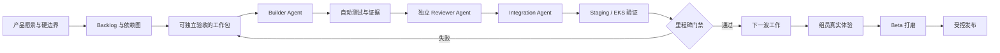
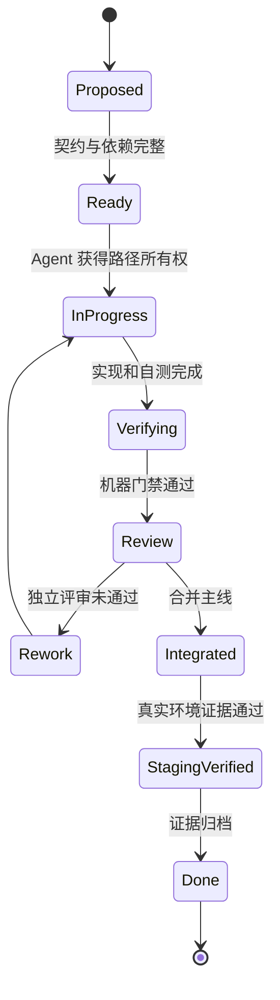

# Inner Cosmos — Agent 全自主开发与交付周期设计

> 文档性质：从当前原型到云原生 Internal Alpha、受控 Pilot 和新加坡发布的执行制度
> 形成时间：2026-07-14
> 上位依据：`00-项目理解与云原生产品化总纲.md`
> 事实依据：`01-项目全面评估.md`、`02-云原生EKS可行性分析.md`、`03-移动端App可行性分析.md`、`04-新加坡发行开发研究.md`
> 核心假设：主要分析、编码、测试、部署、审计和文档工作由 Agent 自主执行；组员负责目标、关键决策、真实体验和最终发布责任。

---

## 0. 核心结论

我建议采用下面这套开发模型：

> **人类定义方向和责任边界，Orchestrator Agent 管理计划与证据，专业 Agent 在独立 worktree 中完成纵向工作包，机器门禁决定能否集成；系统到达 Internal Alpha 后，组员通过真实任务集中体验，再进入 Beta 打磨和发布。**

这不是“让很多 Agent 同时自由写代码”，而是一座可审计的 Agent 开发工厂：



Agent 自主阶段的正确终点不是“自动公开上线”，而是：

> **一个可部署、可回滚、可观测、安全红线已关闭、核心旅程完整、移动端可安装、具备真实体验条件的 Internal Alpha。**

从 Internal Alpha 到最终发布，人的作用会迅速变大，因为 UI/UX、信任、情感节律、文化语境和“是否真的被理解”无法仅靠自动测试证明。

---

## 1. 总体开发哲学

### 1.1 以用户旅程为单位，不以技术组件为单位

每一轮自主开发都应交付一条可体验的纵向切片，例如：

```text
登录
→ 开始 Aurora 对话
→ 安全检查
→ 流式回复
→ 结束对话
→ 异步生成记录卡
→ 用户确认/修改
→ 在记忆星空中查看
→ 全链路可观测
```

不能把“Redis 接好了”“EKS 建好了”“新增了 20 个接口”单独视为产品进展。基础设施只有进入真实旅程并解决明确问题时才算完成。

### 1.2 先建立可信基线，再扩大自主权

Agent 的自主范围应随项目成熟度逐步扩大：

| 阶段 | Agent 自主权 | 原因 |
|---|---|---|
| 当前原型 | 中 | 安全、数据和架构债较多，错误容易被放大 |
| 基线稳定后 | 高 | 契约、测试和工作包边界已建立 |
| Internal Alpha | 高 | Agent 可自主修复、优化和准备体验版本 |
| 真实 Pilot | 中 | 涉及真实敏感数据、用户支持和法规责任 |
| 公开发布 | 低到中 | 发布、商店、收费、事故沟通必须由人承担责任 |

### 1.3 Agent 负责“完成”，机器负责“证明”，人负责“判断”

- Agent 负责分析、实现、测试、修复、文档和证据整理。
- CI、测试环境和 staging 负责证明构建、行为、安全、迁移和部署事实。
- 组员负责判断体验是否真实有价值、表达是否合适、风险是否可接受。

Agent 的文字报告不能代替运行证据；测试通过也不能代替真实体验。

### 1.4 不追求一次性实现终极愿景

理想愿景分四个可独立成立的产品层级：

1. **NUS Cloud-native Showcase**：核心旅程在 Kubernetes 上可靠运行，能展示弹性、故障恢复、可观测和协作开发。
2. **Internal Alpha**：Web/PWA 和 App 可被组员长期使用，安全与数据控制完整。
3. **Singapore Closed Pilot**：小范围真实用户试用，PDPA、跨境 LLM、支持流程和本地安全资源到位。
4. **Public Product**：商店、商业、内容治理、SLO、成本、客服和事件响应具备持续运营能力。

每一层都应能独立交付，不能把所有未来功能绑成一个永远无法结束的大版本。

---

## 2. 人类与 Agent 的责任边界

### 2.1 Agent 可以自主执行的事项

- 读取仓库、文档、ADR、Issue 和运行证据；
- 建立工作包和依赖图；
- 编码、重构、测试和文档更新；
- 创建短期分支和独立 worktree；
- 运行本地容器、Kind/Minikube、测试数据库和合成数据；
- 创建 Terraform/Kustomize/CI 配置并在 sandbox 验证；
- 生成 OpenAPI、客户端、SBOM、测试报告和架构图；
- 在预先授权的 staging 环境部署、回滚和执行故障演练；
- 发现问题后在既定范围内连续修复，直到门禁通过；
- 对其他 Agent 的 PR 做独立代码、安全、测试和产品一致性评审。

### 2.2 必须由人确认的事项

- 产品目标人群、品牌定位和收费模式；
- 医疗/非医疗措辞、危机承诺和人工支持能力；
- 跨境传输、供应商合同、DPO、TRIA 和隐私政策签署；
- 创建付费 AWS 资源、提高预算上限或签订第三方服务；
- 使用真实用户数据、邀请真实 Pilot 用户；
- 破坏性数据库迁移、不可逆数据删除；
- App Store/Google Play 正式提交；
- 生产发布、事故通知、用户沟通和法律声明。

### 2.3 三个最小人类决策门

为了保持“主要由 Agent 自主推进”，人类不需要参与每个 PR，但至少保留三个短门禁：

#### H0：方向冻结

确认首批用户、核心旅程、非医疗定位、Internal Alpha 的范围和不做事项。

#### H1：不可逆方案冻结

确认身份系统、云区域、跨境 LLM 默认路径、数据保留、预算和移动端首发范围。

#### H2：真实用户开放

确认 PDPA、TRIA、明示同意、安全资源、告警、客服、恢复演练和 Pilot 方案。

除这三个门禁外，Agent 应尽可能自主推进并通过证据报告结果，而不是不断询问微小实现选择。

---

## 3. Agent 组织模型

> M1 执行约束：以下八角色是完整周期的能力模型，不代表要同时启动八个 Agent。M1 只保持四条活跃工作流：产品/架构、后端/数据/AI、平台/云、验证/安全/集成；同时活跃 Builder 上限为 4，具体以 `07-H0H1决策表与M1执行包.md` 为准。

### 3.1 核心角色

#### 1. Program Orchestrator Agent

只负责整体状态，不承担大块功能编码：

- 维护目标、里程碑、依赖图和风险；
- 把需求拆成可独立验收的工作包；
- 分配路径所有权，避免 Agent 冲突；
- 汇总证据，判断机器门禁是否通过；
- 将真正需要人的问题放入 Decision Queue；
- 防止某个工作流长期偏离产品主线。

#### 2. Product & UX Agent

- 维护核心用户旅程、信息架构、设计系统和文案；
- 为每个功能写用户结果和可用性验收；
- 生成可交互原型和体验测试脚本；
- 检查功能是否增加理解、控制和真实连接，而不是只增加复杂度。

#### 3. Backend & Domain Agent

- API、领域规则、权限、迁移、异步任务和数据一致性；
- 保持模块化单体边界；
- 负责 Web/App 共用契约与幂等性。

#### 4. Platform & Cloud Agent

- Docker、Terraform、EKS、RDS、Redis、SQS、S3、Secrets；
- CI/CD、GitOps、扩缩容、可观测、备份恢复和成本；
- 只在应用具备正确多副本语义后扩大副本。

#### 5. Mobile Agent

- PWA、Capacitor、iOS/Android 壳、推送、权限、离线、安全存储；
- 维护 OpenAPI 生成客户端，不自行发明另一套后端语义。

#### 6. AI Quality & Safety Agent

- AI Gateway、Provider 路由、Prompt、结构化输出和成本；
- 建立中英文 golden set、回归评估和安全红队；
- 统一 Aurora、慢信、共鸣体和资料通道的安全语义。

#### 7. Verification Agent

- 独立于 Builder，编写或补充测试；
- 验证越权、迁移、并发、故障、性能和回滚；
- 拒绝仅凭 Builder 自述通过工作包。

#### 8. Release & Evidence Agent

- 维护版本、变更日志、SBOM、部署清单、runbook 和 release evidence；
- 执行 staging 晋级和发布前检查；
- 不自行批准生产发布。

### 3.2 并发原则

建议同时活跃的 Builder Agent 不超过 3–4 个。并发太高会导致：

- 同一文件频繁冲突；
- API 和数据模型被不同 Agent 同时改写；
- 集成门禁成为瓶颈；
- Agent 看似完成很多分支，主线却长期不可运行。

优先并行“低耦合工作流”，不要并行“同一核心类的不同重构”。例如：

- 可并行：安全测试、Terraform skeleton、移动信息架构、AI 评测集。
- 不宜并行：两个 Agent 同时重构认证；两个 Agent 同时改 `schema.sql`；多个 Agent 同时拆 `AuroraAgentServiceImpl`。

### 3.3 Builder 不能审核自己

每个高风险工作包至少需要一个不同角色复核：

| 工作类型 | 独立复核者 |
|---|---|
| 权限/认证 | Verification + Safety Agent |
| 数据迁移 | Backend + Platform Agent |
| AI Prompt/Provider | AI Quality + Product Agent |
| UI/UX | Product Agent + 组员体验阶段 |
| Kubernetes/IaC | Platform Reviewer + policy scan |
| 危机流程 | Safety Agent + 人类 H1/H2 |

---

## 4. 权威文件与信息结构

Agent 要长期自主工作，必须知道“什么文件说了算”。建议建立以下权威层级：

```text
1. PRODUCT_CONSTITUTION.md       产品原则、伦理与非目标
2. RELEASE_GOALS.md              当前发布目标和退出门禁
3. ARCHITECTURE.md + ADR         已冻结架构决策
4. WORK_PACKAGES.md              当前工作包、依赖和 owner
5. API / Event / Data Contracts  机器可验证契约
6. QUALITY_GATES.md              测试、安全、部署门禁
7. RUN_LEDGER.md                 Agent 执行与证据索引
8. DECISION_QUEUE.md             必须由人回答的问题
9. KNOWN_GAPS.md                 未关闭风险与明确非完成项
```

冲突时遵循高层文件，不允许 Agent 用自己的实现便利覆盖产品宪法或安全边界。

### 4.1 建议的目录

```text
docs/
├── product/
│   ├── PRODUCT_CONSTITUTION.md
│   ├── PERSONAS_AND_JOBS.md
│   ├── CORE_JOURNEYS.md
│   └── METRICS_DICTIONARY.md
├── architecture/
│   ├── ARCHITECTURE.md
│   └── adr/
├── contracts/
│   ├── openapi.yaml
│   ├── events/
│   └── data-classification.md
├── delivery/
│   ├── RELEASE_GOALS.md
│   ├── WORK_PACKAGES.md
│   ├── QUALITY_GATES.md
│   ├── RUN_LEDGER.md
│   ├── DECISION_QUEUE.md
│   └── KNOWN_GAPS.md
├── runbooks/
├── threat-model/
└── evidence/
    └── <milestone>/<work-package>/
```

---

## 5. 工作包制度

### 5.1 工作包必须足够小、足够完整

一个 Agent 工作包应在一次连续执行中完成，通常对应一个纵向能力或一个明确风险关闭。不能使用“改进后端”“完善 UI”“上 Kubernetes”这类无限范围任务。

标准模板：

```yaml
id: IC-P1-AUTH-001
title: 统一 Web/App 身份主体
user_outcome: 用户跨 Web 和 App 登录后能安全访问自己的数据
scope:
  - SecurityContext principal
  - access/refresh token lifecycle
  - ownership authorization
non_goals:
  - Apple/Google social login
dependencies:
  - IC-P0-IDOR-001
owned_paths:
  - src/main/java/com/innercosmos/config/**
  - src/main/java/com/innercosmos/controller/BaseController.java
acceptance:
  - 所有受保护 API 从 principal 取 userId
  - 跨用户访问测试全部拒绝
risk: high
tests:
  - unit
  - MockMvc authorization matrix
  - refresh rotation integration
telemetry:
  - auth_success_total
  - auth_failure_total
rollback:
  - feature flag / dual auth transition
evidence:
  - test report
  - OpenAPI diff
  - threat-model update
human_gate: H1
```

### 5.2 工作包状态机



只有 `StagingVerified` 才能算高风险能力完成。代码合并不等于完成。

### 5.3 每个工作包的证据包

至少包含：

- commit/PR；
- 变更范围和已知限制；
- 自动化测试结果；
- 对应的 OpenAPI/schema/ADR diff；
- 安全和隐私影响；
- 指标、日志和 trace 示例；
- staging 验证或截图；
- 回滚步骤；
- 未完成项。

Agent 不能用“应该可以”“理论上支持”作为证据。

---

## 6. Git、worktree 与 Agent 安全规则

本次“对齐文档消失”已经证明：多个 Agent 共享同一物理目录并自动切换分支，会造成不可接受的状态混乱。

### 6.1 强制规则

1. 每个 Builder Agent 使用独立 worktree，禁止共享主工作目录。
2. 主工作目录只用于 Orchestrator、集成和最终验证。
3. 分支统一使用 `codex/<wp-id>-<slug>` 或团队约定前缀。
4. Agent 开工前必须记录 `branch / HEAD / worktree / git status`。
5. Agent 不得在存在未知修改时执行 clean、reset、checkout path 或自动迁移。
6. 文档、报告和证据必须被 Git 跟踪；重要产物不能长期保持 untracked。
7. 切换分支前工作树必须 clean；如需 stash，必须在 Run Ledger 记录内容、原因和恢复方式。
8. 一个工作包只拥有声明路径；修改其他路径需要 Orchestrator 重新分配。
9. 禁止两个 Agent 同时执行数据库 schema 主干修改。
10. 合并后及时删除临时 worktree，分支保留到里程碑完成。

### 6.2 推荐分支结构

```text
main                         始终可发布，受保护
release/<version>            仅发布稳定化
codex/<wp-id>-<slug>         Agent 短期工作分支
experiment/<hypothesis>      可丢弃实验，不进入生产数据
```

不建议长期维护 `develop`。主线开发采用小步 PR、feature flag 和向后兼容迁移。

### 6.3 自动合并限制

满足以下条件可由 Integration Agent 自动合并：

- 非 High/Critical 风险；
- 不涉及真实秘密、生产 IAM、破坏性迁移、法律文本；
- 所有必需检查通过；
- 至少一个独立 Reviewer Agent 批准；
- 主线合并后 smoke test 通过。

其他变更进入 Human Decision Queue。

---

## 7. 从当前状态到理想愿景的开发周期

整个周期分为 8 个阶段。阶段内可并行，阶段间由退出门禁控制。

## Stage 0：治理与基线恢复

### 目标

让 Agent 可以在一个不会丢文件、不会互相覆盖、可以客观判断完成度的环境中工作。

### 自主工作

- 建立权威文件、工作包模板、Run Ledger 和 Decision Queue；
- 保护 `main`、PR 模板、CODEOWNERS、CI 基线；
- 统一 Java 21 升级分支的验证和合并决策；
- 固化 613 项测试基线、核心旅程和当前性能数据；
- 建立 secret scan、依赖扫描、格式和编译门禁；
- 所有 Agent 改为独立 worktree。

### 退出门禁 G0

- 主分支 clean、可构建、可运行；
- 所有关键文档被跟踪；
- 工作包、owner、依赖和合并规则可被机器读取；
- Agent 不再直接切换共享目录分支。

---

## Stage 1：生产红线关闭

### 目标

先使系统具备接近真实用户所需的最低安全与数据可信度。

### 工作流 A：安全

- 轮换并移除仓库、镜像、日志中的真实 LLM Key；
- 修复 Goodbye 和 Aurora Self 两处 IDOR；
- 建立 controller/service 全量 ownership matrix；
- 统一 Aurora、慢信、共鸣体等危机入口；
- 修复生产 seed、弱口令、CSRF、cookie、CSP 和 actuator 暴露；
- 数据导出、删除和管理员访问审计验证。

### 工作流 B：数据可信度

- Flyway/Liquibase 替代启动时 Schema Initializer；
- MySQL 冷启动与版本升级测试；
- 修复分页、并发更新和静默伪造 fallback；
- AI 产物记录来源、模型、置信度和降级状态。

### 退出门禁 G1

- 无已知 Critical/High 安全漏洞；
- secret scan 无真实凭据；
- 空库安装和上一版本升级均通过；
- 跨用户授权测试全绿；
- 613 基线测试及新增安全测试通过。

---

## Stage 2：协作契约与模块化单体

### 目标

让 Web、App、Worker 和基础设施可以依赖稳定契约并行开发。

### 自主工作

- 统一 `/api/v1`、响应信封、错误码和 DTO；
- 建立 OpenAPI 和生成客户端；
- cursor pagination、增量同步、`Idempotency-Key`；
- `currentUserId` 从 SecurityContext 获取；
- controller 不再直连 mapper；
- 拆分 `AuroraAgentServiceImpl` 的安全、上下文、模型调用、持久化和流式职责；
- 用 ArchUnit 或类似规则保护模块依赖；
- 保留模块化单体，不提前拆微服务。

### 退出门禁 G2

- Web 仍能完成原核心旅程；
- OpenAPI 客户端可生成并通过契约测试；
- Breaking change 有版本和兼容策略；
- 核心模块依赖规则自动化。

---

## Stage 3：多副本与可靠异步

### 目标

让应用可以在 Pod 随机终止和多副本环境下保持业务正确。

### 自主工作

- 目标身份语义改为 OAuth 2.1/OIDC；
- Redis 承担共享短期状态、令牌状态、限流和在线事件；
- transactional outbox + SQS + DLQ；
- API、Async Worker、Notification Worker 分离运行；
- LLM 调用移出长事务，加入 timeout、retry、circuit breaker 和 bulkhead；
- `@Scheduled` 任务改事件驱动、分布式锁或 K8s CronJob；
- SSE 具备 keepalive、跨 Pod fan-out 和断线补拉；
- 所有异步任务具备幂等键和状态追踪。

### 核心故障验证

- 对话中删除 API Pod；
- Worker 处理一半被终止；
- Redis 短暂不可用；
- LLM 超时、429、返回坏 JSON；
- SQS 消息重复；
- 数据库故障切换。

### 退出门禁 G3

- 两个以上 API Pod 下行为正确；
- Pod 删除不丢任务、不重复写业务事实；
- 非幂等夜间任务不会重复结算；
- 所有失败可以在指标和 trace 中定位。

---

## Stage 4：EKS 与 Day-2 云平台

### 目标

把正确的应用部署到可重复、可恢复、可观测的 AWS 新加坡环境。

### 自主工作

- Terraform：VPC、EKS、RDS、Redis、SQS、S3、IAM、Secrets、监控；
- Kustomize base + dev/staging/prod overlays；
- ALB、WAF、TLS、SSE timeout、NetworkPolicy；
- startup/readiness/liveness、PDB、topology spread；
- KEDA/HPA 和 Karpenter；
- OpenTelemetry、metrics、logs、traces 和 dashboard；
- 备份、PITR、恢复演练和成本预算；
- GitOps 部署、金丝雀和自动回滚。

### 退出门禁 G4

- 从空 sandbox 可声明式重建；
- EKS staging 完成核心旅程；
- 恢复演练满足暂定 RPO/RTO；
- 发布、回滚、扩缩容和故障演示有证据；
- 无公网暴露内部监控和数据服务。

---

## Stage 5：移动端与多端体验

### 目标

提供可安装、可后台通知、可安全保存凭据的真实 App Alpha。

### 自主工作

- 先整理 PWA，再建立 Capacitor iOS/Android；
- 38 页重组为“此刻 / 我的宇宙 / 共鸣 / 我”；
- 设备注册、APNs/FCM、push outbox 和 deep link；
- 加密本地存储、Keychain/Keystore、生物识别锁；
- 离线草稿、增量同步、弱网幂等；
- 原生麦克风、ASR 格式和录音时长限制；
- 安全港、本地热线、一键拨号和端侧即时预检；
- 真机崩溃、性能、权限拒绝和后台场景测试。

### 退出门禁 G5

- iOS/Android 真机完成核心旅程；
- App 被杀后通知仍可到达并能拉取真实状态；
- 离线重试不重复消息；
- 退出登录、账号删除后本地敏感数据被清除；
- 中英文基础 UI 和安全流程通过。

---

## Stage 6：产品深度与 AI 质量

### 目标

从“功能完整”进入“值得长期使用”。这一阶段 Agent 可完成大量准备，但最终判断依赖组员真实体验。

### Aurora

- 对话阶段明确：承接、澄清、整理、行动、结束；
- 模式具有真实行为差异；
- 记忆引用透明且可关闭；
- 避免建议过早、重复话术和过度亲密。

### 记忆系统

- 记录卡先由用户确认；
- 区分原话、事实和 AI 推断；
- 来源、置信度、修订、遗忘和保留期；
- 星空围绕洞察任务，而不是继续增加视觉效果。

### 共鸣体与慢信

- 逐字段授权和公开预览；
- 可解释匹配；
- 有限轮次、撤回授权、举报、拉黑和内容治理；
- 评价有效回复和双方满意度，不追求消息量。

### AI 评测

- 中英文及 code-switching golden set；
- 事实一致性、过度推断、帮助程度、依赖风险、安全和文化适配；
- Provider 延迟、成本、坏输出和 fallback；
- 模型/Prompt 变化必须跑离线评测和小流量在线观察。

### 退出门禁 G6：Internal Alpha

- 所有核心旅程无占位和断链；
- AI 评测达到团队冻结的最低阈值；
- 无 Critical/High 风险；
- Web/App、EKS、数据控制、安全和运营控制台可用；
- Release Evidence 完整；
- 可以交给组员连续使用，而不是只做五分钟演示。

---

## Stage 7：组员真实体验与 Beta 打磨

这是你设想中“组员间相互讨论、实际体验、完成细节打磨”的主要阶段。

### 7.1 不做自由漫游式测试

每位组员既要自由使用，也要完成统一任务：

1. 第一次进入和隐私选择；
2. 用中文、英文或混合语言完成一次倾诉；
3. 修正一张 AI 记录卡；
4. 找到一段过去的高重力记忆；
5. 创建并预览一个共鸣体；
6. 与共鸣体对话并写慢信；
7. 模拟网络中断、通知和重新登录；
8. 导出数据、撤回授权和删除账号；
9. 体验安全港和本地资源入口。

### 7.2 反馈维度

每个问题按以下结构记录：

| 维度 | 核心问题 |
|---|---|
| 价值 | 它是否真的帮助我更清楚？ |
| 信任 | 我是否知道系统记住了什么、发给了谁？ |
| 情感 | Aurora 是温柔清醒，还是模板化/过度亲密？ |
| 摩擦 | 哪一步让我想退出？ |
| 控制 | 我能否修改、撤回、关闭和删除？ |
| 连接 | 共鸣和慢信是否比普通社交更有意义？ |
| 安全 | 高风险内容是否及时、现实导向且不冒充人工救援？ |
| 性能 | 等待、卡顿、断线和通知是否影响信任？ |

### 7.3 Beta 修复优先级

```text
P0：安全、隐私、数据丢失、错误授权、无法恢复
P1：核心旅程中断、AI 严重误解、通知错误、移动端阻塞
P2：高频体验摩擦、文案、布局、性能和无障碍
P3：视觉装饰、低频功能和未来想法
```

Beta 阶段原则上冻结大型新功能，只修复影响价值、信任、安全和发布质量的问题。

### 退出门禁 G7

- 所有组员完成规定旅程；
- P0/P1 全部关闭；
- P2 有明确接受或延期决定；
- 关键体验分歧形成产品决策，而不是平均所有意见；
- 至少完成两轮“使用—讨论—修复—再使用”。

---

## Stage 8：新加坡 Closed Pilot 与发布

### 目标

从组内可用进入受控真实环境，不直接跳到公开商用。

### 发布前合规门

- DPO 和公开联系方式；
- 数据流台账、TRIA、ASEAN MCCs 式合同/DPA；
- 明示同意和中国 LLM 披露；
- prompt 数据最小化和不得训练约束；
- 新加坡安全资源：995、999、1767、1771、IMH 6389 2222；
- 非医疗措辞审计；
- Google API 35、Data Safety、Health declaration；
- Apple 非医疗器械声明、隐私标签和账号删除；
- 泄露响应、三日通知流程和事件演练。

### 技术门

- 新加坡到各 LLM 端点真实延迟/稳定性 PoC；
- MiniMax 国际端点或其他海外 Provider 路由验证；
- DeepSeek 等高延迟路径不作为单点依赖；
- RDS 恢复、Pod 故障、Provider 故障和通知故障演练；
- staging 与 production 账户/数据隔离；
- canary、feature flag、kill switch 和回滚。

### Pilot 原则

- 仅邀请明确知情、18 岁以上、可提供反馈的小范围用户；
- 不以脆弱人群作为产品安全实验对象；
- 不承诺 24/7 人工危机响应，除非团队真的具备；
- 初期限制主动通知、社交范围和高风险自动化；
- 每周复盘安全事件、数据请求、AI 失败、成本和用户结果。

### 退出门禁 G8

- Pilot 指标和访谈证明核心价值；
- 安全、合规和运营事件能够闭环；
- 成本与支持负担可持续；
- Go/No-Go 由组员正式确认；
- 通过后再提交公开商店和扩大用户范围。

---

## 8. 并行波次与依赖设计

不应严格按 Stage 全部串行。推荐用以下波次：

| 波次 | Agent A | Agent B | Agent C | Agent D | 集成结果 |
|---|---|---|---|---|---|
| W0 | 治理/工作包 | 安全基线 | CI/测试基线 | 产品旅程 | 可自主开发基线 |
| W1 | IDOR/认证 | Flyway/数据 | Terraform skeleton | AI golden set | G1/G2 基础 |
| W2 | API v1/契约 | Redis/状态 | EKS local/Kind | PWA 信息架构 | 可并行平台契约 |
| W3 | outbox/SQS | Worker/CronJob | EKS staging | Capacitor shell | 多副本纵向旅程 |
| W4 | 推送/离线 | AI Gateway | 可观测/恢复 | 移动安全 | Internal Alpha 基础 |
| W5 | Aurora/记忆 | 共鸣/慢信 | i18n/SG safety | Admin/运营 | 产品完整度 |
| W6 | 性能/故障 | 安全红队 | 真机 E2E | Release evidence | G6 Internal Alpha |

每一波只在上一波所需契约稳定后启动，Orchestrator 每次最多释放 3–4 个互不冲突的 Builder 工作包。

---

## 9. 自动质量门禁

### Gate A：每次提交

- compile；
- unit tests；
- formatting/lint；
- secret scan；
- dependency/SAST；
- 禁止提交大文件、真实用户数据和密钥。

### Gate B：每个 PR

- 受影响模块测试；
- authorization matrix；
- API contract diff；
- Flyway migration check；
- 独立 Reviewer Agent；
- 文档、指标和回滚检查。

### Gate C：合并主线

- 全量测试；
- MySQL/Redis/SQS 集成测试；
- 核心 E2E；
- Docker image build、SBOM、Trivy；
- ephemeral environment smoke test。

### Gate D：EKS staging

- 多副本和 Pod 删除；
- readiness/liveness/startup；
- 负载、队列和扩缩容；
- LLM 超时/fallback；
- 备份恢复；
- trace、dashboard 和 alerts；
- DAST 和配置扫描。

### Gate E：Release Candidate

- 完整用户旅程；
- 真机矩阵；
- AI golden set 和安全红队；
- 隐私/合规清单；
- runbook 演练；
- 组员体验签字；
- 发布/回滚演练。

---

## 10. Agent 自主循环

每个 Agent 回合采用统一循环：

1. **Read**：读取上位目标、AGENTS、ADR、工作包、相关代码和当前状态。
2. **Verify baseline**：先运行最小基线，确认问题真实存在。
3. **Plan locally**：拆成小提交和测试点，不修改范围外文件。
4. **Implement vertical slice**：优先让一条旅程工作，再扩展边界情况。
5. **Test**：单元、集成、契约、越权、故障和真实环境按风险执行。
6. **Self-review**：检查安全、隐私、可观测、回滚和文档。
7. **Independent review**：另一个 Agent 从反方寻找缺陷。
8. **Integrate**：rebase/merge 后重新跑主线门禁。
9. **Evidence**：把证据写入 Run Ledger 和 evidence 目录。
10. **Continue or stop**：门禁通过自动领取下一工作包；遇到人类决策才进入 Decision Queue。

Agent 不应因为“时间长”“代码复杂”停止；也不应为了保持自主而越过必须由人决定的边界。

---

## 11. 进度与完成度衡量

### 11.1 不用代码量衡量

主进度应按“通过门禁的用户能力”计算：

| 维度 | 示例 |
|---|---|
| Journey coverage | 多少核心旅程在 staging 真实通过 |
| Risk closure | P0/P1 风险关闭比例 |
| Contract stability | API/事件/迁移兼容性 |
| Operational readiness | 告警、恢复、回滚是否演练 |
| Product evidence | 记录卡确认、清晰度、慢信质量 |
| Agent reliability | 自动工作包一次通过率、返工率、冲突率 |

### 11.2 Agent 体系自身指标

- 工作包 cycle time；
- 自动门禁首次通过率；
- Reviewer 发现率；
- 合并后回归率；
- worktree/分支冲突次数；
- 无证据完成声明次数；
- 需要人类澄清的问题比例；
- Agent 修改范围越界次数。

如果 Agent 很忙但主线长期不可部署，说明编排失败而不是进度很快。

---

## 12. 时间与节奏建议

Agent 能显著压缩编码时间，但无法消除产品体验、外部账户、商店审核、合规合同和真实用户观察所需时间。建议按里程碑而非死日期管理，同时保留量级预期：

| 目标 | 参考周期 | 主要不确定性 |
|---|---|---|
| G0–G2 可信开发基线 | 2–4 周 | 安全债、API 改造范围 |
| G3–G4 EKS Internal Platform | 3–6 周 | 状态外置、AWS 权限和成本 |
| G5 移动端 Alpha | 3–5 周 | iOS/Android 真机、推送和离线 |
| G6 产品 Internal Alpha | 4–8 周 | AI 质量和体验深度 |
| G7 组员体验/Beta | 2–4 周 | 反馈返工量 |
| G8 Singapore Pilot-ready | 3–6 周 | TRIA、合同、LLM PoC、商店材料 |

部分阶段并行后，课程级云原生可演示版本可能在较早阶段形成；真正 Pilot-ready 通常需要更长，因为“可运行”与“可承担真实用户责任”是两件事。

### 推荐节奏

- Agent 每日自动生成一次状态摘要，不召开日常逐项汇报会。
- 每周一次 30–45 分钟人类里程碑检查，只讨论 Decision Queue、风险和体验。
- 每个 Gate 完成后做一次可运行演示和证据归档。
- Internal Alpha 后进入高密度组员 dogfooding，暂停大规模功能扩张。

---

## 13. 常见失败模式与防线

| 失败模式 | 防线 |
|---|---|
| 多 Agent 同目录切分支，文件消失 | 独立 worktree + 重要产物立即跟踪 |
| Agent 大量写代码但主线不可运行 | 纵向切片 + 每波集成门 |
| 自动测试只验证 happy path | 独立 Verification Agent + 故障/越权矩阵 |
| Agent 为解决局部问题重写架构 | ADR 和 owned paths |
| 过早拆微服务 | 模块化单体 + 以真实瓶颈触发拆分 |
| Kubernetes YAML 很多但应用仍单副本语义 | G3 先于 G4 |
| AI fallback 让测试“看起来成功” | 产物来源和降级状态显式化 |
| 直到最后才做产品体验 | 早期 Product Agent + Internal Alpha 后集中 dogfooding |
| 直到发布才看合规 | PDPA/数据流从 Stage 1 进入契约 |
| Agent 自己实现、自己验收、自己宣布完成 | Builder 与 Reviewer 分离 |
| 追求 DAU/时长制造依赖 | 结果指标和反指标共同门禁 |

---

## 14. 建议立即启动的第一批工作包

### 治理

- `IC-GOV-001`：建立 Product Constitution、Release Goals、Run Ledger。
- `IC-GOV-002`：建立 Agent worktree 创建、回收和路径 ownership 工具。
- `IC-GOV-003`：GitHub branch protection、CODEOWNERS、PR/Issue 模板。

### 安全与数据

- `IC-SEC-001`：密钥清除、轮换清单和 secret scan。
- `IC-SEC-002`：Goodbye IDOR 修复与回归测试。
- `IC-SEC-003`：Aurora Self commit IDOR 修复与回归测试。
- `IC-SEC-004`：全 API ownership matrix。
- `IC-DATA-001`：Flyway baseline 与 MySQL 升级测试。
- `IC-DATA-002`：生产 seed 和弱口令关闭。

### 契约与架构

- `IC-API-001`：统一错误信封和 `/api/v1` 兼容策略。
- `IC-API-002`：OpenAPI baseline 和 generated client。
- `IC-ARCH-001`：模块边界和 controller→service→mapper 规则。
- `IC-ARCH-002`：Aurora 核心服务拆分 ADR。

### 云平台与评测

- `IC-PLAT-001`：Terraform/EKS sandbox skeleton，不部署生产数据。
- `IC-PLAT-002`：Kind 中的单副本基线部署和 probes。
- `IC-AIQA-001`：中文/英文核心旅程 golden set。
- `IC-PROD-001`：四条核心旅程和 Internal Alpha 体验脚本。

第一波只释放互不冲突的 3–4 个工作包。完成 G0 后再扩大并发。

---

## 15. 对你提出流程的最终建议

你的设想是合理的：

```text
Agent 高自主推进
→ 达到相对完善
→ 组员相互讨论
→ 组员真实体验
→ 细节打磨
→ 最终发布
```

我建议将它调整为：

```text
人类冻结愿景和硬边界
→ Agent 自主完成安全基线、平台和核心旅程
→ 机器门禁持续集成
→ 人类确认少数不可逆决策
→ Agent 推进至 Internal Alpha
→ 组员连续真实使用和讨论
→ Agent 根据体验证据集中修复
→ Closed Pilot
→ 人类确认发布责任
→ 渐进公开发布
```

最大的区别是：

- 不让 Agent 在缺少契约时“自由发挥”；
- 不等到最后才发现产品方向错了；
- 不把组员体验当作普通 QA，而把它视为产品成败的核心验证；
- 不让自动化越过真实用户、安全、法律和付费责任；
- 不以功能全部实现为完成，而以价值、信任、安全和可运营为完成。

Inner Cosmos 很适合 Agent 驱动开发，因为它已有丰富领域模型、明确愿景、较强测试和完整闭环。但它也是一个对情感、安全和隐私要求很高的产品。因此最好的模式不是“无人监督的全自动上线”，而是：

> **高度自治的工程执行 + 稀疏但关键的人类决策 + 集中的真实体验共创。**

这样可以同时获得 Agent 的速度、云原生项目的技术深度，以及最终产品真正需要的人类判断力。
