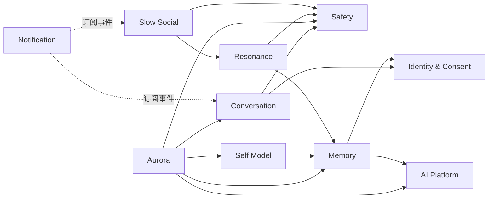
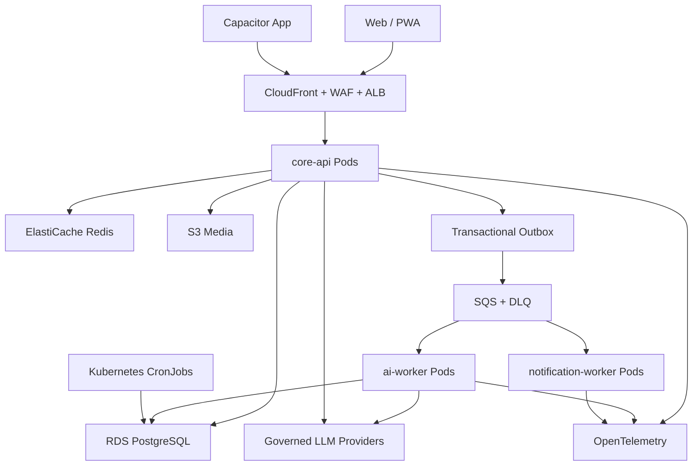
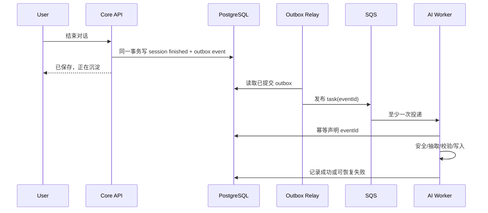
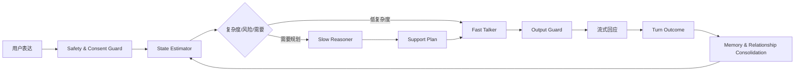

# Inner Cosmos — 目标技术架构与 AI 系统演进设计

> 文档性质：从 Java 课程原型演化为云原生、可研究、可运营产品的技术架构决策草案
> 形成时间：2026-07-14
> 上位依据：`00-项目理解与云原生产品化总纲.md`、`05-Agent全自主开发与交付周期设计.md`
> 分析依据：当前仓库代码与配置、`01-04` 专项评估、截至 2026-07-14 的官方文档与学术研究
> 核心结论：保留 Java/Spring 和现有领域闭环，重构模块、运行角色、数据与 AI 认知架构；不以微服务数量衡量成熟度。

---

## 0. 执行结论

Inner Cosmos 的技术架构确实需要升级，而且升级幅度会很大。但正确方向不是“推倒重写”或“把所有模块拆成微服务”，而是完成四次本质变化：

1. **从技术分层单体变为领域模块化产品内核**：让身份、对话、记忆、Aurora、共鸣体、慢社交、安全、通知具有清晰边界。
2. **从单进程尽力而为变为多副本可靠系统**：把 Session、异步任务、定时任务、推送、限流和临时状态迁出单 Pod 内存。
3. **从“Prompt 调一次 LLM”变为可验证的 AI 认知系统**：建立支持策略规划、分层记忆、用户状态建模、证据检索、安全监督和持续评测。
4. **从功能演示变为可运营产品**：具备版本化 API、数据迁移、权限审计、可观测、回滚、成本治理、隐私控制和真实体验指标。

建议目标技术组合：

| 领域 | 目标选择 | 判断 |
|---|---|---|
| JVM | **Java 21 LTS** | 升级，保留 Java 作为产品主语言 |
| 后端框架 | **Spring Boot 3.5.x + Spring Modulith 1.4** | 先稳定升级，不立即跳 Boot 4 |
| Web 模型 | **Spring MVC，评测后选择性启用虚拟线程** | 不为“现代”而全量改 WebFlux |
| 领域架构 | **模块化单体 + 多运行角色** | 当前最优；微服务按证据提取 |
| 主数据库 | **优先 PoC PostgreSQL + pgvector** | 若记忆检索是壁垒，应在真实数据进入前迁移 |
| 数据访问 | **短期保留 MyBatis-Plus，外加 Repository Port** | 不做低价值 ORM 大重写 |
| 数据迁移 | **Flyway** | 必须替代 `schema.sql + 启动补丁` |
| 共享状态 | **Redis** | Session/令牌、限流、短期状态、在线 fan-out |
| 持久任务 | **Transactional Outbox + SQS + DLQ** | 替代关键 `@Async` |
| 文件/音频 | **S3 + KMS + 生命周期策略** | 不进入 jar 或数据库大字段 |
| 外部 API | **REST + OpenAPI 3.1；聊天保留 SSE** | 不引入无必要的 GraphQL/gRPC |
| 身份 | **OIDC/OAuth2 Resource Server + 短期 Access Token** | 替换自制 Session/JWT 混合语义 |
| Web/App | **React + TypeScript + Vite + Capacitor** | 从静态多页渐进迁移，不一次重画 UI |
| AI 运行层 | **Java AI Orchestrator + Provider Gateway** | 业务权限和审计留在 Java |
| AI 研究层 | **独立 Python ai-lab** | 用于论文复现、数据集、离线评测和实验 |
| AI 基础抽象 | **评估 Spring AI，保留领域自定义策略层** | 可替换模型，但不能把产品逻辑交给框架 |
| 可观测 | **OpenTelemetry + Micrometer + CloudWatch/Prometheus** | HTTP、队列、数据库、LLM 全链路关联 |
| 平台 | **EKS + Terraform + GitOps/CI/CD** | Kubernetes 是运行平台，不是架构本身 |

最关键的架构判断是：

> **Inner Cosmos 应先成为一个边界清晰、事件可靠、数据可解释的模块化单体；再把 API、Worker、Scheduler 作为不同 Kubernetes 工作负载运行；只有某个边界被团队、负载、合规或发布节奏证明需要独立时，才提取为微服务。**

---

## 1. 当前系统的架构事实

本轮对真实仓库的复核得到以下事实：

- Spring Boot `3.3.6`，`pom.xml` 仍声明 Java 17；另有已经通过测试的 Java 21 升级分支。
- 约 42 个 Controller、74 个 Service/实现、55 个 Mapper、56 个 Entity、55 张表。
- `AuroraAgentServiceImpl` 约 1400 行，集中了上下文、状态、流式输出、Provider 调用和响应编排。
- `MemorySettlementServiceImpl`、`CapsuleServiceImpl`、`AgentContextAssembler` 等关键类也已达到高复杂度。
- 关键后处理依赖 `@TransactionalEventListener + @Async`，失败后缺少持久重放保证。
- 主动消息 SSE 连接、部分对话状态、限流和用量统计仍保存在进程内。
- 生产数据库仍依赖 MySQL 手工建表和多个启动期 Schema Initializer，没有正式迁移历史。
- 前端是多页静态 HTML/JS/CSS；视觉资产很强，但缺少组件边界、类型系统和稳定 API 客户端。
- 测试数量较多，但主要集中于 H2、Spring 全上下文和 Mock；MySQL/PostgreSQL、迁移、契约和真实 Provider 测试不足。
- 当前配置仍能识别到内嵌真实访问凭据，且生产允许模型 fallback。

这意味着系统并不是“功能少”，而是：

> **领域功能增长速度已经超过架构承载能力。**

因此这次重构的第一目标不是继续增加表和页面，而是让已有能力进入可持续演化的结构。

---

## 2. 架构设计原则

### 2.1 保留产品知识，替换偶然实现

必须保留：

- Aurora → 记忆 → 星空 → 共鸣体 → 慢信的产品闭环；
- P0-P3 隐私层级和授权共鸣体思想；
- 情感重力、ThoughtFragment、EmotionTrace、Todo 等领域概念；
- 多 Provider Adapter、安全边界、慢信状态机；
- 已验证的 UI 语言、内容风格和用户旅程。

应逐步替换：

- 技术分层目录造成的跨域耦合；
- 进程内共享状态和尽力而为异步；
- `Map<String,Object>` 和实体直接出 API；
- `schema.sql` 和启动补丁式迁移；
- 将 Prompt、Provider、策略、用户状态和流式输出集中在一个大 Service；
- 静态页面之间复制的状态与请求逻辑；
- 把模型输出直接当成真实用户事实。

### 2.2 优先单一事实源

- 业务事实只以关系数据库中的领域记录为准。
- Redis 是可丢失、可重建的短期状态，不是永久记忆库。
- SQS 传递任务，不保存最终业务状态。
- 向量只是检索索引，不是真实记忆本身。
- LLM 生成的是候选解释或候选结构，必须有来源、置信度和状态。

### 2.3 先做可观测的确定性外壳，再接概率模型

模型调用前后都必须存在确定性控制：

```text
身份与授权
→ 输入安全与数据最小化
→ 可审计的支持计划
→ Provider 调用
→ Schema 验证与输出安全
→ 用户可见响应
→ 异步评测与受控记忆更新
```

模型不能自行决定自己可以读取哪些记忆、调用哪些工具、发送哪些通知或公开哪些内容。

### 2.4 用可证伪假设建立技术壁垒

“更懂用户”“更有共鸣”“记忆更好”都不是可验收表述。每项 AI 创新必须写成：

```text
设计假设
→ 对照基线
→ 离线数据集
→ 安全门槛
→ 人类评价
→ 线上受控实验
→ 继续/停止条件
```

---

## 3. Java 与 Spring 是否应该保留

### 3.1 Java 21：应该升级

Java 不是当前问题，Java 17 的老版本基线和应用结构才是问题。

Java 21 带来的主要价值包括：

- 长期支持版本和更长的维护窗口；
- 虚拟线程可用于评估阻塞式 JDBC/HTTP 调用的并发模型；
- 更现代的语言与运行时能力；
- 更好的容器/JVM 生态和供应链维护基础。

但虚拟线程不是打开一个开关就结束：数据库连接池、Provider 限流、SSE 长连接和外部 API 配额仍然是实际瓶颈，必须通过负载测试决定。

### 3.2 Spring Boot：应该升级，但不应追逐最新主版本

截至本次研究，Spring Boot 3.5 仍有维护版本，Boot 4 已进入稳定线而 4.1 仍处在预发布阶段。建议：

1. 先把 Java 21 与 Spring Boot `3.5.x` 作为生产基线；
2. 完成依赖兼容、安全扫描和 613 测试回归；
3. 在独立 Spike 中评估 Boot 4，不与数据库、模块化和前端重构同时进行；
4. 只有 Boot 4 带来明确收益并且 MyBatis/Spring AI/测试生态通过时再迁移。

这可以避免一次把 Jakarta、Jackson、Spring Security、测试基础设施和 AI SDK 全部推入同一风险面。

### 3.3 Spring MVC：保留

当前系统以 JDBC、Servlet、SSE 和大量同步领域事务为主。全量改 WebFlux 会产生明显的认知和调试成本，却不会自动解决 LLM 延迟、连接池、队列和 Provider 配额问题。

建议：

- 外部 REST 和 SSE 继续使用 Spring MVC；
- Provider HTTP 客户端统一为受控的 `RestClient`/`WebClient` Adapter；
- 对流式模型调用可在局部使用 Reactor，但不把领域层改成响应式类型；
- Java 21 虚拟线程只在压测证明收益后启用；
- 当聊天流量独立达到明显瓶颈时，再评估提取 Streaming Gateway。

### 3.4 Spring Modulith：建议引入

Spring Modulith 可验证模块依赖、发现循环、生成模块文档、执行模块测试，并提供事件发布登记能力。它非常适合当前“领域丰富但仍需快速迭代”的阶段。

建议采用与 Boot 3.5 对应的 Spring Modulith 1.4，而不是为了使用最新版 Modulith 先跳 Boot 4。

---

## 4. 目标领域模块

当前按 `controller/service/mapper/entity` 的技术分层，应逐步迁移为按业务能力组织的模块：

```text
com.innercosmos
├── identity/          # 用户、认证、授权、账户、同意
├── conversation/      # 会话、消息、输入和会话生命周期
├── aurora/            # 支持策略、响应编排、关系连续性
├── memory/            # 记忆抽取、确认、检索、巩固、遗忘
├── selfmodel/         # 用户模型、偏好、信念与关系图
├── resonance/         # 共鸣体、授权叙事、匹配和边界
├── slowsocial/        # 慢信、线程、举报和阻断
├── safety/            # 输入/输出/危机/依赖风险
├── notification/      # 站内、Push、邮件及偏好
├── aiplatform/        # Provider、预算、模型路由、Schema、审计
├── analytics/         # 产品事件、实验和聚合，不读取 P0 正文
└── administration/    # 运营、审核、事件响应
```

模块之间只允许两种交互：

1. 调用对方公开的 Application Service 接口；
2. 发布明确版本的 Domain Event。

禁止：

- 直接注入其他模块的 Mapper；
- Controller 跨多个 Mapper 编排；
- 共享万能 Entity；
- 通过数据库表结构暗中形成模块 API；
- 让 AI Provider DTO 渗入领域对象。

推荐依赖方向：



Spring Modulith 测试必须证明依赖图无循环，核心模块拥有独立集成测试。

---

## 5. 目标运行架构

模块化单体不等于只运行一个 Pod。建议一个代码库、一个领域模型，先形成四种运行角色：

| 运行角色 | 责任 | Kubernetes 资源 |
|---|---|---|
| `core-api` | REST、认证、用户操作、聊天 SSE、同步业务事务 | Deployment，2+ 副本 |
| `ai-worker` | 记忆抽取、嵌入、摘要、画像、共鸣体生成、离线评测 | Deployment，按 SQS 深度扩缩 |
| `notification-worker` | Push、慢信到达、通知重试 | Deployment |
| `scheduled-jobs` | 日结、清理、恢复、聚合 | Kubernetes CronJob |

在早期，这些角色可以由同一 jar 通过 Spring Profile 启动；它们共享经过模块约束的代码，但拥有独立资源、扩缩容和权限。



### 为什么不立即微服务化

当前 55 张表之间仍有大量事务和产品规则，团队规模有限，领域还在快速发现。现在拆十几个服务会立即引入：

- 分布式事务和最终一致性；
- API/事件版本兼容；
- 多仓库或多构建维护；
- 服务发现、重试、超时和雪崩；
- 更复杂的本地开发与端到端测试；
- 更多云成本和故障点；
- Agent 同时改多个服务时更大的协调负担。

### 什么时候才提取微服务

只有满足至少一项并有运行证据时才提取：

- 某模块需要独立扩缩，资源特性与 Core 显著不同；
- 某模块需要独立安全/合规边界；
- 独立团队需要自主发布且模块契约已稳定；
- 故障必须隔离，当前进程隔离不足；
- 模块需要不同语言或专用计算；
- 数据所有权已经清晰且跨域事务很少。

第一批潜在提取候选是 `AI Execution`、`Notification`，不是 Identity、Memory 和 Conversation。即使提取，也先从同仓多模块或同构建产物开始。

---

## 6. 数据库与数据架构

### 6.1 MySQL 是否需要更换

MySQL 8.4 足以支撑普通交易型产品；如果 Inner Cosmos 只做课程展示，没有必要迁移。

但长期产品的核心差异正在转向：

- 多层长期记忆；
- 时间与矛盾感知的用户模型；
- 结构化属性 + 全文 + 向量的混合检索；
- JSON 元数据、来源和模型版本；
- 更复杂的分析查询；
- 未来可能使用行级安全与扩展生态。

因此建议在没有真实生产数据、迁移成本仍最低的阶段，完成一次 PostgreSQL PoC。RDS PostgreSQL 已支持 `pgvector`，pgvector 支持 HNSW/IVFFlat 和与 PostgreSQL 全文检索组合的混合检索。

建议决策门：

| 比较项 | MySQL 8.4 | PostgreSQL + pgvector |
|---|---|---|
| 当前代码迁移成本 | 低 | 中高 |
| 事务业务 | 强 | 强 |
| 向量与混合检索 | 需额外系统或云能力 | 原生扩展，统一查询 |
| JSON/复杂查询 | 可用 | 更适合研究型数据模型 |
| 运行组件数 | 若加向量库则增加 | 初期可保持一个主库 |
| 当前团队认知 | 已有 | 需要补齐 |
| 长期 AI 数据产品 | 可实现 | 更自然 |

**推荐结论**：如果团队确认“可解释长期记忆”是核心壁垒，选择 PostgreSQL；如果只要求 NUS 演示按期完成，则先保留 MySQL，但必须把持久层隔离，避免未来迁移被 Entity/SQL 绑死。

### 6.2 不立即上独立向量数据库

在数据规模和查询负载未证明之前，不建议同时引入 Pinecone、Weaviate、Milvus 或 OpenSearch Vector。原因是它会增加双写、一致性、删除合规和成本问题。

初期采用：

```text
PostgreSQL 业务事实
+ pgvector 嵌入索引
+ PostgreSQL FTS 关键词排序
+ 结构化时间/权限过滤
+ 可选 Cross-Encoder 重排
```

只有向量规模、召回延迟或吞吐超过 RDS 能力时，再用统一 Retrieval Port 提取专用检索服务。

### 6.3 数据访问框架

不建议为了“成熟”把 55 个 MyBatis Mapper 全部改成 JPA。ORM 品牌不是主要风险。

建议：

1. 保留 MyBatis-Plus 作为迁移期实现；
2. 领域层只依赖 Repository Port；
3. Mapper 和数据库 Entity 进入模块 `infrastructure`；
4. API DTO、领域对象和持久化对象分离；
5. 复杂检索使用显式 SQL；
6. 如果 PostgreSQL 分析查询显著增加，再以 ADR 评估 jOOQ，不与数据库迁移同时强制替换。

### 6.4 Flyway 是硬要求

所有数据库变化必须：

- 拥有单调版本号；
- 在 CI 中验证空库构建；
- 验证上一发布版本到当前版本升级；
- 对破坏性变化采用 expand → migrate → contract；
- 迁移 Job 成功后才发布新应用；
- 具备备份、恢复和校验脚本。

`schema.sql` 最终只保留测试夹具或由 Flyway baseline 取代；所有 Schema Initializer 应在迁移完成后删除。

### 6.5 数据分类与加密

建议将现有 P0-P3 升级为字段级治理：

| 属性 | 示例 |
|---|---|
| `classification` | P0/P1/P2/P3 |
| `purpose` | conversation/memory/resonance/safety/analytics |
| `consent_scope` | Aurora-only / selected-capsule / public |
| `retention_until` | 自动删除时间 |
| `residency` | SG / provider-region / prohibited-cross-border |
| `encryption_context` | 用户/租户/对象级密钥上下文 |
| `deletion_state` | active/pending/deleted/legal-hold |

P0 正文不进入普通日志、Prometheus 标签、分析事件或 LLM trace。必要的内容审计采用受控采样、独立权限和短保留期。

---

## 7. 可靠事件与异步处理

当前 `@Async` 适用于非关键优化，不适合“对话结束后必须生成记忆”这类产品承诺。

目标流程：



每个任务必须包含：

- `event_id`、`event_type`、`event_version`；
- `aggregate_id`、`user_id`、`trace_id`；
- `occurred_at`、`attempt`、`idempotency_key`；
- 最小化 payload，敏感正文优先通过受权 ID 回查；
- 处理结果、模型/Prompt 版本、token、成本和失败分类。

SQS Standard 是至少一次语义，Consumer 必须幂等；不能用“队列不会重复”作为假设。DLQ 需要人工/Agent 可重放工具和告警，而不是只存失败消息。

Kafka 目前不推荐：没有足够事件吞吐、流式消费组和多下游需求来证明其运维成本。

---

## 8. API、认证与多端契约

### 8.1 API 形态

- 所有外部 API 进入 `/api/v1`；
- OpenAPI 3.1 作为唯一契约；
- Web 和 App 客户端从契约生成类型；
- 统一错误对象、分页、时间格式、幂等键和 Trace ID；
- 不返回数据库 Entity；
- 列表默认 cursor pagination；
- 对创建/发送/删除类操作支持 `Idempotency-Key`；
- 兼容窗口内保持旧字段，采用 additive change。

协议选择：

| 场景 | 协议 |
|---|---|
| CRUD/查询 | REST/JSON |
| Aurora 单向流式输出 | SSE |
| Push | APNs/FCM + 拉取详情 |
| 内部异步任务 | SQS Event |
| 高性能内部 RPC | 暂不需要 gRPC |
| 灵活前端查询 | 暂不需要 GraphQL |

### 8.2 身份系统

当前 HttpSession 与名为 JWT、实为 Session 的 Filter 应退出生产架构。

目标：

- 外部 OIDC Provider 管理身份生命周期，可选 AWS Cognito 或成熟 SaaS；
- Core API 作为 OAuth2 Resource Server 验证 `issuer/audience/exp/scope`；
- 移动端使用 Authorization Code + PKCE；
- Access Token 短期有效；
- Refresh Token 只在受保护端存储并支持轮换/撤销；
- 服务间使用 workload identity，不使用用户 Token；
- 权限最终通过 `subject + resource ownership + purpose + consent` 判断。

所有按 ID 读取/更新的端点必须经过统一 Ownership Policy，不允许各 Controller 自己临时判断。

---

## 9. 前端与 App 技术演进

`03` 基于当前资产得出 PWA + Capacitor 是成本最优路线，这个判断对快速移动化仍然成立。但若目标提升为长期商用品，纯静态多页 JS 会逐渐成为协作和质量瓶颈。

建议采用两阶段策略：

### 阶段 A：保住体验，先完成平台改造

- 保留现有页面和视觉；
- 增加 PWA、统一 API Client、错误处理、认证适配；
- 先完成 Push、后台唤醒和移动安全；
- Capacitor 验证真机能力。

### 阶段 B：Strangler 迁移到组件化前端

- React + TypeScript + Vite；
- TanStack Query 管理服务端状态；
- Router 管理页面边界；
- Zod/生成 Schema 做运行时校验；
- i18next/FormatJS 做国际化；
- Storybook 建立设计系统和状态目录；
- Playwright 做核心旅程 E2E；
- Capacitor 包装同一 Web App。

不要一次重做 18 个页面。优先迁移四条核心旅程：

1. 登录与首次使用；
2. Aurora 对话；
3. 对话结束与记忆确认；
4. 共鸣体授权预览与慢信。

营销网站和应用本体可在未来分离；当前没有必要仅为 SSR 引入 Next.js。

---

## 10. AI 平台层

### 10.1 AI Gateway 不只是 Provider Adapter

现有 `LlmClient` 应升级为受治理的 AI Platform，至少包含：

```text
Model Router
Provider Adapter
Prompt Registry
Schema Registry
Policy & Safety
PII Redaction
Budget & Quota
Retry/Circuit Breaker
Fallback Policy
Trace & Cost Ledger
Evaluation Hook
```

每次调用必须记录：

- use case，不只是模型名；
- provider、region、model、model revision；
- prompt/template/version；
-输入数据分类和跨境决策；
- 输入/输出 token、首 token、总延迟、成本；
- safety policy/version；
- fallback 原因；
- structured output 校验结果；
- trace ID 和产物来源。

生产 fallback 不能悄悄变成 Mock。允许的降级必须显式返回能力状态，例如“当前无法生成深度复盘，但原始对话已安全保存”。

### 10.2 是否采用 Spring AI

Spring AI 2.0 提供 Provider Model API、结构化输出、工具调用、向量存储和可观测抽象，值得建立兼容 Spike。但不应直接用其默认 `ChatMemory` 代替 Inner Cosmos 记忆系统：官方文档也区分 Chat Memory 与完整 Chat History，而本产品还需要来源、权限、时间、矛盾和遗忘。

建议：

- 用 Spring AI 评估统一模型调用、流式接口、工具 Schema 和 Observability；
- 保留现有 Provider Adapter 作为迁移对照；
- 自定义 Aurora Planner、Memory Retrieval、Safety Policy；
- 任何框架都只能实现 Port，不能成为领域模型。

### 10.3 Java 与 Python 的边界

Java 继续负责：

- 用户身份、授权和数据访问；
- 核心领域事务；
- 在线对话编排；
- Provider 路由、安全和审计；
- API、队列任务和产品状态。

新增 `ai-lab/` Python 工作区负责：

- 论文方法复现；
- ESConv/LongMemEval/自有数据集处理；
- embedding/reranker/策略模型离线对比；
- Prompt 与模型评测；
- 合成用户、红队和误差分析；
- 实验报告和可复现实验环境。

只有某个 Python 模型已经通过离线与 Pilot 门禁，并确实需要专用运行时，才部署为独立 inference service。Python 服务不直接获得全库访问，只通过受限任务 payload 或最小化 API 获取数据。

---

## 11. Aurora：从回复生成器到双环支持系统

### 11.1 研究启示

情感支持研究已经反复表明：

- 支持策略选择很重要，单纯生成流畅文本不够；
- LLM 会偏好少数策略，尤其容易过早给建议；
- 多轮支持需要动态用户状态和前瞻策略规划；
- 可解释的情绪、刺激、理解和策略链有助于审计；
- “让人感到被听见”与是否提供解决方案不是同一件事；
- 文化敏感不能靠简单角色扮演完成；
- 心理健康 AI 的评价不能只依赖通用自动指标或单一 LLM Judge。

因此 Aurora 不应只拥有一个越来越长的 Prompt。

### 11.2 建议的双环架构

参考 Talker–Reasoner 思路，但针对情感支持增加独立安全监督：



#### Fast Talker

- 保持自然节律和低延迟；
- 复述、情绪确认、澄清和简短陪伴；
- 使用 Reasoner 已维护的状态；
- 不自行做高风险推断或不可逆行动。

#### Slow Reasoner

- 判断用户当前意图：倾诉、理解、行动、陪伴、复盘；
- 估计情绪强度、信任、对话行为和改变阶段；
- 选择支持策略及其顺序；
- 决定是否检索记忆、调用工具或建议行动；
- 生成结构化计划而不是直接展示内部推理。

#### Safety Supervisor

- 独立于 Talker/Reasoner；
- 结合确定性规则、分类器和受控 LLM 复核；
- 管理危机、自伤、医疗越界、操纵、依赖强化和隐私泄露；
- 高风险时可以覆盖普通策略。

### 11.3 Support Plan

每轮复杂对话先生成受 Schema 约束的计划：

```json
{
  "user_intent": "VENT|REFLECT|ACT|CONNECT",
  "emotion": {"label": "...", "intensity": 0.0, "confidence": 0.0},
  "need": "VALIDATION|CLARITY|AGENCY|INFORMATION|SAFETY",
  "dialogue_stage": "EXPLORE|COMFORT|ACTION|CLOSE",
  "strategy": ["REFLECTION", "OPEN_QUESTION"],
  "memory_evidence_ids": [],
  "avoid": ["PREMATURE_ADVICE", "DIAGNOSIS"],
  "safety_action": "NORMAL|SAFE_COMPLETION|ESCALATE",
  "plan_confidence": 0.0
}
```

系统不向用户展示私有 chain-of-thought，只展示可理解的产品级解释，例如：“我引用了你上周确认过的这条记忆，因为它和今天提到的冲突有关。”

### 11.4 策略不是固定状态机

建议建立可评测策略集合：

- Restatement / Paraphrase；
- Reflection of Feelings；
- Emotional Validation；
- Open Question；
- Clarification；
- Self-disclosure（严格受限）；
- Affirmation/Reassurance；
- Information；
- Suggestion；
- Collaborative Action Split；
- Silence/Space；
- Safe Closure/Escalation。

策略 Planner 应避免模型长期偏好某一种策略，并把“建议”放在用户准备度和明确需求之后。

---

## 12. 长短期记忆与数据处理 Pipeline

### 12.1 记忆不等于向量搜索

建议建立五层记忆：

| 层 | 内容 | 生命周期 |
|---|---|---|
| Working | 最近消息、当前任务、短期流状态 | 分钟/单会话 |
| Episodic | 发生过的事件、转折、关系互动 | 长期，可遗忘 |
| Semantic | 用户确认的事实、偏好、价值、目标 | 长期，带有效期 |
| Relational | 人物、关系、冲突、支持网络 | 长期，高敏感 |
| Procedural | 用户希望 Aurora 如何回应、避免什么 | 长期，可直接控制 |

此外必须独立保留：

- 完整 Chat History：按用户选择和保留策略用于回看与受控审计；
- Safety Memory：只用于安全目的，权限和保留期独立；
- Aurora Relationship State：不能伪装成人类记忆或制造依赖。

### 12.2 记忆记录的最小结构

```text
memory_id
user_id
memory_type
claim / event
source_message_ids
observed_at
valid_from / valid_to
system_from / system_to
confidence
confirmation_status
sensitivity
purpose
consent_scope
model_version / prompt_version
supersedes / contradicts
last_retrieved_at / retrieval_count
retention_until
```

这相当于双时间模型：

- Valid Time：这件事在用户世界中什么时候成立；
- System Time：系统什么时候知道、修改或撤回它。

“我以前不喜欢独处，但现在需要更多自己的时间”不应覆盖旧事实，而应结束旧版本、创建新版本并保留变化轨迹。

### 12.3 写入 Pipeline


所有步骤都是可重试任务，记录模型和 Prompt 版本。抽取失败不能影响原始对话保存；用户纠正具有最高权威。

### 12.4 读取 Pipeline

```text
查询意图与当前情绪需要
→ 权限/用途/敏感等级过滤
→ 时间范围和实体解析
→ 关键词 + 向量候选
→ 关系图按需扩展
→ 时间、置信度、用户确认度重排
→ 矛盾与过期检查
→ Evidence Pack
→ Aurora 使用或明确 abstain
```

不能把相似度最高的记忆直接放进 Prompt。2026 年的情感记忆研究也显示，普通 embedding 或 LLM 检索离“为当前情感需要选择合适记忆”仍有明显差距。

### 12.5 记忆评价

参考 LongMemEval，至少评价：

- 信息抽取；
- 跨会话推理；
- 时间推理；
- 知识更新；
- 不知道时拒答。

Inner Cosmos 还需增加：

- 用户未授权记忆召回率必须为 0；
- 过期/被纠正记忆错误引用率；
- 情感需要与记忆类型匹配度；
- 来源可追溯率；
- 删除后索引残留率；
- “记得太多”造成的不适和惊吓率。

---

## 13. 用户模型：从静态画像变为有证据的动态假设

不建议生成一段“这个用户是一个怎样的人”的固定 Persona。这会把模型推断固化为事实，也容易产生刻板印象。

建议采用多时间尺度模型：

| 层 | 示例 | 更新方式 |
|---|---|---|
| Stable Preferences | 语言、称呼、交互边界 | 用户显式设置优先 |
| Values & Themes | 自主、关系、公平、成就 | 多证据、低速更新 |
| Relationships | 人物、角色、支持/冲突 | 事件驱动，时间化 |
| Goals & Commitments | 近期目标、待办、承诺 | 用户确认和状态机 |
| Interaction Policy | 喜欢先被听见还是直接拆行动 | 显式反馈 + 行为证据 |
| Moment State | 情绪强度、意图、信任、改变阶段 | 每轮估计，不长期固化 |

每个推断都是 Hypothesis：

```text
hypothesis
evidence_ids
confidence
first_observed / last_observed
confirmation_status
counter_evidence
allowed_use
```

原则：

- 显式纠正 > 显式表达 > 多次一致行为 > 单次模型推断；
- 高敏感特征不得通过隐式行为推断后用于个性化；
- 不推断临床诊断；
- 用户能查看“系统认为我是什么样的人”，并修改或关闭；
- 个性化效果必须与不使用画像的 baseline 比较；
- 不把提升互动时长当作画像正确的证明。

---

## 14. 共鸣体的技术突破方向

共鸣体最有潜力成为独特产品，但前提是它不是“把用户 Prompt 化后克隆一个人格”。

建议重新定义为：

> **基于用户明确授权、经过抽象和边界约束的叙事接口；它表达一种可共鸣的经验结构，而不是冒充原用户本人。**

### 14.1 Capsule Contract

每个共鸣体包含不可绕过的契约：

- 可用的授权记忆 ID；
- 允许表达的抽象主题；
- 禁止披露的事实和实体；
- 第一人称/第三人称表达边界；
- 能否接受慢信；
- 最大轮次和关闭方式；
- 不知道时的固定拒答策略；
- 内容、危机和依赖边界；
- 创建者撤销和重新生成版本。

### 14.2 共鸣匹配不是相似度排序

候选评分可以探索：

```text
ResonanceScore =
  semantic_relevance
+ emotional_need_fit
+ narrative_complementarity
+ boundary_compatibility
+ diversity_serendipity
- privacy_risk
- dependency_risk
- repetition
```

匹配必须是双边安全的：不仅判断访客是否喜欢，也判断访客的问题是否落在创建者授权的叙事边界内。

### 14.3 可研究的原创命题

以下可以发展成课程展示甚至研究方向，但在实验前只能称“候选创新”，不能声称已经突破：

1. **Consent-aware Resonance**：把授权范围作为检索约束，而不是生成后再脱敏。
2. **Narrative Complementarity**：不只匹配“经历相同”，还匹配“能提供不同视角但不会压迫”的经验。
3. **Finite Relational Interface**：通过轮次、节律和慢信降低即时社交压力与依赖诱导。
4. **Mutual Safety Matching**：同时优化访客收益、创建者隐私和边界完整性。
5. **Provenance-bounded Generation**：共鸣体每个自传性陈述都能追溯授权证据，否则拒答。

评价指标应包括越权率、虚构自传率、边界保持率、创建者后悔率、访客被理解感和真实连接转化，而不是只看对话轮数。

---

## 15. AI 安全与产品伦理

Inner Cosmos 必须坚持非诊断、非治疗替代定位。研究型功能也不能绕过产品安全。

安全架构至少覆盖：

1. **输入风险**：危机、自伤、虐待、未成年人、高敏感信息；
2. **输出风险**：诊断、过度肯定妄想、危险建议、操纵、性化、隐私泄露；
3. **关系风险**：排他性、情感依赖、阻止寻求人类帮助、以离开威胁用户；
4. **记忆风险**：错误人格固化、惊吓式记忆、过期事实、未授权召回；
5. **工具风险**：模型未经确认发送消息、修改数据或触发外部行动；
6. **文化风险**：用刻板文化标签替代个体理解；
7. **运营风险**：高危告警无人处理却暗示有人值守。

WHO 在 2026 年关于 AI 与心理健康的讨论继续强调跨学科治理、受影响者参与、临床/研究专业意见和真实数据。Inner Cosmos 即使定位为情感陪伴，也应使用这一更高标准，而不是把“非医疗”理解成无需严谨评价。

生产发布前必须有人类负责：

- 危机流程和本地资源；
- 模型行为边界；
- 数据用途与跨境传输；
- Pilot 监测和停止条件；
- 事故响应和用户沟通。

---

## 16. AI 评测与研究体系

### 16.1 四层评测

| 层 | 目标 | 示例 |
|---|---|---|
| Component | 单个模型/策略是否正确 | Schema、策略分类、检索 Recall |
| Journey | 完整对话是否有帮助 | felt heard、连贯、行动准备度 |
| Safety | 是否守住底线 | 危机、诊断、依赖、隐私红队 |
| Longitudinal | 长期是否仍然正确 | 记忆更新、关系连续、文化适配、依赖风险 |

### 16.2 不依赖单一 LLM Judge

评价组合：

- 确定性规则和 Schema；
- 专家/组员 rubric；
- 文化内评审者；
- 双盲人类偏好；
- 多 Judge 一致性；
- 用户自报结果；
- 真实错误和投诉；
- 纵向行为，但不把时长直接视为正向。

2026 年负责任心理健康 AI 评测研究明确指出，通用指标、少量自动 Judge 和缺乏专业/用户参与不足以支持真实部署。

### 16.3 Aurora 核心指标

- Perceived Responsiveness / Felt Heard；
- 情绪确认准确性；
- 过早建议率；
- 支持策略适配率；
- 用户意图误判率；
- 记忆引用正确率和来源可见率；
- 安全漏报/误报；
- 首 token、完整响应、Reasoner 额外延迟；
- 每次有效对话成本；
- 纠正后再次犯错率；
- 依赖诱导和排他性表达率。

### 16.4 研究资产

建议建立：

```text
ai-lab/
├── datasets/
│   ├── public-manifests/
│   ├── synthetic/
│   └── private-pointers/       # 不提交原始敏感数据
├── evals/
│   ├── emotional-support/
│   ├── memory/
│   ├── safety/
│   ├── cultural-sensitivity/
│   └── capsule-boundary/
├── experiments/
├── baselines/
├── reports/
└── pyproject.toml
```

每次实验冻结模型、Prompt、数据版本、随机种子、Judge、成本和结果，不以一次漂亮 Demo 代替证据。

---

## 17. Kubernetes 与平台设计

Kubernetes 应承载已经具备分布式语义的应用，而不是掩盖单实例状态。

基础设施建议：

- Terraform 管理 VPC、EKS、RDS、Redis、SQS、S3、KMS、WAF、IAM；
- EKS Pod Identity 给不同运行角色最小权限；
- External Secrets/Secrets Store 读取 Secrets Manager；
- API/Worker/Notification 使用不同 ServiceAccount；
- NetworkPolicy 限制东西向访问；
- Deployment 配置 startup/readiness/liveness；
- 多副本使用 topology spread、PDB、HPA；
- Worker 按 SQS queue depth 扩缩，而不只看 CPU；
- CronJob 替代多副本 `@Scheduled`；
- 数据库迁移使用独立 Job；
- 镜像签名、SBOM、漏洞扫描和非 root；
- OTel 贯通 HTTP → DB → Outbox → SQS → Worker → LLM。

AWS 的 EKS 可靠性指南明确要求多副本、跨节点/AZ 调度、正确探针、回滚和可观测；Kubernetes 本身不会让进程内状态自动可靠。

---

## 18. 大规模重构的正确方式

不建议开一个长期 `rewrite-v2` 分支后几个月再合并。采用 Branch by Abstraction + Strangler：

### Phase A：安全与版本基线

- 吊销并重新签发仓库中出现过的真实凭据；
- 清空所有配置默认 secret；
- Java 21 + Boot 3.5.x；
- 锁定依赖与 SBOM；
- 保持现有 613 测试通过；
- 增加 MySQL/PostgreSQL Testcontainers 基线。

### Phase B：领域模块化

- 引入 Spring Modulith；
- 先迁移 Identity、Conversation、Memory、Aurora；
- 建立模块 API 与事件；
- 用 ArchUnit/Modulith 阻止 Mapper 跨模块；
- 拆解 1400 行 Aurora Service。

### Phase C：数据与可靠事件

- Flyway baseline；
- 完成 PostgreSQL + pgvector PoC 和正式 ADR；
- Repository Port 隔离数据库；
- Outbox + SQS + DLQ；
- 记忆任务幂等和可重放；
- Redis 外移 Session/限流/流状态。

### Phase D：API 与多端

- OAuth2/OIDC；
- `/api/v1` + OpenAPI；
- 生成 TypeScript Client；
- React/TypeScript 渐进迁移；
- PWA/Capacitor、Push 和真机安全。

### Phase E：AI 认知系统

- AI Gateway 和调用台账；
- Support Plan + Talker/Reasoner；
- 五层记忆、时间和来源模型；
- 用户状态 Hypothesis；
- 共鸣体 Contract；
- ai-lab 和离线评测。

### Phase F：EKS 与 Pilot

- 拆分运行角色；
- Terraform/EKS staging；
- 故障、扩缩、恢复和成本验证；
- 组员 dogfooding；
- 新加坡 PDPA/TRIA 和 Closed Pilot。

每个 Phase 都必须保持核心旅程可运行；新实现通过 Feature Flag 和影子评测逐步替换旧实现。

---

## 19. 建议冻结的 ADR

| ADR | 需要回答的问题 |
|---|---|
| ADR-001 | Java 21 + Boot 3.5.x 的版本与升级策略 |
| ADR-002 | Spring Modulith 模块边界和依赖方向 |
| ADR-003 | PostgreSQL + pgvector vs MySQL + 外部向量系统 |
| ADR-004 | MyBatis Repository Port 与未来 jOOQ 条件 |
| ADR-005 | OAuth2/OIDC Provider 与 Token 生命周期 |
| ADR-006 | Outbox + SQS 事件格式、幂等和 DLQ |
| ADR-007 | Redis 的职责与禁止持久业务事实规则 |
| ADR-008 | React/TypeScript + Capacitor 的迁移策略 |
| ADR-009 | Spring AI 采用范围和退出方案 |
| ADR-010 | Aurora Talker/Reasoner/Guardian 边界 |
| ADR-011 | 记忆时间、来源、确认、遗忘和检索模型 |
| ADR-012 | 共鸣体 Contract 和双边安全策略 |
| ADR-013 | Python ai-lab 与生产服务边界 |
| ADR-014 | 新加坡数据驻留和 LLM 路由 |

H1 人类决策门至少要确认 ADR-003、005、010、011、012、014。

---

## 20. 明确不做的事情

在没有证据前，不做：

- 为展示 Kubernetes 而拆十几个微服务；
- 全量 WebFlux 重写；
- 全量 JPA/jOOQ 重写后才继续产品开发；
- 同时保留 MySQL、PostgreSQL、向量数据库和图数据库四套事实；
- 把 Kafka、Service Mesh、Event Sourcing 当作成熟度标签；
- 让 LangChain/Spring AI 等框架决定领域边界；
- 用超长 Prompt 代替状态、计划和记忆模型；
- 把 LLM 推断直接写成确定用户画像；
- 用 LLM Judge 一项分数宣布情感支持有效；
- 在没有真实安全和运营能力时宣传治疗、诊断或 24/7 危机支持。

---

## 21. 建议立即启动的技术工作包

### 第一组：必须立即处理

- `IC-SEC-001`：吊销仓库暴露凭据、重新签发、secret scan 和历史处置方案。
- `IC-PLAT-000`：合并 Java 21 验证成果，升级 Boot 3.5.x Spike。
- `IC-ARCH-001`：Spring Modulith 模块发现、当前循环依赖报告。
- `IC-DATA-001`：Flyway baseline，空库与升级测试。

### 第二组：架构决策 Spike

- `IC-DATA-003`：PostgreSQL + pgvector 迁移 4 张核心表的 PoC。
- `IC-AI-ARCH-001`：Spring AI vs 当前 Adapter 的流式/结构化/可观测对照。
- `IC-AURORA-001`：从现有 Aurora Service 抽出 `SupportPlan` 接口，不改变用户响应。
- `IC-MEM-001`：定义双时间、来源和确认状态的 Memory V2 Schema。

### 第三组：研究基线

- `IC-AIQA-002`：复现 ESConv 策略分类 baseline。
- `IC-AIQA-003`：引入 LongMemEval 子集并增加权限/过期/纠正用例。
- `IC-AIQA-004`：建立中文、英文、新加坡文化语境支持集。
- `IC-CAPSULE-001`：定义 Capsule Contract 与虚构自传/越权测试。

第一轮不是同时实现所有新架构，而是用这些 Spike 消除最大的不确定性，再冻结 ADR。

---

## 22. 最终判断

Inner Cosmos 完全有机会被优化到技术上非常优秀的程度，原因不是它可以堆叠多少云组件，而是它已经拥有三个少见的基础：

1. 一个完整且有辨识度的用户闭环；
2. 相当丰富的记忆、情绪、关系和慢社交领域模型；
3. 可以与情感支持、长期记忆和用户建模研究直接结合的产品场景。

但“优秀”需要用下面的标准定义：

- 架构边界可以被机器验证；
- Pod、Provider 或队列故障不会破坏用户事实；
- 每条记忆可追溯、可纠正、可遗忘；
- Aurora 的支持策略可以被解释和比较；
- 共鸣体不会越过创建者授权；
- 用户能够感到被理解，而不是被技术包围；
- 系统不会通过依赖、恐惧或误导换取留存；
- 每项研究创新都有 baseline、指标和停止条件；
- Kubernetes、数据库和 AI 系统最终共同服务于真实体验。

因此，最佳目标不是“重构成一个复杂系统”，而是：

> **建立一个工程上可靠、认知上可解释、隐私上可控制、研究上可证伪、产品上真正有温度的云原生系统。**

---

## 附录 A：主要技术资料

- [Spring Boot 3.5.16 release](https://spring.io/blog/2026/06/25/spring-boot-3-5-16-available-now/)
- [Spring Boot support policy](https://spring.io/support-policy)
- [Spring Modulith compatibility and modules](https://docs.spring.io/spring-modulith/reference/appendix.html)
- [Spring Modulith application events](https://docs.spring.io/spring-modulith/reference/events.html)
- [Spring Security OAuth2 Resource Server](https://docs.spring.io/spring-security/reference/servlet/oauth2/resource-server/index.html)
- [OpenAPI Specification 3.1.2](https://spec.openapis.org/oas/v3.1.2.html)
- [Spring AI APIs](https://docs.spring.io/spring-ai/reference/api/)
- [Spring AI Chat Memory](https://docs.spring.io/spring-ai/reference/api/chat-memory.html)
- [AWS Transactional Outbox Pattern](https://docs.aws.amazon.com/prescriptive-guidance/latest/cloud-design-patterns/transactional-outbox.html)
- [Amazon EKS Application Reliability](https://docs.aws.amazon.com/eks/latest/best-practices/application.html)
- [Amazon EKS Pod Identity](https://docs.aws.amazon.com/eks/latest/userguide/pod-identities.html)
- [RDS PostgreSQL supported extensions](https://docs.aws.amazon.com/AmazonRDS/latest/PostgreSQLReleaseNotes/postgresql-extensions.html)
- [pgvector](https://github.com/pgvector/pgvector)
- [OpenTelemetry Spring Boot Starter](https://opentelemetry.io/docs/zero-code/java/spring-boot-starter/)

## 附录 B：主要研究资料

- [Towards Emotional Support Dialog Systems / ESConv](https://aclanthology.org/2021.acl-long.269/)
- [Improving Multi-turn Emotional Support Dialogue Generation with Lookahead Strategy Planning](https://aclanthology.org/2022.emnlp-main.195/)
- [Can Large Language Models be Good Emotional Supporter?](https://aclanthology.org/2024.acl-long.813/)
- [ESCoT: Towards Interpretable Emotional Support Dialogue Systems](https://aclanthology.org/2024.acl-long.723/)
- [Agents Thinking Fast and Slow: A Talker-Reasoner Architecture](https://arxiv.org/abs/2410.08328)
- [AI can help people feel heard, but an AI label diminishes this impact](https://www.pnas.org/doi/10.1073/pnas.2319112121)
- [LongMemEval: Benchmarking Chat Assistants on Long-Term Interactive Memory](https://arxiv.org/abs/2410.10813)
- [ESCA: Emotional Support Strategy Planning](https://ojs.aaai.org/index.php/AAAI/article/view/38807)
- [Tailored Emotional LLM-Supporter: Enhancing Cultural Sensitivity](https://aclanthology.org/2026.eacl-long.25/)
- [ENPMR-Bench: Proactive Memory Retrieval for Emotional Support](https://aclanthology.org/2026.findings-acl.2080/)
- [Responsible Evaluation of AI for Mental Health](https://aclanthology.org/2026.acl-long.347/)
- [WHO: Ethics and governance of AI for health](https://www.who.int/publications/i/item/9789240029200)
- [WHO 2026: Responsible AI for mental health and well-being](https://www.who.int/news/item/20-03-2026-towards-responsible-ai-for-mental-health-and-well-being--experts-chart-a-way-forward)
