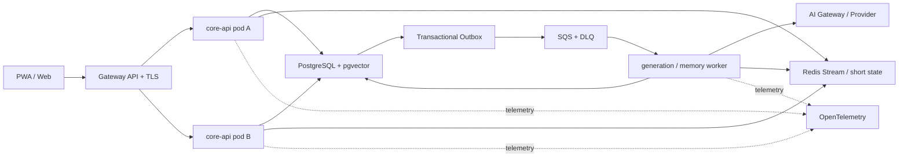
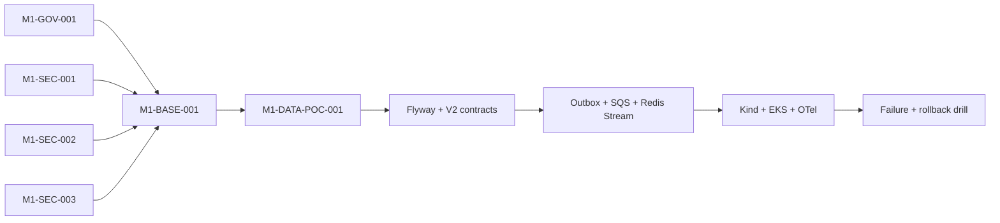

# Inner Cosmos H0/H1 决策表与 M1 执行包

> 文档性质：当前阶段的执行权威（Execution Authority）  
> 形成时间：2026-07-14  
> 当前 Horizon：H1 — NUS Cloud-native Showcase  
> M1 截止目标：2026-07-30  
> 代码基线：`feat/run006-aurora-self-understanding` / `66f2b5d`  
> 回归基线：Java 21.0.10，Maven Surefire 实际执行 613 tests，0 failures / 0 errors / 0 skipped  
> 适用关系：本文件不推翻 `00`—`06` 的长期愿景；若 M1 范围、顺序或验收口径冲突，以本文件为准。

---

## 0. 本轮只解决一个问题

Inner Cosmos 当前同时承载课程展示、产品 V2、AI 研究、移动端、新加坡发行和 Agent 工厂六条愿景。它们不能在同一个两周里同时成为主线。

本轮唯一问题是：

> **能否把一条真正属于 Inner Cosmos 的核心旅程，做成两副本、可中断、可恢复、可追踪、可确认记忆的云原生系统，并用可复现实验证明？**

### 0.1 三个 Horizon

| Horizon | 目标 | 当前状态 |
|---|---|---|
| H1 — NUS Cloud-native Showcase | 一条 Aurora 核心旅程可靠运行于 Kubernetes，并有故障、恢复、追踪和回滚证据 | **当前唯一执行主线** |
| H2 — Internal Alpha | Aurora、长期记忆、用户控制与安全达到组员可持续使用水平 | M1 后进入 |
| H3 — Closed Pilot / Public | 共鸣体、慢连接、移动 App、新加坡合规与运营闭环 | 暂不实施 |

### 0.2 产品北极星

Inner Cosmos 不是“让用户依赖一个越来越像人的 AI 伴侣”，而是：

> **一个 consent-first、由用户与 AI 共同维护的纵向自我理解系统（Co-authored Longitudinal Self Model）。**

Aurora 是反思协作者，不是产品主角。产品主角是用户对自己的理解、可撤回的记忆权威，以及在用户主动选择时与真实人的连接。

核心闭环固定为：

```text
表达
  → 支持性澄清
  → 用户确认“系统理解了什么”
  → 可编辑 Memory Receipt
  → 纵向主题与变化
  → 可选微行动
  → 可选 Human Bridge
```

---

## 1. H0：方向冻结决策表

`FROZEN` 表示除非新增证据触发 ADR，否则 Agent 不得自行改向；`HYPOTHESIS` 表示必须验证，不能伪装成事实；`PARKED` 表示本轮禁止进入实现主线。

| ID | 决策 | 状态 | M1 约束 / 解冻条件 |
|---|---|---|---|
| H0-01 | 产品定位为 consent-first longitudinal self-understanding system | FROZEN | 任何功能必须回答它如何增加理解、控制或真实连接 |
| H0-02 | Aurora 只能作为反思协作者，Aurora Self / Constitution / Emergence 只能下沉为后台 Behavior Policy | SUPERSEDED_PENDING_INNOVATION_ADR | W0 只修安全与工程红线；不得据此删除、降级或隐藏 Aurora 人格、关系状态、演化与用户体验能力 |
| H0-03 | 用户确认与纠正高于模型推断 | FROZEN | 权威顺序必须进入数据模型、检索和测试 |
| H0-04 | M1 只交付 Aurora → Memory Receipt 一条核心旅程 | FROZEN | 新功能不得挤占 M1 关键路径 |
| H0-05 | 初始目标用户为 18+ 的 NUS 团队/受控体验者 | HYPOTHESIS | H2 前通过访谈、可用性测试和安全评审验证 |
| H0-06 | 非医疗、非诊断、非紧急服务 | FROZEN | 所有入口统一说明与危机转介；不得做诊断性标签 |
| H0-07 | 反依赖优先 | FROZEN | 禁止排他、内疚诱导、拟人受伤、鼓励用户减少现实关系等行为 |
| H0-08 | 保留 Aurora、Memory Receipt、长期记忆、洞察型星空、记忆控制、微行动 | FROZEN | M1 只实现其中核心最小切片 |
| H0-09 | 共鸣体从静态卡片/有限问答起步，主动消息采用极低固定预算，M1 后默认保守收缩创新 | SUPERSEDED_PENDING_INNOVATION_ADR | 保留现有动态对话、人格、主动性、慢信、星空、匹配及领域模型；新方向由 Innovation ADR 决定 |
| H0-10 | 完整原生 App、全量 React 重写、广泛社交、复杂推荐和管理后台 | PARKED | H2/H3 重新立项 |
| H0-11 | 图数据库、Kafka、Service Mesh、Event Sourcing、多区域双活 | PARKED | 只有量化瓶颈和 ADR 才能解冻 |
| H0-12 | Agent 以四工作流、最多四并发推进 | FROZEN | 产品/架构；后端/数据/AI；平台/云；验证/安全/集成 |

### 1.0.1 2026-07-14 创新方向覆盖

用户已明确：当前 W0 继续关闭 Secret、生产配置、两处 IDOR 与升级基线，但不得借安全修复删除、降级或重构掉 Aurora proactive、Aurora Self / Constitution / Emergence、内部人格与关系演化、用户画像与心理建模、共鸣体动态对话与人格、慢信、星空和匹配领域能力。

与上述方向冲突的旧产品约束统一标记为 `SUPERSEDED_PENDING_INNOVATION_ADR`。在 Innovation ADR 被接受前，当前工程只允许最小安全修复并保持既有产品语义；若两者发生实质冲突，必须停止对应修改并报告。

### 1.1 功能组合

| 立即强化 | 受控实验 | M1 延后 |
|---|---|---|
| Aurora 文字/语音输入、自然意图选择、误解修复、Memory Receipt、记忆控制、统一安全、洞察型星空 | 共鸣体、慢信、周报、主动触达、不同支持模式 | Capacitor、完整 React、动态共鸣体、多用户社交图、推荐系统、新加坡真实发行 |

---

## 2. H1：不可逆技术决策表

| ID | 决策 | 状态 | 实施边界 / 退出标准 |
|---|---|---|---|
| H1-01 | Java 21 + Spring Boot 3.5.x | FROZEN | 不在 M1 升 Boot 4；全量回归不得退化 |
| H1-02 | Spring MVC + SSE | FROZEN | 不为“现代化”全量改 WebFlux；流恢复由 Job + Stream 语义承担 |
| H1-03 | Spring Modulith 约束模块化单体 | FROZEN | 一个代码库、多运行角色；按证据而非愿望拆微服务 |
| H1-04 | PostgreSQL + pgvector | CONDITIONAL | 48 小时 PoC 通过才切为 M1 单一事实源；失败则保留 MySQL，不双写 |
| H1-05 | MyBatis 保留并收口到 Repository | FROZEN | 不做 JPA 大改；领域服务不得新增直连 Mapper |
| H1-06 | Flyway 成为唯一 schema 演进机制 | FROZEN | 空库、旧版本升级、重复执行、回滚兼容均需证据 |
| H1-07 | Transactional Outbox + SQS + DLQ | FROZEN | 业务写入与 outbox 同事务；Worker 至少一次消费、业务效果恰好一次 |
| H1-08 | Redis 只承载短期状态与 token stream | FROZEN | PostgreSQL 保存最终事实；Redis 丢失不得造成已确认记忆丢失 |
| H1-09 | Spring Session Redis 作为 M1 过渡；OIDC 为产品目标 | FROZEN | M1 不同时完成完整身份重写；授权仍须服务层校验 |
| H1-10 | PWA first，Capacitor after Alpha | FROZEN | M1 只保证响应式 Web/PWA 核心旅程 |
| H1-11 | EKS + Terraform + Kustomize | FROZEN | 本地 Kind 先证明，EKS staging 再提供云证据；GitOps 控制器延后 |
| H1-12 | Gateway API，不锁死附件中的旧 bundle 号 | FROZEN | 按 EKS/Kubernetes/控制器兼容矩阵锁定版本并记录；2026-07 官方安装示例已为 v1.6.0 |
| H1-13 | OpenTelemetry 贯穿 HTTP → DB → Outbox → SQS → Worker → LLM | FROZEN | traceId、任务 ID、attempt、provider、耗时和成本可关联 |
| H1-14 | Spring AI 仅做适配/观测 Spike | CONDITIONAL | 不允许它成为第二套领域抽象或阻塞 M1 |
| H1-15 | 新加坡真实用户与跨境路由不进入 M1 | FROZEN | H2/H3 依据 `04` 的合规门禁重新批准 |

Gateway API 的 `GatewayClass`、`Gateway`、`HTTPRoute` 属于稳定 Standard Channel；实际 bundle 必须在部署 ADR 中记录，不能写“latest”。官方依据：[Gateway API introduction](https://gateway-api.sigs.k8s.io/docs/introduction/)、[installation guide](https://gateway-api.sigs.k8s.io/guides/getting-started/introduction/)。

---

## 3. M1 定义

> **M1：两副本、可中断、可追踪、可确认记忆的 Aurora 核心旅程运行在 Kubernetes staging。**

### 3.1 In Scope

- 用户登录并选择自然意图：“只想被听见 / 帮我理清 / 可以建议 / 帮我决定 / 帮我迈出第一步”；
- 文字输入；语音可先使用现有上传/转写能力，不追求完整原生录音；
- 支持计划在内部生成，用户界面只呈现自然交互；
- 异步、可追踪的 Aurora 生成 Job；
- Redis Stream 中继 token，SSE 使用 `Last-Event-ID` 重连；
- 对话完成后通过 outbox + SQS 生成且只生成一张 Memory Receipt；
- 用户可编辑、删除、确认或选择“不记住”；
- 用户纠正进入权威链并影响后续检索；
- Kind 双副本、EKS staging、故障实验、OTel、回滚证据；
- 中英文核心路径和统一危机边界的最小回归。

### 3.2 Out of Scope

- Capacitor、App Store / Google Play 上架；
- 全量 React 重写；
- 动态共鸣体、推荐系统、广泛社交、复杂运营后台；
- 新加坡真实用户、真实健康服务合作或生产跨境数据；
- 55 张表一比一搬迁；
- Kafka、Service Mesh、图数据库、多区域双活；
- Agent 自动批准生产发布。

### 3.3 诚实的恢复边界

API Pod 被删除时，客户端应能从 Redis Stream 续读已经产生的 token。若 Generation Worker 在上游 Provider 流中途被终止，系统**不能声称精确续写 Provider 未提交的 token**；它应关闭旧 attempt、创建新 attempt、重新生成，并保证只有一个成功 attempt 提交最终回复。

---

## 4. M1 最小目标架构



本地教学环境允许 PostgreSQL StatefulSet + PVC；EKS staging 使用 RDS PostgreSQL。两者不得被描述成同一可用性等级。

---

## 5. M1 可机器验收标准

每项证据必须写入 `evidence/m1/<acceptance-id>/`，至少包含命令、时间、环境、提交 SHA、原始输出和结论。截图只能补充，不能替代日志或测试报告。

### 5.1 产品与 AI

| ID | 验收条件 | 必需证据 |
|---|---|---|
| P-01 | 五种自然意图可选，缺省不强迫给建议 | API/组件测试 + 录屏 |
| P-02 | 用户可明确标记“你理解错了”，系统建立 repair 记录 | 契约测试 + 数据证据 |
| P-03 | 每个完成会话最多一张 Memory Receipt | 并发/重试集成测试 |
| P-04 | Receipt 可确认、修改、删除、不记住 | E2E + 审计记录 |
| P-05 | 用户修改高于所有模型推断，后续检索读取修订版 | 权威优先级测试 |
| P-06 | 关键回复通过反依赖与危机边界回归集 | 中英文 golden set 报告 |

### 5.2 安全与隐私

| ID | 验收条件 | 必需证据 |
|---|---|---|
| S-01 | 仓库、镜像、构建日志中无真实 Secret；已暴露密钥完成外部轮换 | secret scan + 人类轮换签字 |
| S-02 | Goodbye、Aurora Self 两处已知 IDOR 被修复 | 跨用户负向测试 |
| S-03 | 核心对象拥有 ownership matrix，controller 与 service 双层阻断越权 | 授权矩阵 + 自动化测试 |
| S-04 | 生产 profile 不创建 demo/弱口令账号，不允许 LLM Mock fallback | 启动测试 + 配置测试 |
| S-05 | Cookie、CSRF、CORS、Actuator、数据库 TLS 具备 staging 安全基线 | 配置扫描 + HTTP 证据 |
| S-06 | Memory Receipt 的读取、编辑、删除均记录主体和版本 | 审计查询证据 |

### 5.3 数据与迁移

| ID | 验收条件 | 必需证据 |
|---|---|---|
| D-01 | Flyway 是唯一生产迁移入口，禁用运行时 `ALTER TABLE` 初始化器 | 架构测试 + 启动日志 |
| D-02 | 空库安装、上一基线升级、重复启动均通过 | 三组迁移日志 |
| D-03 | PostgreSQL PoC 若通过，4 类核心对象与向量检索满足门限 | PoC 报告；否则 MySQL ADR |
| D-04 | message + generation_job + outbox_event 同事务 | 故障注入集成测试 |
| D-05 | 用户纠正保留 evidence、revision、actor、reason | 数据契约测试 |
| D-06 | 发布 N 与 N-1 应用/Schema 兼容，回滚不丢确认数据 | rollback drill |

### 5.4 可靠性与 Kubernetes

| ID | 验收条件 | 必需证据 |
|---|---|---|
| R-01 | core-api 两副本，无 Pod 本地事实状态 | 两副本 E2E |
| R-02 | 删除当前 API Pod，客户端重连并从最后事件继续；消息不重复 | 自动化故障脚本 + 录屏 |
| R-03 | 删除 Worker，任务重试；旧 attempt 不提交，最终业务效果一次 | Job/DB/SQS 证据 |
| R-04 | poison message 到达 DLQ 且可按 runbook 重放 | DLQ 演练 |
| K-01 | GatewayClass/Gateway/HTTPRoute、Service、EndpointSlice 解析正常 | conformance/smoke 输出 |
| K-02 | startup/readiness/liveness、`preStop`、termination grace 正确 | 探针与终止实验 |
| K-03 | PDB、topology spread、requests/limits 生效 | manifest policy + 调度证据 |
| K-04 | API 使用 HPA；Worker 按队列积压使用 KEDA 或等价非 CPU 指标 | 负载曲线 + 扩缩容记录 |
| K-05 | NetworkPolicy 与 Pod Identity/最小权限生效 | 拒绝性测试 |

### 5.5 可观测与交付

| ID | 验收条件 | 必需证据 |
|---|---|---|
| O-01 | 单个 trace 可关联 HTTP、DB、outbox、SQS、Worker、LLM | trace export |
| O-02 | dashboard 展示成功率、p95、队列年龄、重试、DLQ、token 与成本 | dashboard JSON + 截图 |
| O-03 | 日志不包含 P0 原文、Secret 或完整敏感 Prompt | 日志扫描 |
| V-01 | Kind 可由声明式配置从零重建 | CI/脚本日志 |
| V-02 | Terraform 可重建 EKS staging，计划无未解释漂移 | plan/apply evidence |
| V-03 | 发布、故障、恢复、回滚均有 runbook 且由非 Builder 复核 | drill ledger |
| V-04 | 全量 613 基线与新增测试全绿，0 skipped | Surefire 报告 |

---

## 6. 课程展示脚本（17 步）

1. 展示提交 SHA、环境和双副本状态；
2. 用户登录；
3. 选择“帮我理清”；
4. 输入文字或语音；
5. Aurora 开始流式回复；
6. 定位当前承载连接的 API Pod 并删除；
7. 客户端使用 `Last-Event-ID` 重连，已显示内容不重复；
8. 用户结束会话；
9. 展示 message、generation job、outbox 的事务性记录；
10. Worker 从 SQS 获取记忆任务；
11. 删除 Worker 或注入 Provider 失败；
12. 展示旧 attempt 关闭、重试以及最终只提交一次；
13. 用户看到唯一 Memory Receipt；
14. 用户修改一条 AI 推断并保存为权威版本；
15. 时间线/星空读取修订后的信息；
16. 用一条 trace 展示 HTTP → DB → Outbox → SQS → Worker → LLM；
17. 展示 dashboard、告警、兼容性回滚结果和成本边界。

---

## 7. 回归基线的唯一口径

| 指标 | 当前值 | 用途 |
|---|---:|---|
| Surefire 实际执行测试 | **613** | M1 回归权威数字 |
| Failures / Errors / Skipped | **0 / 0 / 0** | 当前基线 |
| 测试源码文件 | 80 | 资产盘点 |
| `@Test` 等源码注解静态计数 | 580 | 只用于盘点，不等于实际执行数 |

原因：参数化测试、动态展开和测试引擎会使实际执行数不同于源码注解数。所有迁移门禁以 Surefire XML/终端汇总为准。

---

## 8. 执行波次与 Work Package 图

### 8.1 时间盒

| 波次 | 日期 | 目标 | 退出门 |
|---|---|---|---|
| W0 | 07-14—07-16 | 冻结、红线、安全、真实基线 | 无已知 Critical/High；密钥轮换完成；613+ 新测试全绿 |
| W1 | 07-17—07-20 | 数据契约、Flyway、PostgreSQL 48h PoC | 数据库单一事实源 ADR；空库/升级通过 |
| W2 | 07-21—07-24 | Outbox/SQS、Redis Stream、幂等、多副本语义 | API/Worker 中断测试通过 |
| W3 | 07-25—07-28 | Kind、EKS、Gateway API、OTel、扩缩容 | M1 在 staging 全链路通过 |
| W4 | 07-29—07-30 | 故障、回滚、报告、展示 | 17 步脚本与证据包完成 |

### 8.2 依赖图



### 8.3 首批可领取包

| 顺序 | Package | 工作流 | 路径所有权 | 是否可并行 |
|---:|---|---|---|---|
| 1 | `M1-GOV-001` | 产品/架构 | 对齐文档、工作包、ADR 模板 | 与 SEC-001/2/3 并行 |
| 1 | `M1-SEC-001` | 平台/安全 | 配置、seed、secret scan | 与 SEC-002/3 并行 |
| 1 | `M1-SEC-002` | 后端/安全 | Goodbye 相关类与测试 | 与 SEC-001/3 并行 |
| 1 | `M1-SEC-003` | 后端/安全 | Aurora Self continuity 相关类与测试 | 与 SEC-001/2 并行 |
| 2 | `M1-BASE-001` | 验证/集成 | `pom.xml`、CI、回归证据 | 四个 W0 包合入后 |
| 3 | `M1-DATA-POC-001` | 数据/架构 | 隔离 PoC、ADR，不直接迁生产表 | BASE 通过后 |

包的完整可执行定义位于 `docs/work-packages/m1/`。任何 Agent 一次只能领取一个包；没有 owner、base SHA、owned paths、验收命令和证据目录的工作不得开始。

---

## 9. PostgreSQL + pgvector 48 小时决策门

### 9.1 PoC 只做四类对象

- `conversation_session` / `message` / `support_plan` / `interaction_feedback`；
- `memory_item` / `memory_evidence` / `memory_revision` / `memory_embedding`；
- `consent_grant` / `retrieval_audit` / `retention_policy`；
- `outbox_event` / `ai_job` / `job_attempt`。

### 9.2 通过条件

1. Java 21 + MyBatis 对 PostgreSQL CRUD、事务、JSONB/数组映射无阻断；
2. pgvector 完成带 user/consent/retention filter 的检索，不能先全局相似度后在应用层过滤；
3. 迁移工具可重复创建 PoC schema；
4. 10k/100k 合成 memory_item 下 p95 达到团队预设阈值并保留原始报告；
5. RDS Singapore 区域、备份、加密与预算可接受；
6. 团队能说明从 MySQL 的迁移、双写禁止、回滚窗口和数据核对方法。

任一硬阻断在 48 小时内无法关闭，则记录 ADR：M1 保留 MySQL 为唯一事实源，向量能力使用可替换接口延后；禁止为赶进度建立 MySQL/PostgreSQL 双事实源。

---

## 10. Agent 运行协议

### 10.1 四工作流

1. **产品/架构**：产品契约、Journey、ADR、API/Memory 语义；
2. **后端/数据/AI**：授权、领域、迁移、异步、Memory Receipt、AI policy；
3. **平台/云**：容器、Kind、Terraform、EKS、队列、观测与成本；
4. **验证/安全/集成**：独立测试、故障注入、威胁模型、证据和集成门。

### 10.2 每个包的强制状态

```text
READY → CLAIMED → IMPLEMENTED → VERIFIED → INTEGRATED
                    ↓             ↓
                  FAILED        REJECTED
```

- Builder 不能把自己的实现标记为 `VERIFIED`；
- 同一 owned path 同一时刻只有一个 Builder；
- 每次集成先 rebase 到指定 base SHA，再跑包级测试和全量回归；
- Agent 可自动修复、测试和准备 PR，但不得自动批准真实生产发布、密钥轮换、合规结论或真实用户开放。

### 10.3 停止条件

遇到以下任一项，停止扩展功能并回到红线修复：

- 发现真实 Secret 仍可用或进入历史、镜像、日志；
- 新增/遗留跨用户读取或写入；
- 613 基线出现失败或 skipped；
- Schema 迁移无法从空库与上一版本重现；
- 系统将 Mock/Fallback 结果伪装成真实 Provider 成功；
- API/Worker 中断导致重复最终消息或重复 Memory Receipt；
- 无法证明用户纠正覆盖模型推断；
- 对 Provider 中断声称不真实的“精确 token 续传”；
- EKS 费用、跨境数据或真实用户范围越过已批准边界。

---

## 11. M1 完成定义

只有同时满足以下条件才能声明 M1 完成：

1. 本文 P/S/D/R/K/O/V 全部 `PASS`，不存在人工口头豁免；
2. 17 步展示脚本在全新环境成功执行并有原始证据；
3. 613 基线与新增测试 0 failure / 0 error / 0 skipped；
4. 两处已知 IDOR、生产 seed/弱口令、Secret 与 prod fallback 红线关闭；
5. 数据库路线由 ADR 单选，Flyway 是唯一生产迁移入口；
6. 两副本、API Pod 删除、Worker 删除、DLQ、回滚均完成演练；
7. 非 Builder 完成独立验证；
8. 团队实际体验核心旅程并把问题进入 H2 backlog；
9. 未把 H2/H3 工作包装成 M1 已完成能力。

M1 之后才进入 Internal Alpha：届时重点不是继续堆云组件，而是长期记忆质量、程序性偏好、误解修复、纵向洞察、反依赖、安全体验和组员持续使用反馈。
