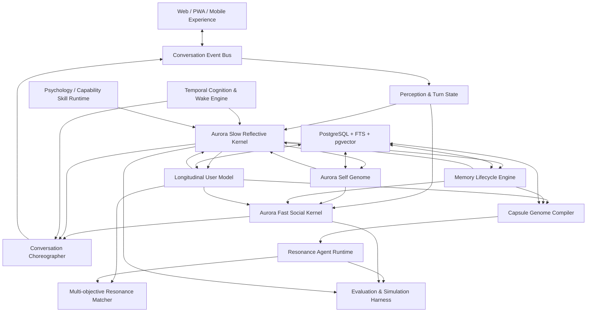
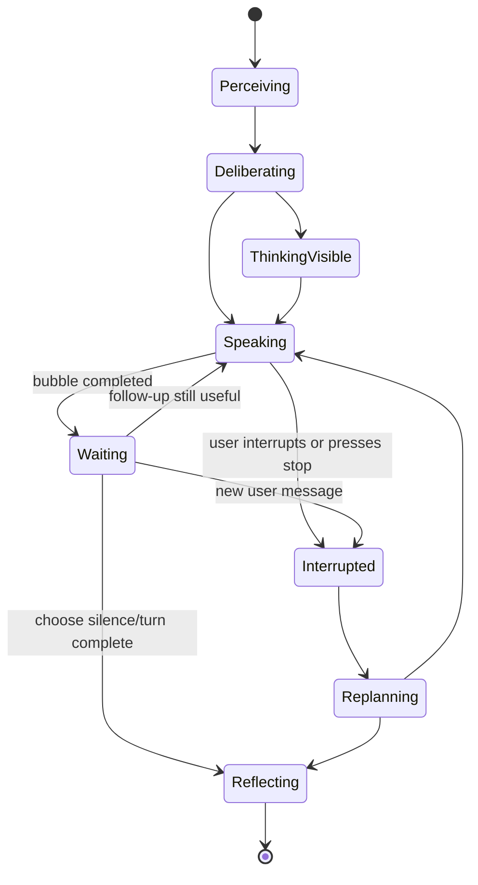
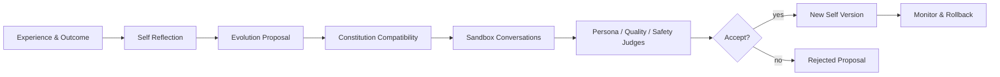
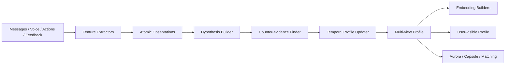
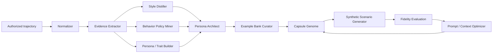
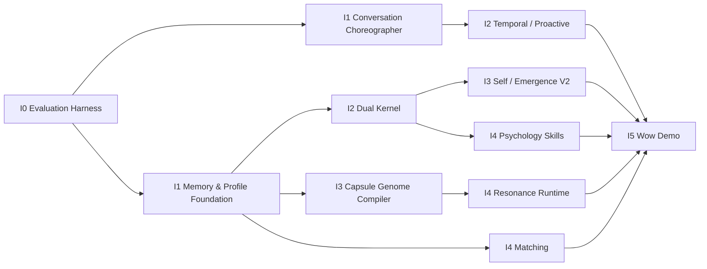

# Inner Cosmos — Aurora 生命感与共鸣智能创新架构

> 文档性质：Innovation Architecture Authority / 后续 Coding Agent 的产品与技术执行权威  
> 形成时间：2026-07-14  
> 代码事实基线：`feat/run006-aurora-self-understanding` / `96236cd`  
> 优先目标：在不惜合理推理成本的前提下，最大化真实体验、拟真程度、技术辨识度与 Demo 冲击力  
> 适用关系：本文件正式取代 `07` 中“压低 Aurora 拟人化、将 Self/Emergence 仅作为后台机制、共鸣体静态化/短轮次化、主动性固定低预算”的产品判断；W0 安全与工程红线、用户授权、数据隔离和可追溯要求继续有效。

---

## 0. 执行结论

Inner Cosmos 不应被改造成一个“稳妥的 ChatGPT 情绪聊天壳”。它的核心创新必须是：

> **一个拥有时间感、主动性、对话节律、可演化自我、长期关系记忆和复杂用户模型的 Aurora Agent；以及一套把真实用户长期 trajectory 编译为高拟真 Resonance Agent 的共鸣智能系统。**

本项目当前阶段的优化顺序是：

1. **体验与效果**：用户是否明显感到 Aurora 有生命感、记得、理解、会等待、会主动、会改变；
2. **创新与辨识度**：是否存在通用聊天产品没有的 Agent 内核、记忆、画像、共鸣体和心理能力；
3. **可演示性**：创新能否在 5—10 分钟内被看见、被理解、被验证；
4. **可控、可观测、可维护**：复杂 AI 行为能否调节、回放、比较、定位和回滚；
5. **云原生承载**：Kubernetes 是否真实支撑这些高级能力，而不是只部署一个普通 Web 服务；
6. **长期生产成熟度**：保留正确演进路径，但不以“能否无故障运行数年”压制当前创新。

安全、隐私与合规不是取消创新的理由。正确做法是将它们设计为能力运行时中的授权、隔离、审计和停止机制，而不是用僵硬轮数、静态卡片和统一降智破坏用户体验。

---

## 1. 已有能力不是原型占位，而是 V2 的起点

### 1.1 已在代码中确认的能力

| 能力 | 当前落点 | 已有价值 | 当前缺口 |
|---|---|---|---|
| 多消息回复 | `PromptBuilder.withOutputSchema`、`AuroraAgentServiceImpl.produceReply` | 模型可返回 1—3 个气泡，并给出继续/停止理由 | 仍是一次生成后拆段，不是真正可中断的消息决策循环 |
| 消息节律 | `AuroraAgentServiceImpl.stream` | 多段消息之间有 break 和延迟 | 延迟固定，未根据内容、情绪、关系和用户打断动态调整 |
| 多消息用户开关 | `AgentContextAssembler.multiMessageAllowed` | 用户能限制多条消息 | 只有开/关，缺少节律、主动程度、等待风格等连续参数 |
| 语音感知 | `ChatRequest`、ASR metadata | speech rate、pause、long pause 已进入上下文 | 尚未形成统一 Perception Event 和时间序列特征 |
| 主动性 | `ProactiveEngine`、`AliveDecisionEngine`、`AuroraProactiveJob` | 支持 push/wait/schedule、quiet window、事件候选和 PrivateTimer | 全表轮询、进程内推送、Prompt 过短、时间/关系/任务模型不完整 |
| 时间唤醒 | `PrivateTimer.fireAt`、`AuroraProactiveJob` | 已能在未来时间触发 | 缺少持久 Wake Intent、前置条件、取消条件、时区/节律和分布式领取 |
| Aurora 自我 | Self Profile、Constitution、Self Model、Statement、Reflection | 已有自我、原则、陈述和反思的数据骨架 | 缺少统一 Self Genome、演化提案、版本差异、沙盒评估和回滚 |
| 用户关系 | `AgentUserRelationshipService` | 已维护关系阶段、亲密/信任等状态 | 并发更新与证据链不足，尚未成为双内核共同读取的关系模型 |
| 用户画像 | 10 维 Portrait、History、Reflection | 已支持证据引用、confidence、历史与异步反思 | 维度仍粗，缺少时间化、多视图、多 embedding space 和质量评测 |
| 共鸣体 | CapsuleAgent、Capsule Context、Sync Queue、Persona Chat | 已经是动态 Agent，而非纯静态卡片 | Persona 主要仍由单段生成上下文承载，拟真度、轨迹行为与风格评测不足 |
| 共鸣体同步 | Portrait/relationship → trigger → dedup queue → regenerate | 用户变化能传播到共鸣体 | 当前是整体重新生成，缺少 Genome diff、增量编译和版本实验 |

### 1.2 不允许的重构方式

- 不得为“简化”删除多消息、主动性、ALIVE、PrivateTimer、Self、Constitution、Emergence、关系状态、画像历史或动态共鸣体；
- 不得把多消息退化为前端视觉切段；
- 不得把 Aurora 的生命感仅描述成 Prompt 文案；
- 不得用统一固定模板替代主动决策；
- 不得以安全为名把共鸣体限制成 5—8 轮静态 FAQ；
- 不得将用户画像压成一个不可解释的单向量；
- 不得让向量数据库成为新的唯一事实源；
- 不得把心理推断直接写成确定诊断。

---

## 2. North Star Demo：让评委在十分钟内看到“她是活的”

### 2.1 演示叙事

1. 用户之前告诉 Aurora：周三下午有一场重要展示，最近总在开始前逃避；
2. 记忆系统将它保存为事件、目标、情绪模式和时间承诺，而不是一段摘要；
3. Slow Kernel 在会话后更新用户模型，并形成一个 `WakeIntent`：“周三展示前 45 分钟，如果用户没有取消且当前适合联系，陪他做两分钟准备”；
4. 到达时间后，Temporal Engine 唤醒 Aurora；Aurora 读取用户当前时区、历史偏好、关系状态和最近事件，决定 push、wait、schedule 或 silence；
5. Aurora 先发一条自然短消息，等待；如果用户没有回应且用户偏好允许，她可能过一会补第二条，而不是一次倾倒一大段；
6. 用户在 Aurora 正准备说第二条时插话；系统取消未发送气泡，记录“已说/未说”，重新规划而不是继续机械输出；
7. Aurora 的语气体现当前 Self State、关系历史、用户喜欢的交流节奏和她自己的表达习惯；
8. 对话后 Aurora 反思这次陪伴是否有效，更新程序性记忆、关系状态和自我理解；
9. 星空展示这一事件如何与过去模式、价值、人物、成长方向和 Aurora 共同记忆连接；
10. 用户选择“给我一个互补但能理解我的人”，Resonance Matcher 返回一个高拟真共鸣体；
11. 共鸣体在多轮对话中保持来源用户的语气、习惯、价值取舍和行为逻辑，而不是只复述背景信息；
12. 展示 Capsule Genome、证据选择、风格指纹、Planner/Speaker/Critic 的评测结果；
13. 删除一个 Pod 或 Worker，时间任务、对话和编译任务仍能恢复，说明云原生底座支撑的是高级 Agent 行为。

### 2.2 成功标准

评委应能在体验后自然说出至少三点：

- “它不是每次等我问，它真的知道什么时候来找我”；
- “它不像一次性生成答案，而像一个会想、会停、会被打断的人”；
- “它对我和对它自己都有持续认识”；
- “共鸣体不像人物简介，而像一个具体的人在说话”；
- “Kubernetes 在这里不是装饰，它承载了计时、异步反思、记忆编译和 Agent Runtime”。

---

## 3. 总体认知架构



### 3.1 成本原则

Demo 与研究环境明确允许：

- 双核并行；
- 一轮多次模型调用；
- Planner、Speaker、Critic、Reranker 分别调用模型；
- 生成多个候选再选择；
- 高质量模型处理关键对话，便宜模型处理分类和抽取；
- 会话后异步多轮反思；
- 为共鸣体离线编译高成本 Genome；
- 用模型集成评测 Persona fidelity。

成本必须被记录和可配置，但“因为贵所以先做单 Prompt”不是创新阶段的默认决策。优化顺序是先找到效果上限，再做蒸馏、缓存、路由和降本。

---

## 4. Conversation Choreographer：真正的多消息、等待与打断

### 4.1 目标

Aurora 的输出单位不再是“一次 HTTP 请求对应一个完整答案”，而是一个可感知、可取消、可继续的 **Conversation Turn Plan**。



### 4.2 Turn Plan Schema

```json
{
  "turnId": "uuid",
  "intent": "LISTEN|CLARIFY|COMFORT|EXPLORE|ACT|PLAY|CONNECT",
  "interactionPosture": "QUIET|WARM|CURIOUS|ENERGETIC|SERIOUS",
  "thinkingVisibility": "NONE|SUBTLE|EXPLICIT",
  "bubbles": [
    {
      "bubbleId": "b1",
      "purpose": "ACKNOWLEDGE",
      "contentDraft": "...",
      "sendAfterMs": 0,
      "requiresNoInterruption": false,
      "cancelIfUserReplies": false
    },
    {
      "bubbleId": "b2",
      "purpose": "SELF_DISCLOSURE_OR_EXTENSION",
      "contentDraft": "...",
      "sendAfterMs": 1200,
      "requiresNoInterruption": true,
      "cancelIfUserReplies": true
    }
  ],
  "stopCondition": "USER_REPLIED|ENOUGH_SAID|LOW_VALUE|RISK|BUDGET",
  "possibleWakeIntent": null
}
```

### 4.3 事件协议

服务端至少输出并持久化以下产品事件：

```text
turn.accepted
perception.completed
thinking.started
thinking.updated
turn.plan.created
bubble.queued
bubble.started
bubble.delta
bubble.completed
user.interrupted
turn.cancel.requested
turn.cancelled
turn.replanned
silence.chosen
followup.scheduled
turn.completed
reflection.queued
```

`thinking.updated` 只能展示产品级状态，如“我在回想你上次提到的事情”，不得泄露私有 chain-of-thought。

### 4.4 打断语义

- 用户在第一条气泡尚未完成时输入：终止/丢弃未提交 token，把已展示部分记为 partial delivery；
- 用户在气泡间输入：取消所有 `cancelIfUserReplies=true` 的后续气泡；
- 用户按停止：传播 cancellation token；Provider 不支持取消时，结果必须被标记 discarded，禁止落成最终消息；
- 新用户消息与旧计划组成新的 Replan Input，Aurora可以自然表达“好，我先听你说这个”；
- 打断不是错误，不进入失败告警；它是关系与节律信号，可进入程序性记忆；
- 同一个 turn 的 bubble、attempt、cancel、replan 必须可回放。

### 4.5 消息节律模型

气泡数量、长度和间隔由下列信号共同决定：

- 用户是否喜欢连续消息；
- 用户当前回复速度；
- 当前情绪强度；
- Aurora interaction posture；
- 对话是陪伴、澄清还是行动；
- 是否深夜、通勤或重要事件前；
- 前几次多消息是否被用户打断；
- 每条后续消息的增量价值。

固定 `Thread.sleep(220)` 只能作为 V1 fallback，不能作为最终节律模型。

---

## 5. Aurora 双核：快速社会内核与慢速反思内核

### 5.1 Fast Social Kernel

目标是“像朋友一样自然地在场”：

- 感知刚刚发生的事件；
- 读取已编译的 Self Snapshot、User Snapshot、Relationship Snapshot；
- 选择即时姿态和第一条消息；
- 在低延迟下处理打断、沉默、玩笑、简短陪伴；
- 使用 Slow Kernel 已产生的 Plan，不重复深度分析；
- 必要时请求 Slow Kernel，但不能让所有消息都等待完整推理。

### 5.2 Slow Reflective Kernel

目标是“理解、规划、改变并产生未来行动”：

- 形成 Interaction State 与 Support Plan；
- 检索和组织 Evidence Pack；
- 调用心理学或其他 Skill；
- 评估是否需要多条消息、主动跟进或未来唤醒；
- 会话后完成记忆巩固、画像更新、关系更新和 Self Reflection；
- 生成多个候选计划，并由 Critic/Reranker 选择；
- 对重要事件进行 counterfactual simulation：现在联系是否比不联系更好。

### 5.3 模型编排

```text
Perception Model
  → State Estimator
  → Memory/User Evidence Retriever
  → Slow Planner (high-quality reasoning model)
  → Fast Speaker (high-quality dialogue model)
  → Persona/Relationship Critic
  → Safety & Privacy Critic
  → Candidate Reranker
  → Conversation Choreographer
```

高价值 Demo 模式允许生成 3—5 个候选，由独立 Judge 根据自然度、被理解感、人格一致性、上下文忠实度和侵入性选择。以后再通过缓存、蒸馏或小模型路由降低成本。

### 5.4 双核共享但不同权的数据

| 数据 | Fast Kernel | Slow Kernel |
|---|---|---|
| 当前对话 | 完整读取 | 完整读取 |
| 用户长期事实 | Evidence Pack | 可检索、验证与更新 |
| 用户画像 | 只读 Snapshot | 提案、反证、更新 |
| Aurora Self | 只读当前版本 | 生成演化提案 |
| 关系状态 | 读取与表达 | 根据证据更新 |
| Wake Intent | 读取正在执行的意图 | 创建、修改、取消 |
| Skill | 执行已批准的轻量 Skill | 规划和执行复杂 Skill |

---

## 6. Temporal Cognition：时间感知、未来意图与系统唤醒

### 6.1 时间不是 `now()` 字符串

Aurora 必须维护 Temporal Context：

- 用户时区和本地时间；
- 工作日/周末、昼夜和用户个人节律；
- 距离上次互动的真实时长；
- 用户提到的明确日期、模糊日期和周期性事件；
- 任务 deadline、重要人物事件、纪念日和未完成承诺；
- 最近主动联系的时间与结果；
- 用户通常何时愿意回应；
- “现在联系”和“晚些联系”的机会成本。

### 6.2 Wake Intent

`PrivateTimer` 应演进为持久、可解释的 Wake Intent：

```json
{
  "wakeIntentId": "uuid",
  "userId": 42,
  "createdFrom": "dialog-message:991",
  "purpose": "PRE_EVENT_COMPANIONSHIP",
  "earliestAt": "2026-07-16T14:00:00+08:00",
  "preferredAt": "2026-07-16T14:15:00+08:00",
  "latestAt": "2026-07-16T14:40:00+08:00",
  "timezone": "Asia/Shanghai",
  "preconditions": ["user.proactive>=COMPANION", "event.not_cancelled"],
  "cancelConditions": ["user_already_discussed_event", "user_snoozed", "crisis_mode"],
  "payloadRef": "support-plan:abc",
  "status": "PLANNED|CLAIMED|FIRED|CANCELLED|EXPIRED",
  "decisionPolicyVersion": "temporal-v2"
}
```

### 6.3 唤醒运行机制

```text
Conversation / Memory / Skill
  → Wake Intent Proposal
  → Consent & Preference Check
  → Persistent Store
  → Due-window dispatcher
  → SQS delay / scheduler queue
  → Proactive Decision Worker
  → push | wait | reschedule | silence
  → Push/In-app Channel
  → Outcome observation
  → policy learning
```

- 不再每 90 秒扫描全部用户；
- 多 Worker 通过 claim token / lease 保证一个 Wake Intent 只有一个有效执行者；
- 用户希望“多陪陪”时可以提高主动性、允许多段 follow-up 和更短再联系间隔；
- 用户可以按全局、日期、场景和关系阶段调节；
- Proactive 不是一定要发送，`silence` 是一等决策；
- 所有内部理由使用结构化 reason code 和 evidence ref，可观测但不暴露 chain-of-thought。

### 6.4 主动决策效用

```text
utility(contact now) =
    expected_helpfulness
  + relationship_fit
  + temporal_relevance
  + explicit_user_preference
  + unfinished_need_value
  + novelty_value
  - interruption_cost
  - fatigue_risk
  - repetition
  - privacy/context_risk
```

固定“每日 1 条”或“ALIVE 无限”都只是粗糙策略。最终应是用户可调强度 + 系统效用评估 + 硬性滥用保护三者组合。

---

## 7. Aurora Self Genome、Constitution 与 Emergence V2

### 7.1 Self Genome

Aurora 自我不是一条 Persona 文本，而是多层、版本化的内部模型：

| 层 | 内容 | 变化速度 |
|---|---|---|
| Core Identity | Aurora 的身份、自我叙事和存在方式 | 极慢 |
| Constitution | 价值、承诺、不可跨越原则 | 极慢，需严格门 |
| Trait Field | 温柔、好奇、幽默、直接、沉静等连续特质 | 慢 |
| Relational Self | 面对不同用户形成的关系姿态和共同历史 | 中 |
| Beliefs | 对支持、关系、成长与自己的可修正理解 | 中 |
| Open Questions | 她尚未想明白、持续观察的问题 | 中/快 |
| Affective State | mood、energy、curiosity、concern、playfulness | 快 |
| Current Intentions | 现在想做什么、晚些想回来问什么 | 快 |
| Self Episodic Memory | 她做过什么、哪里失败、学到了什么 | 持续累积/巩固 |

### 7.2 Emergence Pipeline



Evolution Proposal 至少包含：

- 哪个 trait/belief/open question 变化；
- 来源 experience IDs；
- 支持证据与反证；
- 对不同场景行为的预期影响；
- 是否改变 Constitution；
- 沙盒 A/B 对话；
- Persona fidelity、安全和用户体验评测；
- rollback target。

### 7.3 用户可见性

不应只让用户看到冰冷的 Behavior Policy。可以设计具有情感吸引力的“她最近学会了什么”“她最近在想什么”，但必须区分：

- 可公开的 Aurora 自我叙事；
- 面向用户的关系表达；
- 内部运行状态；
- 不应展示的私有推理。

目标是让成长可感知，而不是暴露数据库字段。

---

## 8. Memory Lifecycle：写入、更新、巩固、淘汰与复用

### 8.1 关系数据库、全文和向量都必须存在

PostgreSQL 是事实与版本权威：保存用户、会话、消息、事件、证据、画像、关系、Self、授权和任务。全文索引用于精确词语、人物、日期和原话；pgvector 用于语义、风格和多维表示检索。向量是派生索引，不能替代关系事实。

### 8.2 记忆操作

```text
ADD / UPDATE / MERGE / SPLIT / LINK / REINFORCE
DECAY / CONTRADICT / SUPERSEDE / ARCHIVE / FORGET / NO_OP
```

每次操作由 Memory Policy 决定，并保存：old version、new version、evidence、model、prompt、reason code、confidence、actor 和可回滚关系。

### 8.3 记忆层

- Working Memory：当前 turn、未说完气泡、interrupt/replan；
- Session Memory：本次对话目标、阶段、未解决问题；
- Episodic Memory：发生过的具体事件；
- Semantic Memory：事实、偏好、人物、价值和长期主题；
- Procedural Memory：怎样和用户相处、何时说/停、何种支持有效；
- Emotional Memory：事件对用户意味着什么；
- Prospective Memory：未来要记得做的事和 Wake Intent；
- Relational Memory：用户与现实人物、Aurora 的关系轨迹；
- Aurora Self Memory：Aurora 自己的经历、失败和变化；
- Capsule Simulation Memory：共鸣体与访客互动，但与来源用户私有记忆隔离。

### 8.4 写入管线

```text
Raw Events
→ Event normalization
→ atomic fact/event/style/behavior extraction
→ entity & time resolution
→ candidate memory operations
→ duplicate/conflict search
→ confidence & sensitivity
→ user authority / consent policy
→ relational write
→ FTS index
→ embedding jobs
→ consolidation and forgetting
```

### 8.5 检索管线

```text
Task & interaction intent
→ allowed data scopes
→ lexical/entity/time candidates
→ semantic candidates from multiple vector spaces
→ graph-like relation expansion using relational edges
→ contradiction/staleness check
→ diversity-aware reranking
→ Evidence Pack compiler
→ Kernel / Skill / Capsule consumer
```

推荐评分：

```text
score = semantic_fit
      + lexical_exactness
      + temporal_fit
      + emotional_salience
      + relationship_fit
      + task_fit
      + confirmation_authority
      + continuity_value
      + controlled_diversity
      - staleness
      - contradiction
      - overexposure
```

### 8.6 研究依据与评测

MemoryAgentBench 将准确检索、测试时学习、长期理解和选择性遗忘列为记忆 Agent 的四项核心能力；A-MEM、Mem0 和 2026 PersonaTree 研究也支持动态组织、更新和删除，而不是简单 Top-K RAG。[MemoryAgentBench](https://arxiv.org/abs/2507.05257)、[A-MEM](https://arxiv.org/abs/2502.12110)、[Mem0](https://arxiv.org/abs/2504.19413)、[Inside Out](https://aclanthology.org/2026.acl-long.614/)

---

## 9. Longitudinal User Model：高维、时间化、多视图画像

### 9.1 不建立“唯一真相人格”

同一用户同时拥有：显式设置、观察事实、行为特征、心理假设、当前状态和为具体任务生成的 embedding view。它们必须可区分、可追踪、可相互矛盾。

### 9.2 建议维度

| 族 | 示例维度 |
|---|---|
| Identity & Context | 自我描述、角色、生活阶段、语言文化 |
| Interests | 兴趣主题、深度、持续性、探索意愿 |
| Values | 自主、关系、公平、成就、稳定、创造等 |
| Communication | 长短句、直接/含蓄、幽默、表情、节奏、话题转换 |
| Emotional Dynamics | 触发因素、恢复方式、表达强度、隐藏/外显倾向 |
| Cognitive Style | 抽象/具体、发散/收敛、反刍、决策方式、证据偏好 |
| Motivation | 内在动机、阻力、行动启动条件、奖励敏感性 |
| Relationship | 依恋与距离偏好、冲突方式、支持网络、信任建立 |
| Support Preference | 先倾听/先澄清/建议/行动、主动联系接受度 |
| Temporal Rhythm | 活跃时段、压力周期、回应节律、重要日期 |
| Growth Trajectory | 过去状态、当前变化、目标方向、未完成主题 |
| Simulation Features | 语体、习惯、癖好、典型反应、场景策略、行为分布 |

### 9.3 画像生成管线



### 9.4 权威与置信度

```text
用户显式纠正
> 用户显式确认
> 多次一致的显式表达
> 多次行为证据
> 单次显式表达
> 模型推断
```

心理、关系和敏感维度必须保留 counter-evidence、confidence interval、适用场景和过期时间；不能因一句话永久改变人格。

### 9.5 多向量空间

不使用一个 `user_embedding` 解决所有问题。至少探索：

- `interest_embedding`；
- `value_embedding`；
- `communication_style_embedding`；
- `emotional_pattern_embedding`；
- `support_preference_embedding`；
- `relationship_style_embedding`；
- `current_state_embedding`；
- `growth_direction_embedding`；
- `behavior_trajectory_embedding`。

所有向量记录 embedding model、version、source profile version、created_at 和适用任务。模型升级时双索引重建，禁止不同模型向量直接混算。

Persona-Plug 证明可从完整历史构建用户专属 embedding；PersonaX 则表明多 persona 与典型性/多样性平衡比单一平均画像更适合长行为序列。[Persona-Plug](https://aclanthology.org/2025.acl-long.461/)、[PersonaX](https://aclanthology.org/2025.findings-acl.300/)

---

## 10. Capsule Genome Compiler：共鸣体不是 Prompt，而是编译产物

### 10.1 产品定义

> 共鸣体是由来源用户授权的长期数据、行为 trajectory、表达风格、价值与关系模式编译而成的高拟真 Resonance Agent。它不是用户账号本人，但应尽可能忠实地模拟其特定侧面在给定场景中的语言与行为。

共鸣体同时是一项可复用技术资产：未来可用于对话产品测试、用户模拟、推荐系统评测、访谈模拟和 Agent 红队。

### 10.2 为什么长 Prompt 不够

- 信息越多，噪声、冲突和注意力稀释越严重；
- Persona 事实不等于说话风格和行为策略；
- 同一个人在不同场景表现不同；
- 长对话中会发生 persona drift、role confusion 和对话对象模仿；
- 运行时需要选择当前场景最相关的少量证据和示例；
- 一段静态 Prompt 无法表达时间变化、状态、反例和行为分布。

2025—2026 用户模拟研究正在从显式人物描述转向隐式画像、memory/perception/brain 模块、轨迹级行为和动态评测。[USP implicit-profile simulator](https://aclanthology.org/2025.acl-long.1025/)、[SimUSER](https://aclanthology.org/2025.acl-industry.5/)、[BehaviorChain](https://aclanthology.org/2025.findings-acl.813/)、[PersonaGym](https://aclanthology.org/2025.findings-emnlp.368/)

### 10.3 Capsule Genome 组成

```text
Capsule Genome
├── Identity Facets
├── Values and Belief Tendencies
├── Life Themes and Authorized Episodes
├── Relationship Patterns
├── Communication Style Fingerprint
├── Lexical and Discourse Habits
├── Behavioral Policies by Scenario
├── Emotional Response Tendencies
├── Goals and Avoidances
├── Contradictions and Context Dependencies
├── Example Bank
├── State Transition Model
├── Privacy/Disclosure Contract
└── Evaluation Baseline
```

### 10.4 离线 Persona Compiler



编译不是让一个模型自由写 Prompt，而是多个角色协作：

1. **Evidence Extractor**：从消息、事件、选择和反馈中提取证据；
2. **Style Distiller**：分析句长、分段、标点、表情、语气词、隐喻、幽默、停顿和话题转换；
3. **Behavior Policy Miner**：学习在不同场景下如何判断、拒绝、安慰、探索和改变立场；
4. **Persona Architect**：建立带冲突和上下文条件的结构化 Genome；
5. **Example Curator**：选择少量高代表性、互补而非重复的真实/脱敏示例；
6. **Scenario Generator**：生成未见场景，测试能否外推而非背诵；
7. **Critic Ensemble**：评价拟真、一致性、自然度、轨迹行为和隐私；
8. **Prompt/Context Optimizer**：对不同 Genome 组织方式做搜索和 A/B，选择效果最好的版本。

### 10.5 不微调条件下的高拟真策略

- 结构化 Genome，而非大段人物传记；
- scenario-conditioned retrieval；
- 从真实 trajectory 选择 few-shot exemplars；
- Planner 先决定“这个人会怎么想和行动”，Speaker 再用其语言表达；
- 显式维护当前情绪、关系、目标和最近经历；
- 生成多个候选；
- Style Critic、Behavior Critic、Fact Critic 分别评分；
- Reranker 选择或要求修订；
- 每轮后更新 Capsule Session State，但不反向污染来源用户事实；
- 长会话周期性 Persona Anchor refresh；
- 监测对访客语言的过度模仿和 persona drift。

### 10.6 运行时 Context Composer

每轮只装配当前最有用的信息：

```text
1. Capsule identity core
2. Current scenario and role
3. Current capsule affect/goal state
4. Visitor model and conversation relationship
5. Relevant authorized facts/episodes
6. Relevant behavioral policies
7. Representative style exemplars
8. Recent conversation and unresolved threads
9. Disclosure/privacy constraints
10. Output plan and fidelity checks
```

Context Composer 的选择本身由可评测 AI Planner 参与，但必须输出结构化 `ContextBuildManifest`：选择了哪些模块、证据和示例，为什么适合当前场景，token 占用与版本是什么。

### 10.7 推荐的数据对象

```text
capsule_genome
capsule_genome_version
capsule_identity_facet
capsule_style_feature
capsule_behavior_policy
capsule_state_transition
capsule_evidence_ref
capsule_example
capsule_context_build
capsule_generation_attempt
capsule_simulation_trace
capsule_fidelity_evaluation
```

### 10.8 共鸣体限制新原则

- 不设置破坏体验的固定 5—8 轮上限；
- 陌生用户可有宽松、公平、透明的资源额度；
- 创建者决定哪些 facet、记忆和风格可参与；
- 不允许泄露未授权事实，但不能因此统一生成空洞拒答；
- 不把安全策略写成频繁打断对话的声明；
- 共鸣体可以高拟真，但必须在身份层面明确是 AI Resonance Agent；
- 创建者可以暂停、重新编译、回滚和撤回。

---

## 11. Resonance Matching：相似、互补、成长与意外

### 11.1 匹配模式

| 模式 | 目标 |
|---|---|
| Mirror | 深层经历、价值、表达或情绪模式相似 |
| Complement | 视角、能力、节律或应对方式互补 |
| Growth | 对方曾经历并走过用户当前阶段 |
| Safe Contrast | 有差异但具备沟通兼容性 |
| Serendipity | 表面不同，深层主题可能产生意外共鸣 |
| Moment | 当前状态和此刻需求匹配 |
| Dialogue Fit | 说话节律、开放程度和对话习惯匹配 |

### 11.2 多目标评分

```text
match_score =
    deep_resonance
  + reciprocal_interest
  + communication_compatibility
  + selected_complementarity
  + growth_relevance
  + novelty
  + temporal_readiness
  + predicted_conversation_quality
  - harmful_conflict
  - privacy_exposure
  - repetitive_match
```

不能简单把所有维度求平均。不同模式使用不同权重、约束和候选生成策略；用户可以显式选择“像我”“补足我”“给我意外”。

### 11.3 算法路线

1. 关系/授权/语言/可用性硬过滤；
2. 多 embedding space 分别 ANN 召回；
3. lexical/theme/trajectory 候选补充；
4. 学习或规则化多目标 rerank；
5. LLM 对 Top-N 做场景化对话潜力评估；
6. 多样性重排，避免连续推荐同类；
7. 通过真实对话质量、继续交流意愿和双方反馈更新策略。

匹配评测要使用离线标注、模拟器交互与真人盲测三类证据，不能用停留时长代替共鸣质量。

---

## 12. Psychology Capability Runtime：可被 Aurora 与用户调用的心理能力

### 12.1 定位

心理学能力既可以由 Aurora Planner 在合适场景调用，也可以由用户显式打开。它必须是版本化 Skill，而不是散落在 Prompt 中的建议。

### 12.2 Skill Descriptor

```yaml
id: psychological-flexibility-reflection
version: 1.0.0
theory_basis:
  - process-based-therapy
invocation:
  agent: allowed
  user: explicit
required_scopes:
  - current-conversation
optional_scopes:
  - confirmed-memory
inputs_schema: schemas/flexibility-input.json
outputs_schema: schemas/flexibility-output.json
allowed_actions:
  - ask-question
  - propose-reflection
forbidden_claims:
  - diagnosis
evaluation_suite: evals/psychological-flexibility-v1
```

### 12.3 首批 Skill 候选

- 情绪与需要澄清；
- 价值澄清；
- 认知模式反思；
- 心理灵活性；
- 决策冲突映射；
- 行动阻力与微行动；
- 关系视角转换；
- 支持偏好发现；
- 结构化自我评估；
- 危机识别与现实资源连接。

### 12.4 三层产品边界

| 层 | 用户体验 | 要求 |
|---|---|---|
| L1 心理学启发的理解 | Aurora 自然使用理论帮助澄清 | 无诊断；输出可纠正 |
| L2 显式结构化自评 | 用户选择某项评估/练习 | 说明依据、范围、不确定性和数据用途 |
| L3 临床式筛查研究 | 研究/受控环境 | 量表授权、专业评审、验证与合规门 |

ACL 2025 的 questionnaire-guided adaptive RAG 显示，按标准问卷组织证据比直接让 LLM 判断更可靠；阶段感知的情感支持 Agent 也显示结构化心理过程能显著改善表现。[Adaptive RAG psychometrics](https://aclanthology.org/2025.acl-long.440/)、[DeepPsy-Agent](https://arxiv.org/abs/2503.15876)

### 12.5 Skill Runtime

- Skill Registry 只把 name/description 暴露给 Planner，命中后按需加载；
- 每个 Skill 声明数据权限、工具权限、成本和超时；
- 脚本默认沙箱运行，不直接访问全库；
- 输入由 Capability Gateway 最小化；
- 输出必须通过 schema、theory、safety 和 user-authority 校验；
- 每次调用记录 skill/version/model/evidence/result/outcome；
- 新 Skill 先通过离线 eval、模拟用户、真人 review，再进入 Aurora 自动调用列表。

Agent Skills 已成为可移植的开放能力格式，适合借鉴 progressive disclosure；Inner Cosmos 在此之上增加心理依据、数据权限和产品评测。[Agent Skills specification](https://github.com/agentskills/agentskills)

---

## 13. Memory Starfield：从漂亮背景变成可操作的自我模型

### 13.1 可视化映射

| 数据 | 视觉 |
|---|---|
| 情感重力 | 星体大小/质量 |
| 情绪 | 色相与光晕 |
| confidence | 边缘清晰度 |
| 时间 | 轨道/深度/时间轴 |
| 主题 | 星座聚类 |
| 人物关系 | 引力边与共同轨道 |
| 记忆更新 | 星体演化动画 |
| 矛盾 | 双星/拉扯连接 |
| 遗忘与衰减 | 亮度与远离 |
| 用户确认 | 稳定核心光 |
| Aurora 共同记忆 | 特殊双轨标记 |
| 未来意图 | 尚未点亮的轨迹/彗星 |

### 13.2 交互

- 从“现在”滑向过去，观察主题如何形成；
- 选择某颗星，看 Evidence、变化和相关人物；
- 切换事实/情绪/关系/成长/未来意图视图；
- 比较“系统最初理解”与“用户修正后”；
- 观察 Aurora Self 和双方关系如何随共同经历演化；
- 从某个星座创建共鸣体 facet；
- 在匹配结果中解释“为什么产生共鸣”。

视觉实现可以采用 Canvas/WebGL/Three.js，但渲染技术必须服从数据语义和交互叙事。

---

## 14. 云原生运行角色

```text
core-api
conversation-runtime-worker
slow-reasoner-worker
memory-consolidation-worker
portrait-embedding-worker
temporal-wake-worker
proactive-delivery-worker
capsule-compiler-worker
capsule-runtime-worker
resonance-matching-worker
psychology-skill-worker
evaluation-simulation-worker
```

初期仍可同一仓库、同一镜像、不同 Spring Profile；无需为每个名字建立独立微服务。Kubernetes 价值在于：

- Fast/Slow Kernel 独立资源和扩缩容；
- 高成本 Capsule Compiler 异步批处理；
- Wake Intent 持久领取和故障恢复；
- Conversation Choreographer 的跨 Pod stream；
- Evaluation Worker 并行运行大量模拟；
- 不同 Skill 使用不同权限和资源；
- GPU/高质量 Provider 任务与普通抽取隔离；
- 每个 AI 阶段有 trace、attempt、成本和质量指标。

---

## 15. 数据模型演进建议

PostgreSQL 迁移时不一比一复制 55 张表。新架构至少需要以下聚合；具体由 ADR 和迁移 PoC 决定。

### 15.1 Conversation Agency

```text
conversation_turn
turn_plan
message_bubble
generation_attempt
conversation_event
interruption_event
turn_outcome
```

### 15.2 Temporal / Proactive

```text
wake_intent
wake_attempt
temporal_event
proactive_policy
proactive_decision
delivery_attempt
proactive_feedback
```

### 15.3 Aurora Self

```text
aurora_self_genome
aurora_self_version
aurora_trait
aurora_belief
aurora_open_question
aurora_affective_state
aurora_self_episode
emergence_proposal
emergence_evaluation
```

### 15.4 Memory / Portrait

```text
memory_item
memory_version
memory_evidence
memory_relation
memory_operation
memory_embedding
user_observation
user_hypothesis
user_profile_view
user_profile_version
user_profile_embedding
```

### 15.5 Capsule / Matching / Skill

```text
capsule_genome*
capsule_context_build
capsule_generation_attempt
capsule_fidelity_evaluation
resonance_candidate
resonance_match_explanation
match_feedback
skill_definition
skill_version
skill_invocation
skill_evaluation
```

所有 AI 生成表必须记录 `model_id`、`prompt/skill/policy_version`、`input_evidence_refs`、`attempt_id`、`confidence`、`created_at` 和适用的 consent scope。

---

## 16. 评测：效果优先也必须可证伪

### 16.1 Aurora Experience Scorecard

| 维度 | 指标示例 |
|---|---|
| Naturalness | 像真人聊天、非文章、非模板 |
| Timing | 说话/等待/主动联系时机是否合适 |
| Interruption Handling | 被打断后是否自然停止和重规划 |
| Felt Understanding | 用户是否感到被准确理解 |
| Memory Appropriateness | 记忆是否准、是否该在此刻提及 |
| Self Continuity | Aurora 跨会话人格与自我是否连续 |
| Emergence Quality | 变化是否可感知、合理且非随机漂移 |
| Proactive Value | 主动消息是否真正有帮助/令人喜欢 |
| Relationship Authenticity | 关系感是否自然、不机械 |

### 16.2 Capsule Fidelity Scorecard

| 维度 | 指标示例 |
|---|---|
| Identity Fidelity | 是否符合来源用户的授权 facet |
| Style Fidelity | 词汇、句法、节奏、表情、话题转换相似度 |
| Behavioral Fidelity | 相同场景下决策和反应是否一致 |
| Trajectory Fidelity | 多轮行为链而非单句模仿 |
| Persona Stability | 长对话中是否漂移、角色混淆或模仿访客 |
| Generalization | 未见场景是否仍像该用户 |
| Authenticity | 人类盲测可置信度 |
| Diversity | 不同共鸣体是否真的不同 |
| Privacy Fidelity | 未授权信息泄露率必须为零 |

### 16.3 评测方法

- 来源用户盲评：真实本人对多个候选排序；
- 熟人识别测试：熟悉该用户的人能否辨识；
- 行为预测：从历史前缀预测下一反应；
- held-out trajectory：编译时不可见的会话作为测试；
- counterfactual scenarios：新场景外推；
- PersonaGym/BehaviorChain 风格动态测试；
- 多 Judge ensemble；
- LLM Judge 只作一层，不替代真人；
- A/B 比较 single prompt、structured genome、planner+speaker、full compiler；
- 报告质量—成本 Pareto，但先找到质量上限。

PersonaGym 显示更强模型不必然拥有更高 persona fidelity，因此模型名不能代替评测。[PersonaGym](https://aclanthology.org/2025.findings-emnlp.368/)

---

## 17. 实施顺序

详细 Work Packages 位于 `docs/work-packages/innovation/README.md`。总顺序：



### 17.1 第一批必须先做的研究型基础

1. 建立现状回放集：保存当前 Aurora 和 Capsule 的真实行为，防止重构降级；
2. 建立 evaluator：自然度、多消息、打断、主动时机、Persona fidelity、隐私；
3. 将当前一次性 `segments` 升级为持久 Turn Plan 和 Conversation Event；
4. 建立 Memory/Profile V2 Schema PoC 和多向量实验；
5. 用 3—5 个经过用户授权的测试 persona 建立 Capsule held-out trajectory 集；
6. 在不改生产路径的实验工作区验证 Persona Compiler 的增益。

### 17.2 每个 Coding Agent 必须交付

- 代码和迁移；
- 设计决策与 superseded 行为；
- 自动化测试；
- 固定数据集上的前后对比；
- 成本、延迟和调用次数；
- 失败案例；
- 可回放 trace；
- Demo 录屏或可复现脚本；
- 对现有创新能力无意外删除的证明。

---

## 18. 人类决策门

Agent 可以自主实现和评测，但以下事项必须由用户/团队决定：

- Aurora 最终人格叙事和用户可见的自我成长程度；
- 主动性默认档位与 Demo 档位；
- 哪些真实用户数据可用于共鸣体编译；
- 来源用户如何授权语气、习惯、经历和行为模拟；
- 心理评估是否进入用户产品、研究环境或仅内部实验；
- 哪个 Capsule 版本在真人盲测中“最像”；
- 是否将 Simulator 能力发展为独立 B2B 资产；
- 任何真实公开发布与新加坡跨境数据路径。

---

## 19. 研究路线与一手资料

### Agent、长期对话与主动性

- [Hello Again! LD-Agent — event perception, dynamic persona, response generation](https://aclanthology.org/2025.naacl-long.272/)
- [Dual Process Theory Agent](https://arxiv.org/abs/2502.11882)
- [Beyond Reactivity / PROBE](https://arxiv.org/abs/2510.19771)
- [ProTOD passive-to-proactive planner](https://aclanthology.org/2025.coling-main.614/)

### Memory 与画像

- [MemoryAgentBench](https://arxiv.org/abs/2507.05257)
- [A-MEM](https://arxiv.org/abs/2502.12110)
- [Mem0](https://arxiv.org/abs/2504.19413)
- [Inside Out PersonaTree](https://aclanthology.org/2026.acl-long.614/)
- [Persona-Plug](https://aclanthology.org/2025.acl-long.461/)
- [PersonaX](https://aclanthology.org/2025.findings-acl.300/)

### Persona / User Simulator

- [USP — User Simulator with Implicit Profiles](https://aclanthology.org/2025.acl-long.1025/)
- [BehaviorChain digital-twin benchmark](https://aclanthology.org/2025.findings-acl.813/)
- [PersonaGym](https://aclanthology.org/2025.findings-emnlp.368/)
- [SimUSER](https://aclanthology.org/2025.acl-industry.5/)
- [LLM Roleplay](https://aclanthology.org/2025.sicon-1.1/)
- [PUB personality-driven simulator](https://arxiv.org/abs/2506.04551)

### 心理建模与能力

- [Adaptive RAG for interpretable psychometric practice](https://aclanthology.org/2025.acl-long.440/)
- [DeepPsy-Agent](https://arxiv.org/abs/2503.15876)
- [Longitudinal mental-health dynamics](https://aclanthology.org/2025.clpsych-1.21/)
- [ESC-Judge](https://aclanthology.org/2025.emnlp-main.811/)
- [Agent Skills open specification](https://github.com/agentskills/agentskills)

---

## 20. 最终判断

Aurora 的壁垒不是一个更温柔的 system prompt；共鸣体的壁垒也不是把用户资料放进长 Prompt。真正的壁垒是：

- 一个能够感知时间、计划消息、等待、停止、被打断并重新规划的 Agent Runtime；
- 一个拥有 Self、Constitution、关系状态、自我记忆和可评测演化机制的 Aurora；
- 一套能够写入、更新、冲突、巩固、遗忘和复用的长期记忆系统；
- 一个高维、时间化、有证据、多向量视图的用户模型；
- 一个用 AI 编译和运行个体 trajectory 的 Capsule Genome 系统；
- 一套可以比较相似、互补、成长与意外共鸣的匹配智能；
- 一个能持续安装心理学与其他专业能力的 Skill Runtime；
- 一套证明“更像、更懂、更自然、更有帮助”的评测与模拟基础设施。

后续 Coding Agent 的任务不是把这些方向压缩回普通 CRUD，而是逐层把它们变成可运行、可体验、可测量、可回放的系统。
