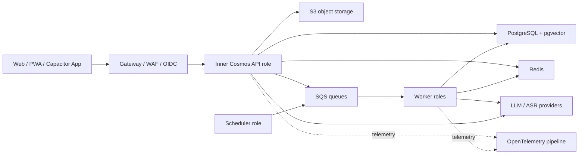

# Inner Cosmos 完全体系统架构与工程规格

> 文档性质：L1 目标架构规范
> 状态：AUTHORITATIVE
> 原则：为完整产品选择足够成熟且可演进的架构，不以“技术越多越好”为目标
> 详细 AI 架构：`08-Aurora生命感与共鸣智能创新架构.md`

## 0. 架构结论

完全体采用“模块化单体 + 多运行角色 + 托管云服务”的演进式云原生架构：

- 核心业务保持一个 Java/Spring 代码库中的严格领域模块，避免过早微服务化。
- 同一制品按 API、Worker、Scheduler/Migration 等角色运行，独立伸缩和故障隔离。
- PostgreSQL + pgvector 统一事务数据、JSONB 和第一阶段向量检索；Redis 管理短状态、限流与协调；SQS/DLQ 承担跨进程可靠异步；S3 保存对象与大体积派生物。
- React/TypeScript PWA 是统一前端，Capacitor 提供移动端壳与原生能力。
- EKS 是目标运行平台，Terraform + Kustomize 管理基础设施与环境差异，Gateway API/受管入口负责流量。
- OpenTelemetry 统一 trace、metric、log 与 AI 运行观测。
- AI 能力以内部平台模块和可版本化 runtime 实现，不散落在 Controller 或 Prompt 字符串中。

### 0.1 三种部署 Profile

本架构必须区分运行目标，禁止把 AWS Academy 的教学限制混入商业目标，也禁止让商业托管服务成为课程演示的不可用硬依赖：

| Profile | 角色 | 基础设施选择 |
|---|---|---|
| `local-complete` | 完整产品、真实模型、UIUX 和 AI 质量主验收 | 本地 PostgreSQL/pgvector、Redis、API/Worker/Scheduler；可选 kind |
| `academy-eks` | NUS 课程 Kubernetes/EKS 证据 | 预置 `us-east-1` EKS、Envoy Gateway、静态 PV PostgreSQL、短期 Redis、JDBC outbox；不依赖 Pod SQS/IRSA |
| `commercial-sg` | 未来真实新加坡商用 | `ap-southeast-1` EKS、RDS、ElastiCache、SQS/DLQ、S3、Secrets Manager、Terraform |

`SQS`、RDS、ElastiCache、Secrets Manager 和完整 Terraform 在本文件中属于 `commercial-sg` 目标。`academy-eks` 的能力与替代方案以 `14-AWS-Academy-EKS约束与双轨部署架构.md` 为准。



## 1. 目标技术栈

| 领域 | 完全体选择 | 约束/理由 |
|---|---|---|
| JVM | Java 21 LTS | 编译与运行基线统一，不只用 JDK21 跑 Java17 target |
| Framework | Spring Boot 3.5.x 最新受支持补丁 | 在 W0 人工密钥门禁关闭后升级并生成依赖/SBOM/漏洞证据 |
| Web | Spring MVC + SSE | 当前负载和团队能力下足够；不为流式输出整体切 WebFlux |
| 模块化 | Spring Modulith + ArchUnit | 以可执行边界约束模块依赖和事件 |
| 数据访问 | MyBatis/MyBatis-Plus 经 Repository/Port 封装 | 允许渐进迁移，不让 mapper 泄漏到跨模块编排 |
| 数据库 | PostgreSQL 16+ + pgvector | 事务、JSONB、全文/向量能力与云托管成熟度 |
| 迁移 | Flyway | schema 只能前向版本化迁移，不依赖启动重放 `schema.sql` |
| 缓存/协调 | Redis/ElastiCache | session、幂等、限流、短期 agent 状态、分布式锁/租约 |
| 消息 | AWS SQS + DLQ + transactional outbox | 支持可靠异步和独立 worker；当前无需 Kafka |
| 对象存储 | S3 | 音频、导出、评测资产、较大派生数据；短时签名访问 |
| 身份 | Spring Security + OIDC/OAuth 2.1 | Web 使用安全 Cookie/BFF 语义，移动端 Authorization Code + PKCE |
| 前端 | React + TypeScript + Vite | 统一 SPA/PWA、组件系统、类型化 API 与可测试状态 |
| 移动 | Capacitor | 最大化 Web 复用，同时接入推送、麦克风、深链和安全存储 |
| API | REST/JSON + SSE + OpenAPI | 契约优先、版本化、幂等、统一问题响应和客户端生成 |
| IaC | Terraform | AWS/VPC/EKS/RDS/Redis/SQS/S3/观测资源可复现 |
| K8s 配置 | Kustomize | base + dev/staging/prod overlays；不复制整套 YAML |
| 入口 | Gateway API + AWS 受管实现/WAF | TLS、路由、安全头、限流与渐进发布 |
| 可观测 | OpenTelemetry | 统一关联用户请求、异步任务、模型调用和产品事件 |
| CI/CD | GitHub Actions 或课程批准平台 | build/test/scan/image/sign/deploy/verify/rollback |

若版本在实施时已更新，采用同一大版本的最新稳定补丁并记录 ADR；不得静默跳到新的主版本。

## 2. 代码库与模块边界

目标仍可保持 monorepo，推荐结构：

```text
apps/
  backend/                 # Spring Boot 多运行角色
  web/                     # React PWA
  mobile/                  # Capacitor 壳、原生配置和商店资产
modules/                   # 后端领域模块（可先在现目录渐进形成）
  identity-access/
  aurora-runtime/
  conversation/
  memory-model/
  profile-model/
  psychology-skills/
  capsule/
  resonance/
  slow-social/
  safety-trust/
  notification/
  administration/
platform/
  api-contracts/
  ai-provider/
  eventing/
  observability/
  persistence/
infra/
  terraform/
  k8s/base/
  k8s/overlays/{dev,staging,prod}/
docs/  evidence/  scripts/
```

不要求一次性搬目录。先用 package、Spring Modulith、ArchUnit 和公开接口形成真实边界，再在收益明确时物理拆分。每个领域模块拥有自己的应用服务、领域对象、repository port、事件和 API mapper；禁止其他模块直接使用其 mapper 或修改其表。

### 2.1 领域责任

| 模块 | 拥有的能力与数据 |
|---|---|
| identity-access | 用户、会话、设备、角色、同意、登录与账户状态 |
| conversation | 会话、消息、附件、流式事件、用户打断/停止 |
| aurora-runtime | 双核、编排计划、Self/Constitution/Emergence、Relationship State、WakeIntent |
| memory-model | 原始到记忆的提取、生命周期、主题、星空投影 |
| profile-model | 用户画像、证据、置信度、冲突、版本、纠正与多向量表示 |
| psychology-skills | Skill registry、执行、结果、风险、证据版本和用户授权 |
| capsule | Genome 编译、版本、沙盒、发布、撤回与对话 runtime |
| resonance | 候选生成、多策略排序、解释、反馈和质量评测 |
| slow-social | 慢信、连接请求、关系状态、举报/屏蔽/退出 |
| safety-trust | 内容风险、隐私策略、数据权利、审计、危机资源 |
| notification | 应用内、Push、Email 偏好、预算、投递和回执 |
| administration | 最小权限运营能力、feature flag、审核和系统健康 |

## 3. 运行角色与 Kubernetes 拓扑

同一个后端代码库至少产出以下可独立部署角色：

- `api`：HTTP/SSE 边界、认证、轻量同步事务；不执行分钟级 AI 管线。
- `ai-worker`：记忆、画像、Genome、心理 Skill、离线评测等模型任务。
- `event-worker`：outbox 投递、通知、数据权利传播、非 AI 领域事件。
- `scheduler`：仅负责抢占式调度并写入持久化任务；`commercial-sg` 写 SQS，`academy-eks` 写 PostgreSQL outbox，不在 cron 线程做重业务。
- `migration-job`：发布前执行 Flyway，成功后才滚动应用。

每个角色必须：

- 使用无状态 Pod；session 和任务状态外置。
- 有 startup/readiness/liveness probe，且三者语义不同。
- 配置 requests/limits、PodDisruptionBudget、TopologySpread、非 root、只读根文件系统和最小 ServiceAccount。
- 支持优雅终止：停止接流量、完成/释放租约、关闭 SSE、确认或重投消息。
- 用 HPA 按 CPU/内存和队列深度伸缩；Scheduler 单活使用租约或托管调度。
- 通过 Secret Manager/External Secrets 注入密钥，生产配置 fail-fast，禁止 Mock/fallback/demo seed。

`academy-eks` 是明确例外 profile：课程环境未证明 Secrets Manager/Pod Identity 可用，密钥由操作员当次创建 Kubernetes Secret，绝不入 Git；持久化仅用于可重建 demo，不能宣称生产耐久性。

## 4. 数据架构

### 4.1 数据层级与用途绑定

沿用并强化 P0—P3：

- P0 原始表达：对话、音频、原始碎片；默认仅用户与授权 AI 管线访问。
- P1 派生理解：记忆、画像、情绪、主题、Skill 结果；每项带来源、用途、置信度和版本。
- P2 共鸣资产：经显式授权编译的 Genome、公开摘要和向量；与 P0/P1 分离。
- P3 社交数据：共鸣会话、慢信、连接、举报和关系状态。

数据访问由“主体 + 资源所有者 + 用途 + 隐私层级 + 同意版本”共同决定，管理员角色不自动获得 P0/P1 内容访问权。

### 4.2 PostgreSQL 模式原则

- 主键使用适合分布式生成和排序的 UUIDv7/ULID 或经 ADR 确定的统一方案；迁移期保留旧 BIGINT 映射。
- 每个用户域表显式包含 `user_id`/owner，所有更新把 owner 与预期版本/状态写进 WHERE 条件。
- 使用 `created_at`、`updated_at`、`version`，时间统一 UTC 存储、客户端本地化显示。
- 稳定检索字段规范化为列；高变、模型派生结构可用 JSONB，但必须有 schema version。
- 向量记录保存 embedding model、维度、来源版本、用途、生成时间和 tombstone。
- 使用部分索引、复合索引和 pgvector HNSW/IVFFlat 前，必须有真实查询与 explain 证据。
- RLS 可作为纵深防御 PoC，但不能替代应用所有权校验；采用与否写 ADR 和性能证据。

### 4.3 记忆与画像生命周期

统一支持：`create → consolidate → reinforce → contradict → supersede → decay → archive → forget`。

每个派生结论记录 provenance DAG：源消息/事件、提取器版本、模型、Prompt/Skill 版本、置信度、用户确认和下游消费者。用户纠正或撤回时，系统必须找到并重算/失效下游洞察、向量、缓存、共鸣体和匹配特征。

### 4.4 多向量表示

不要把用户压成一个万能 embedding。至少按用途拆分：

- semantic experience（经历/主题语义）
- values & worldview（价值与世界观）
- interests（兴趣）
- interaction style（表达与互动风格）
- emotional pattern（经同意的情绪模式）
- current context（当前阶段和即时需求）

匹配和检索组合这些空间与结构化特征，权重受策略、用户偏好、置信度和新鲜度控制。线上召回与离线重排分离，保留可解释贡献。

### 4.5 迁移路径

1. 冻结现有 schema 事实并为 MySQL/H2 数据建立盘点和数据字典。
2. 建 PostgreSQL Testcontainers 契约测试和 Flyway `V1` baseline。
3. 写可重复、可校验的迁移器；双读只用于短期验证，不长期维护双写。
4. 比较数量、外键、状态分布、JSON schema、时间和关键用户旅程。
5. 切换前做备份与回滚演练；发布后保留可审计 reconciliation report。

H2 可保留给极小单元测试，但集成/生产契约以 PostgreSQL 为准，不能再以 `MODE=MySQL` 证明兼容。

## 5. 可靠异步与一致性

- 业务事务与 outbox 在同一 PostgreSQL 事务提交。
- Dispatcher 将 outbox 投递 SQS；消费者用 event id 建幂等 inbox/processing record。
- 事件 schema 有名称、版本、occurredAt、actor、trace、privacy class 和最小 payload。
- 至少一次投递是正常语义，消费者必须幂等；不声称端到端 exactly-once。
- 重试采用指数退避、最大次数和可观察 DLQ；毒消息可检查、修复和重放。
- 长 AI 管线采用持久化 workflow/state machine：每步记录输入版本、结果、成本、延迟、错误和恢复点。
- 定时唤醒写 `WakeIntent` 和租约，节点重启、多副本与时钟漂移下仍不得重复轰炸用户。

## 6. AI Runtime 架构

### 6.1 统一 Provider 层

所有 LLM/embedding/ASR 调用通过 provider gateway：

- 能力发现而非大量 `if provider`。
- 请求/响应 schema、timeout、retry、circuit breaker、预算和取消传播。
- 模型路由按任务质量、隐私区域、延迟和成本，不把 fallback 静默伪装成原模型结果。
- 生产严禁回退 Mock；用户可感知的失败采用诚实降级。
- 记录 model id、provider、region、token/cost、latency、template/version、trace 与安全决策；敏感内容按策略脱敏或不落日志。

### 6.2 Aurora 双核与对话编排

核心流水线：

```text
input/event
 → context & permission assembly
 → fast social kernel
 → slow reflective kernel (conditional/parallel)
 → conversation choreographer
 → safety/privacy critics
 → stream of typed UI events
 → post-turn memory/profile/wake proposals
```

Choreographer 输出的不是一个字符串，而是版本化事件，例如：

`listening.started`、`thinking.phase`、`message.planned`、`message.delta`、`message.completed`、`pause.scheduled`、`plan.interrupted`、`plan.revised`、`followup.proposed`、`turn.settled`、`error.recoverable`。

事件必须支持 sequence、plan id、causation、cancel token 和断线恢复。不能向客户端输出隐私敏感的内部思维链；`thinking.phase` 仅表达可公开状态。

### 6.3 Temporal Cognition

时间引擎统一处理用户时区、当地时段、相对间隔、日历/承诺、quiet hours 和关系契约。主动性采用两阶段：生成 WakeIntent，临近投递时再根据最新上下文做 Send/Delay/Drop/Convert-to-in-app 决策。

### 6.4 Self、Constitution 与 Emergence

- Self Genome：稳定身份、风格、价值倾向、互动偏好和能力边界。
- Constitution：行为原则、不可逾越边界、冲突优先级和审计版本。
- Relationship State：共同历史、信任/熟悉程度、用户契约和未完成线程；不是伪造“爱情数值”。
- Emergence Proposal：从长期表现产生的可审查变更，必须通过回放、质量、安全、身份连续性和回归评测才可激活。

所有状态版本化、可解释、可回滚；在线自由度被限定在经评测的参数/策略空间内，而不是每轮任意改写 system prompt。

### 6.5 Memory/Profile Retrieval

上下文装配不是“取更多”：先按任务确定需要的记忆类型和隐私用途，再混合结构化过滤、全文、向量、图式关系投影、时效与重要性；最后做去重、冲突标记和 token budget 编排。返回内容带 source ids，生成后的事实一致性 critic 可反查。

### 6.6 Capsule Genome Compiler

Compiler 是持久化、多阶段 AI workflow：授权快照 → 特征提取 → 风格示例选择 → 事实/价值/习惯冲突处理 → 场景化记忆索引 → 系统约束生成 → 覆盖与泄露评测 → 用户沙盒 → 版本发布。

运行时由 Planner、Retriever、Speaker、Critics 与 Reranker 协作。Prompt 是编译产物之一，不是全部系统。

### 6.7 Psychology Skill Runtime

Skill manifest 必须声明：id/version、owner、evidence、locale、input/output schema、allowed tools/data、risk tier、consent、retention、evaluation、fallback 和 escalation。运行时使用 allowlist、隔离上下文、限时/限额和结构化输出；高风险 Skill 必须有人类专家审批门禁。

### 6.8 评测与发布

- 固定 golden scenarios + 纵向多轮 trajectory + 对抗/隐私集 + 多语言集。
- 指标覆盖 empathy/helpfulness、persona fidelity、memory precision、contradiction、boundary leakage、proactive appropriateness、interrupt recovery、latency 和 cost。
- Prompt、模型、Self、Genome Compiler 或 Skill 变更必须跑受影响评测；关键能力用 pairwise blind review。
- 线上采用 shadow/canary/feature flag，保留 replay 输入引用和版本，不记录不必要原文。
- 质量门槛由 `docs/research/innovation-evaluation-spec.yml` 及后续版本具体化。

## 7. API 与客户端契约

- `/api/v1` 版本化；OpenAPI 是生成客户端和契约测试的来源。
- 错误采用稳定 code + 本地化 message + trace id；不得让前端解析异常字符串。
- 创建/发送/结束/支付类操作支持 Idempotency-Key。
- 列表使用 cursor pagination；时间、枚举、nullability 和 money 明确定义。
- 并发修改使用 version/ETag；资源所有权在读取模型或调用 LLM 前校验。
- SSE 支持 event id、heartbeat、resume 或明确的 session recovery；移动网络断开不产生重复消息。
- 前端采用生成 API client + TanStack Query（或经 ADR 的同类）管理 server state；本地 UI state 与后端事实分离。

## 8. 身份、安全与隐私架构

### 8.1 身份与会话

- Spring Security 统一认证授权，密码沿用强哈希并可渐进迁移。
- Web 使用 HttpOnly、Secure、SameSite 合理配置的 Cookie，并有 CSRF 防护与 session fixation 防护。
- 移动使用 OIDC Authorization Code + PKCE，token 放系统安全存储；刷新、撤销和设备管理可见。
- RBAC 只控制职能，资源访问仍做 owner/purpose/consent 校验；管理员无 P0 默认读取权。

### 8.2 隐私工程

- consent ledger 版本化记录目的、数据类别、Provider/区域、时间与撤回。
- 数据处理前执行 policy decision；对外 LLM 请求采用任务最小化、去标识和区域路由。
- 日志、trace、prompt capture 默认不存 P0；需要研究 capture 时另行同意、加密、短保留和隔离访问。
- 导出/删除采用异步可追踪 workflow，覆盖数据库、向量、S3、Redis、共鸣体、队列和备份保留策略。
- KMS 加密、Secrets Manager、密钥轮换、网络分段、egress allowlist、审计和 break-glass 访问形成纵深防御。

### 8.3 软件供应链

- 锁定依赖、生成 CycloneDX/SPDX SBOM、SCA/SAST/secret/IaC/container scan。
- 镜像多阶段构建、最小非 root runtime、按 digest 部署、签名并生成 provenance。
- CI 对 high/critical 风险有例外审批和过期时间；不能用“课程项目”跳过。

## 9. 前端与移动工程

- React/TypeScript 严格模式、功能域结构、统一 design tokens 和组件库。
- Storybook/组件文档覆盖所有状态：loading/empty/error/offline/permission/streaming/interrupted。
- Playwright 覆盖核心旅程；Vitest/Testing Library 覆盖逻辑和交互；关键页面做视觉回归与可访问性扫描。
- PWA 支持安装、离线 shell、草稿和网络恢复；敏感长期数据不无边界缓存。
- Capacitor 提供 Push、麦克风、深链、安全存储、App lifecycle、权限说明和商店隐私清单。
- 原生桥接必须有 Web fallback；同一业务规则不在 Web 与移动复制两份。

## 10. 可观测、SLO 与运营

### 10.1 统一遥测

每条链路关联 `trace_id`、匿名/受控 user key、session、job/event、model call 和 deployment version。对话编排、SQS、数据库与 Provider 都传播 trace context。

关键指标：

- API availability/latency/error，SSE 首 token 与完成率。
- Queue age/depth/retry/DLQ，worker 成功率与租约冲突。
- DB pool/lock/query latency，Redis hit/eviction。
- Provider latency/error/token/cost/fallback/cancel。
- 主动消息 send/delay/drop/disable/negative feedback。
- 记忆确认/纠正、共鸣体泄露、危机路径、数据权利 SLA。

### 10.2 初始 SLO（需用真实流量校准）

- 核心非 AI API 月可用性 ≥ 99.9%。
- 核心读取 p95 ≤ 400ms（新加坡生产、排除客户端网络）。
- Aurora 流首个可见状态 p95 ≤ 800ms；首条内容目标 p95 ≤ 3s，慢核可随后补充。
- 关键异步任务 99% 在声明 SLA 内完成，DLQ 无未知积压。
- 数据导出/删除在隐私政策声明期限内完成并可证明。

AI 质量 SLO 不用单一延迟替代，必须同时看成功、质量、成本和安全。

### 10.3 备份与恢复

- RDS 自动备份 + PITR，S3 versioning/lifecycle，关键配置和 IaC 存 Git。
- staging 定期执行恢复演练，验证数据一致性、向量重建、队列恢复和应用启动。
- 初始目标 RPO ≤ 15 分钟、RTO ≤ 2 小时；公开承诺前用演练证明。

## 11. CI/CD 与环境

流水线顺序：

```text
lint/static analysis
 → unit/module/contract tests
 → PostgreSQL/Redis integration
 → AI offline eval subset
 → package + SBOM + scans + sign
 → ephemeral/staging deploy
 → migration + smoke + E2E + accessibility
 → approval/canary production
 → SLO/error observation
 → promote or rollback
```

环境至少有 local、CI ephemeral、academy-eks、staging 和 prod。测试 Provider 与生产 Provider 明确隔离；feature flag 带 owner、expiry 和默认安全状态。数据库 migration 先验证向前兼容，应用滚动期间支持 N/N-1 schema 交叠。Academy 每次 4 小时会话开始都执行 capability preflight，不能复用上次探针结论。

## 12. 微服务拆分判据

只有同时出现明确收益和证据时才拆独立服务，例如：

- 独立伸缩无法通过运行角色解决。
- 故障或安全隔离确有硬要求。
- 数据所有权与团队所有权已经稳定。
- 发布节奏强冲突且模块契约成熟。
- 性能数据证明单部署单元构成瓶颈。

首批潜在拆分候选是 notification、AI execution 或 public capsule runtime，而不是按实体拆服务。拆分前必须有 ADR、契约测试、SLO、运维 owner 和迁移/回滚方案。

## 13. 明确不采用的默认方案

- 不默认使用 Kafka：SQS/outbox 足以支持当前可靠异步和课程展示。
- 不默认使用 Service Mesh：先用 Gateway、SDK/OTel 和 K8s 网络策略。
- 不默认使用图数据库：关系投影先用 PostgreSQL；达到查询瓶颈再 PoC。
- 不默认 Event Sourcing：审计/版本表与领域事件满足需求，避免重放复杂性。
- 不默认多区域 active-active：先在 AWS Singapore 单区域多 AZ 做可靠性。
- 不用向量数据库替代关系数据库、全文检索、数据治理或画像表。
- 不微调个人用户模型作为共鸣体默认方案：优先编译、检索、状态与多 Agent runtime，保留模型可替换性和删除能力。

## 14. 从当前架构迁移的顺序约束

1. 先关闭 W0 安全门禁与密钥人工轮换，保持生产 fail-fast。
2. 升 Java21/Boot3.5、建立 SBOM/容器 smoke 与依赖基线。
3. 引入模块边界、Spring Security、OpenAPI 和 PostgreSQL/Flyway 测试底座。
4. 将 session、scheduler 和异步状态外置，形成 API/Worker/Scheduler 运行角色。
5. 建 outbox/SQS、幂等、DLQ 和 OTel，再把长 AI 管线迁入 worker。
6. 建 React PWA shell 和类型化契约，以纵向旅程逐页替换旧物理 HTML。
7. 分阶段实现 `08` 的 AI runtime、数据与评测；不要等基础设施“全部结束”才开始体验创新。
8. Capacitor、EKS 和新加坡发布准备持续与产品纵向切片并行。

每一步都必须可回滚、保留现有闭环并给出数据/体验/运行证据。禁止以大爆炸重写造成数月不可演示状态。
